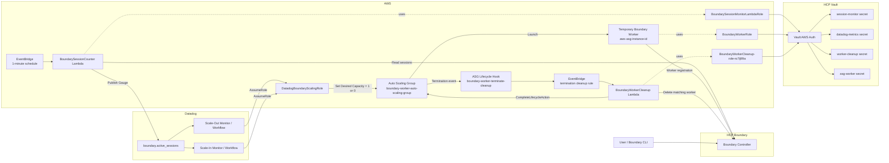
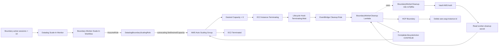

# Boundary + Vault + Datadog + AWS Load Handling
## Final Current Infrastructure Only — Step-by-Step

> This document contains only the **current final architecture and configuration**.
> It intentionally excludes retired, replaced, experimental, or previous infrastructure.

---

# Current Final Architecture

```text
HCP Boundary
    ↓
BoundarySessionCounter Lambda
    ↓
Datadog metric: boundary.active_sessions
    ↓
Datadog Scale-Out / Scale-In Monitors
    ↓
Datadog Workflows
    ↓
DatadogBoundaryScalingRole
    ↓
AWS Auto Scaling Group
    ↓
Desired Capacity = 1 / 0
```

Scale-in cleanup:

```text
ASG Desired Capacity = 0
    ↓
Termination Lifecycle Hook
    ↓
EventBridge
    ↓
BoundaryWorkerCleanup Lambda
    ↓
Vault AWS Auth
    ↓
Boundary cleanup credential from Vault
    ↓
HCP Boundary API
    ↓
Delete aws-asg-<instance-id>
    ↓
CompleteLifecycleAction(CONTINUE)
    ↓
EC2 terminates
```

Current required AWS roles:

```text
BoundaryWorkerRole
BoundarySessionMonitorLambdaRole
BoundaryWorkerCleanup-role-ro7ij99a
DatadogBoundaryScalingRole
```

Current required Lambda functions:

```text
BoundarySessionCounter
BoundaryWorkerCleanup
```

Current ASG:

```text
boundary-worker-auto-scaling-group
```

Current Datadog metric:

```text
boundary.active_sessions
```

---


# Overall Architecture Diagram with IAM Roles

## Why this diagram is useful

This diagram shows the current final relationship between HCP Boundary, HCP Vault, AWS Lambda, Datadog, AWS IAM roles, and the Auto Scaling Group.


For an exact text-based version that is easy to keep in GitHub, use the Mermaid diagram below.



## IAM Role Relationships

| AWS IAM Role | Used by | Why it is required |
|---|---|---|
| `BoundaryWorkerRole` | Temporary Boundary worker EC2 | Provides AWS identity for Vault AWS IAM authentication |
| `BoundarySessionMonitorLambdaRole` | `BoundarySessionCounter` Lambda | Provides Lambda execution/VPC permissions and AWS identity for Vault AWS Auth |
| `BoundaryWorkerCleanup-role-ro7ij99a` | `BoundaryWorkerCleanup` Lambda | Provides Lambda execution/VPC permissions, Vault AWS identity, and lifecycle completion permission |
| `DatadogBoundaryScalingRole` | Datadog Workflow | Allows Datadog to call `DescribeAutoScalingGroups` and `SetDesiredCapacity` |

---

# Scale-Out Flow Diagram

## Trigger

```text
boundary.active_sessions >= 10
```

## Result

```text
ASG Desired Capacity = 1
```


## Scale-Out Role Path

```text
Datadog
   ↓ sts:AssumeRole + External ID
DatadogBoundaryScalingRole
   ↓ autoscaling:SetDesiredCapacity
boundary-worker-auto-scaling-group
   ↓ launch EC2
BoundaryWorkerRole
   ↓ Vault AWS Auth
HCP Vault
   ↓ read worker-registration credential
Temporary Boundary Worker
   ↓ register
HCP Boundary
```

---

# Scale-In Flow Diagram

## Trigger

```text
boundary.active_sessions < 10
for the configured 3-minute scale-in window
```

## Result

```text
ASG Desired Capacity = 0
```



## Scale-In Role Path

```text
Datadog
   ↓ sts:AssumeRole + External ID
DatadogBoundaryScalingRole
   ↓ autoscaling:SetDesiredCapacity
boundary-worker-auto-scaling-group
   ↓ termination lifecycle event
BoundaryWorkerCleanup Lambda
   ↓ uses
BoundaryWorkerCleanup-role-ro7ij99a
   ↓ Vault AWS Auth
HCP Vault
   ↓ read cleanup credential
HCP Boundary
   ↓ delete matching aws-asg-instance-id
CompleteLifecycleAction(CONTINUE)
   ↓
EC2 termination completes
```

---

# Step 1 — Create BoundaryWorkerRole

## Why we use it

The temporary Boundary worker EC2 instance needs an AWS identity so it can authenticate to HCP Vault by using Vault AWS IAM authentication.

## AWS Console

```text
AWS Console
→ IAM
→ Roles
→ Create role
→ AWS service
→ EC2
```

Role name:

```text
BoundaryWorkerRole
```

Trust policy:

```json
{
  "Version": "2012-10-17",
  "Statement": [
    {
      "Effect": "Allow",
      "Principal": {
        "Service": "ec2.amazonaws.com"
      },
      "Action": "sts:AssumeRole"
    }
  ]
}
```

No additional secret-reading permissions are required if the worker gets its registration credential from Vault.

---

# Step 2 — Create BoundarySessionMonitorLambdaRole

## Why we use it

`BoundarySessionCounter` needs:

```text
Lambda execution
CloudWatch logging
VPC networking
AWS identity for Vault AWS Auth
```

## AWS Console

```text
AWS Console
→ IAM
→ Roles
→ Create role
→ AWS service
→ Lambda
```

Role name:

```text
BoundarySessionMonitorLambdaRole
```

Attach:

```text
AWSLambdaBasicExecutionRole
AWSLambdaVPCAccessExecutionRole
```

Trust policy:

```json
{
  "Version": "2012-10-17",
  "Statement": [
    {
      "Effect": "Allow",
      "Principal": {
        "Service": "lambda.amazonaws.com"
      },
      "Action": "sts:AssumeRole"
    }
  ]
}
```

---

# Step 3 — Create BoundaryWorkerCleanup Lambda Role

## Why we use it

`BoundaryWorkerCleanup` must:

```text
write CloudWatch logs
use VPC networking
authenticate to Vault
call autoscaling:CompleteLifecycleAction
```

Create Lambda role:

```text
BoundaryWorkerCleanup-role-ro7ij99a
```

Attach:

```text
AWSLambdaBasicExecutionRole
AWSLambdaVPCAccessExecutionRole
```

Add inline policy:

```json
{
  "Version": "2012-10-17",
  "Statement": [
    {
      "Sid": "CompleteBoundaryTermination",
      "Effect": "Allow",
      "Action": "autoscaling:CompleteLifecycleAction",
      "Resource": "arn:aws:autoscaling:<AWS_REGION>:<AWS_ACCOUNT_ID>:autoScalingGroup:<ASG_UUID>:autoScalingGroupName/boundary-worker-auto-scaling-group"
    }
  ]
}
```

---

# Step 4 — Create DatadogBoundaryScalingRole

## Why we use it

Datadog directly changes the Auto Scaling Group desired capacity.

## First get the Datadog External ID

In Datadog:

```text
Integrations
→ Amazon Web Services
→ Add / Edit AWS Account
→ Manual setup
→ Role Delegation
```

Copy:

```text
AWS External ID
```

Also note the Datadog AWS account ID shown by Datadog.

## Create AWS role

```text
AWS Console
→ IAM
→ Roles
→ Create role
→ AWS account
→ Another AWS account
```

Use:

```text
Datadog AWS Account ID:
<DATADOG_AWS_ACCOUNT_ID>

Require external ID:
Enabled

External ID:
<DATADOG_EXTERNAL_ID>
```

Role name:

```text
DatadogBoundaryScalingRole
```

Trust policy:

```json
{
  "Version": "2012-10-17",
  "Statement": [
    {
      "Effect": "Allow",
      "Principal": {
        "AWS": "arn:aws:iam::<DATADOG_AWS_ACCOUNT_ID>:root"
      },
      "Action": "sts:AssumeRole",
      "Condition": {
        "StringEquals": {
          "sts:ExternalId": "<DATADOG_EXTERNAL_ID>"
        }
      }
    }
  ]
}
```

Add inline policy:

```json
{
  "Version": "2012-10-17",
  "Statement": [
    {
      "Sid": "DescribeBoundaryASG",
      "Effect": "Allow",
      "Action": "autoscaling:DescribeAutoScalingGroups",
      "Resource": "*"
    },
    {
      "Sid": "SetBoundaryDesiredCapacity",
      "Effect": "Allow",
      "Action": "autoscaling:SetDesiredCapacity",
      "Resource": "arn:aws:autoscaling:<AWS_REGION>:<AWS_ACCOUNT_ID>:autoScalingGroup:<ASG_UUID>:autoScalingGroupName/boundary-worker-auto-scaling-group"
    }
  ]
}
```

Policy name:

```text
DatadogBoundaryAutoScalingPolicy
```

---

# Step 5 — Configure Vault CLI Environment

## Why we use it

Vault stores:

```text
Boundary session-monitor credential
Boundary cleanup credential
Boundary ASG worker registration credential
Datadog API key
SSH CA
```

Set:

```bash
export VAULT_ADDR="<HCP_VAULT_PRIVATE_ENDPOINT>"
export VAULT_NAMESPACE="admin"
```

Login:

```bash
vault login
```

Verify:

```bash
vault status
```

---

# Step 6 — Enable Vault AWS Auth

Check:

```bash
vault auth list
```

If `aws/` is not enabled:

```bash
vault auth enable aws
```

## Why we use it

AWS workloads authenticate to Vault by using their IAM roles.

```text
BoundaryWorkerRole
BoundarySessionMonitorLambdaRole
BoundaryWorkerCleanup-role-ro7ij99a
```

---

# Step 7 — Create Vault Policy for ASG Worker

Create:

```bash
cat > boundary-asg-worker.hcl <<'EOF'
path "boundary-registration/data/asg-worker" {
  capabilities = ["read"]
}
EOF
```

Apply:

```bash
vault policy write boundary-asg-worker boundary-asg-worker.hcl
```

## Why we use it

The ASG worker only needs to read its Boundary worker-registration credential.

---

# Step 8 — Create Vault Policy for Session Counter

Create:

```bash
cat > boundary-session-monitor.hcl <<'EOF'
path "boundary-registration/data/session-monitor" {
  capabilities = ["read"]
}

path "boundary-registration/data/datadog-metrics" {
  capabilities = ["read"]
}
EOF
```

Apply:

```bash
vault policy write boundary-session-monitor boundary-session-monitor.hcl
```

## Why we use it

`BoundarySessionCounter` needs:

```text
Boundary monitor username/password
Datadog API key
```

---

# Step 9 — Create Vault Policy for Cleanup Lambda

Create:

```bash
cat > boundary-worker-cleanup.hcl <<'EOF'
path "boundary-registration/data/worker-cleanup" {
  capabilities = ["read"]
}
EOF
```

Apply:

```bash
vault policy write boundary-worker-cleanup boundary-worker-cleanup.hcl
```

## Why we use it

The cleanup Lambda only needs to read its dedicated Boundary cleanup credential.

---

# Step 10 — Create Vault AWS Auth Role for ASG Worker

```bash
vault write auth/aws/role/boundary-asg-worker \
  auth_type=iam \
  bound_iam_principal_arn="arn:aws:iam::<AWS_ACCOUNT_ID>:role/BoundaryWorkerRole" \
  policies="boundary-asg-worker" \
  ttl=15m \
  max_ttl=30m \
  resolve_aws_unique_ids=false
```

Verify:

```bash
vault read auth/aws/role/boundary-asg-worker
```

---

# Step 11 — Create Vault AWS Auth Role for Session Counter

```bash
vault write auth/aws/role/boundary-session-monitor-lambda \
  auth_type=iam \
  bound_iam_principal_arn="arn:aws:iam::<AWS_ACCOUNT_ID>:role/BoundarySessionMonitorLambdaRole" \
  policies="boundary-session-monitor" \
  ttl=15m \
  max_ttl=30m \
  resolve_aws_unique_ids=false
```

Verify:

```bash
vault read auth/aws/role/boundary-session-monitor-lambda
```

---

# Step 12 — Create Vault AWS Auth Role for Cleanup Lambda

```bash
vault write auth/aws/role/boundary-worker-cleanup \
  auth_type=iam \
  bound_iam_principal_arn="arn:aws:iam::<AWS_ACCOUNT_ID>:role/BoundaryWorkerCleanup-role-ro7ij99a" \
  policies="boundary-worker-cleanup" \
  ttl=15m \
  max_ttl=30m \
  resolve_aws_unique_ids=false
```

Verify:

```bash
vault read auth/aws/role/boundary-worker-cleanup
```

---

# Step 13 — Store ASG Worker Registration Credential in Vault

```bash
vault kv put boundary-registration/asg-worker \
  login_name="<BOUNDARY_WORKER_REGISTRATION_LOGIN>" \
  password="<BOUNDARY_WORKER_REGISTRATION_PASSWORD>"
```

## Why we use it

The temporary worker uses this Boundary identity to register itself as a worker.

---

# Step 14 — Store Session Monitor Credential in Vault

```bash
vault kv put boundary-registration/session-monitor \
  login_name="boundary-session-monitor" \
  password="<BOUNDARY_SESSION_MONITOR_PASSWORD>"
```

## Why we use it

`BoundarySessionCounter` uses this Boundary account to list active sessions.

---

# Step 15 — Store Datadog API Key in Vault

```bash
vault kv put boundary-registration/datadog-metrics \
  api_key="<DATADOG_API_KEY>"
```

## Why we use it

The Session Counter sends the metric directly to Datadog.

---

# Step 16 — Store Cleanup Boundary Credential in Vault

```bash
vault kv put boundary-registration/worker-cleanup \
  login_name="boundary-worker-cleanup" \
  password="<BOUNDARY_WORKER_CLEANUP_PASSWORD>"
```

## Why we use it

The cleanup Lambda uses this identity to delete only the matching temporary Boundary worker.

---

# Step 17 — Configure Boundary Session Monitor Permission

Create or use a Boundary user/account:

```text
boundary-session-monitor
```

Grant:

```text
ids=*;type=session;actions=list,read
```

## Why we use it

The Lambda only needs read-only access to sessions.

---

# Step 18 — Configure Boundary Cleanup Permission

Create or use:

```text
boundary-worker-cleanup
```

Grant:

```text
type=worker;actions=list
ids=*;type=worker;actions=read,delete
```

## Why we use it

The cleanup Lambda must find and delete the matching ASG worker.

---

# Step 19 — Configure Boundary ASG Worker Registration Permission

Create a dedicated Boundary user/account for ASG worker registration.

Grant:

```text
type=worker;actions=create:worker-led
```

Store the credential in:

```text
boundary-registration/asg-worker
```

---

# Step 20 — Configure ASG Boundary Worker HCL

Use:

```hcl
disable_mlock = true

hcp_boundary_cluster_id = "<HCP_BOUNDARY_CLUSTER_ID>"

listener "tcp" {
  address = "0.0.0.0:9202"
  purpose = "proxy"
}

worker {
  auth_storage_path = "/var/lib/boundary"
}

tags {
  type       = ["egress"]
  cloud      = ["aws"]
  pool       = ["aws-autoscaling"]
  target     = ["on-aws"]
  cred-store = ["vault"]
}
```

## Why we use these tags

```text
type=egress
→ worker is used for outbound target access

pool=aws-autoscaling
→ identifies temporary ASG workers

target=on-aws
→ can be used by Boundary target worker filters

cred-store=vault
→ can be selected for private Vault access
```

---

# Step 21 — Create AWS Launch Template

Name:

```text
autoscaling-worker-template
```

Configure:

```text
AMI:
Ubuntu supported image

Instance type:
t2.small

IAM instance profile:
BoundaryWorkerRole

Network:
Private subnet

Public IP:
Disabled

Security group:
Boundary worker security group
```

Required outbound connectivity:

```text
TCP 9202 → HCP Boundary
TCP 8200 → HCP Vault
TCP 443  → HCP Boundary API / AWS / package repositories
TCP 22   → SSH targets
```

---

# Step 22 — Add Launch Template User Data

Use this bootstrap logic:

```bash
#!/usr/bin/env bash
set -euo pipefail

BOUNDARY_ADDR="<HCP_BOUNDARY_ADDR>"
BOUNDARY_AUTH_METHOD_ID="<BOUNDARY_PASSWORD_AUTH_METHOD_ID>"
BOUNDARY_CLUSTER_ID="<HCP_BOUNDARY_CLUSTER_ID>"

VAULT_ADDR="<HCP_VAULT_PRIVATE_ENDPOINT>"
VAULT_NAMESPACE="admin"
VAULT_AWS_ROLE="boundary-asg-worker"

export BOUNDARY_ADDR
export VAULT_ADDR
export VAULT_NAMESPACE

apt-get update
apt-get install -y curl wget gpg lsb-release jq unzip

wget -qO- https://apt.releases.hashicorp.com/gpg \
  | gpg --dearmor \
  > /usr/share/keyrings/hashicorp-archive-keyring.gpg

echo "deb [signed-by=/usr/share/keyrings/hashicorp-archive-keyring.gpg] \
https://apt.releases.hashicorp.com $(lsb_release -cs) main" \
  > /etc/apt/sources.list.d/hashicorp.list

apt-get update
apt-get install -y boundary-enterprise vault

IMDS_TOKEN="$(curl -fsS -X PUT \
  -H 'X-aws-ec2-metadata-token-ttl-seconds: 21600' \
  http://169.254.169.254/latest/api/token)"

INSTANCE_ID="$(curl -fsS \
  -H "X-aws-ec2-metadata-token: ${IMDS_TOKEN}" \
  http://169.254.169.254/latest/meta-data/instance-id)"

WORKER_NAME="aws-asg-${INSTANCE_ID}"

id boundary >/dev/null 2>&1 || \
  useradd --system --home /var/lib/boundary --shell /usr/sbin/nologin boundary

mkdir -p /etc/boundary.d /var/lib/boundary
chown -R boundary:boundary /var/lib/boundary
chmod 700 /var/lib/boundary

cat >/etc/boundary.d/pki-worker.hcl <<EOF
disable_mlock = true

hcp_boundary_cluster_id = "${BOUNDARY_CLUSTER_ID}"

listener "tcp" {
  address = "0.0.0.0:9202"
  purpose = "proxy"
}

worker {
  auth_storage_path = "/var/lib/boundary"
}

tags {
  type       = ["egress"]
  cloud      = ["aws"]
  pool       = ["aws-autoscaling"]
  target     = ["on-aws"]
  cred-store = ["vault"]
}
EOF

cat >/etc/systemd/system/boundary-worker.service <<'EOF'
[Unit]
Description=HashiCorp Boundary Worker
After=network-online.target
Wants=network-online.target

[Service]
Type=simple
User=boundary
Group=boundary
ExecStart=/usr/bin/boundary server -config=/etc/boundary.d/pki-worker.hcl
Restart=on-failure
RestartSec=5

[Install]
WantedBy=multi-user.target
EOF

systemctl daemon-reload
systemctl enable --now boundary-worker

AUTH_REQUEST_FILE="/var/lib/boundary/auth_request_token"

for i in $(seq 1 60); do
  if [ -s "${AUTH_REQUEST_FILE}" ]; then
    break
  fi
  sleep 2
done

WORKER_AUTH_REQUEST_TOKEN="$(cat "${AUTH_REQUEST_FILE}")"

VAULT_TOKEN="$(vault login \
  -method=aws \
  -token-only \
  -no-store \
  role="${VAULT_AWS_ROLE}")"

export VAULT_TOKEN

SECRET_JSON="$(vault kv get \
  -mount=boundary-registration \
  -format=json \
  asg-worker)"

BOUNDARY_LOGIN_NAME="$(echo "${SECRET_JSON}" | jq -r '.data.data.login_name')"
BOUNDARY_PASSWORD="$(echo "${SECRET_JSON}" | jq -r '.data.data.password')"

AUTH_PAYLOAD="$(jq -n \
  --arg login "${BOUNDARY_LOGIN_NAME}" \
  --arg password "${BOUNDARY_PASSWORD}" \
  '{
    attributes: {
      login_name: $login,
      password: $password
    },
    command: "login"
  }')"

BOUNDARY_AUTH_JSON="$(curl -fsS \
  -X POST \
  -H 'Content-Type: application/json' \
  -d "${AUTH_PAYLOAD}" \
  "${BOUNDARY_ADDR}/v1/auth-methods/${BOUNDARY_AUTH_METHOD_ID}:authenticate")"

BOUNDARY_TOKEN="$(echo "${BOUNDARY_AUTH_JSON}" | jq -r '.attributes.token')"

export BOUNDARY_TOKEN

boundary workers create worker-led \
  -name="${WORKER_NAME}" \
  -description="AWS Auto Scaling Boundary worker" \
  -worker-generated-auth-token="${WORKER_AUTH_REQUEST_TOKEN}" \
  -token env://BOUNDARY_TOKEN
```

## Why the worker name is important

```text
aws-asg-<INSTANCE_ID>
```

The cleanup Lambda receives the terminating EC2 instance ID, so it can calculate the exact matching Boundary worker name.

---

# Step 23 — Create Auto Scaling Group

Name:

```text
boundary-worker-auto-scaling-group
```

Use:

```text
Launch Template:
autoscaling-worker-template

Min:
0

Desired:
0

Max:
2
```

Scaling behavior:

```text
10 or more active sessions
→ Desired Capacity = 1

Below 10 for the configured scale-in window
→ Desired Capacity = 0
```

---

# Step 24 — Create BoundarySessionCounter Lambda

Function name:

```text
BoundarySessionCounter
```

Runtime:

```text
Python 3.12
```

Execution role:

```text
BoundarySessionMonitorLambdaRole
```

VPC:

```text
VPC/subnet that can reach HCP Vault private endpoint
```

Environment variables:

```text
VAULT_ADDR=<HCP_VAULT_PRIVATE_ENDPOINT>
VAULT_NAMESPACE=admin
VAULT_AWS_ROLE=boundary-session-monitor-lambda

BOUNDARY_ADDR=<HCP_BOUNDARY_ADDR>
BOUNDARY_AUTH_METHOD_ID=<BOUNDARY_PASSWORD_AUTH_METHOD_ID>
BOUNDARY_SCOPE_ID=global

DD_SITE=datadoghq.com
```

---

# Step 25 — Add BoundarySessionCounter Lambda Code

```python
import os
import json
import base64
import time
import urllib.request
import urllib.parse

import boto3
from botocore.auth import SigV4Auth
from botocore.awsrequest import AWSRequest


def vault_aws_login(vault_addr, vault_namespace, vault_aws_role):
    credentials = (
        boto3.Session()
        .get_credentials()
        .get_frozen_credentials()
    )

    sts_url = "https://sts.amazonaws.com/"
    sts_body = "Action=GetCallerIdentity&Version=2011-06-15"

    aws_request = AWSRequest(
        method="POST",
        url=sts_url,
        data=sts_body,
        headers={
            "Content-Type":
                "application/x-www-form-urlencoded; charset=utf-8",
            "Host": "sts.amazonaws.com",
        },
    )

    SigV4Auth(
        credentials,
        "sts",
        "us-east-1",
    ).add_auth(aws_request)

    payload = {
        "role": vault_aws_role,
        "iam_http_request_method": "POST",
        "iam_request_url": base64.b64encode(
            sts_url.encode()
        ).decode(),
        "iam_request_body": base64.b64encode(
            sts_body.encode()
        ).decode(),
        "iam_request_headers": base64.b64encode(
            json.dumps(dict(aws_request.headers.items())).encode()
        ).decode(),
    }

    request = urllib.request.Request(
        f"{vault_addr}/v1/auth/aws/login",
        data=json.dumps(payload).encode(),
        method="POST",
        headers={
            "Content-Type": "application/json",
            "X-Vault-Namespace": vault_namespace,
        },
    )

    with urllib.request.urlopen(request, timeout=10) as response:
        result = json.loads(response.read().decode())

    print("Vault AWS authentication successful")
    return result["auth"]["client_token"]


def vault_read(vault_addr, namespace, token, path):
    request = urllib.request.Request(
        f"{vault_addr}/v1/{path}",
        method="GET",
        headers={
            "X-Vault-Token": token,
            "X-Vault-Namespace": namespace,
        },
    )

    with urllib.request.urlopen(request, timeout=10) as response:
        result = json.loads(response.read().decode())

    return result["data"]["data"]


def boundary_login(boundary_addr, auth_method_id, login_name, password):
    payload = {
        "attributes": {
            "login_name": login_name,
            "password": password,
        },
        "command": "login",
    }

    request = urllib.request.Request(
        f"{boundary_addr}/v1/auth-methods/{auth_method_id}:authenticate",
        data=json.dumps(payload).encode(),
        method="POST",
        headers={"Content-Type": "application/json"},
    )

    with urllib.request.urlopen(request, timeout=10) as response:
        result = json.loads(response.read().decode())

    print("Boundary authentication successful")
    return result["attributes"]["token"]


def lambda_handler(event, context):
    vault_addr = os.environ["VAULT_ADDR"].rstrip("/")
    vault_namespace = os.environ["VAULT_NAMESPACE"]
    vault_role = os.environ["VAULT_AWS_ROLE"]

    boundary_addr = os.environ["BOUNDARY_ADDR"].rstrip("/")
    auth_method_id = os.environ["BOUNDARY_AUTH_METHOD_ID"]
    scope_id = os.environ.get("BOUNDARY_SCOPE_ID", "global")

    dd_site = os.environ.get("DD_SITE", "datadoghq.com")

    vault_token = vault_aws_login(
        vault_addr,
        vault_namespace,
        vault_role,
    )

    boundary_secret = vault_read(
        vault_addr,
        vault_namespace,
        vault_token,
        "boundary-registration/data/session-monitor",
    )

    print("Boundary monitoring credentials retrieved from Vault")

    datadog_secret = vault_read(
        vault_addr,
        vault_namespace,
        vault_token,
        "boundary-registration/data/datadog-metrics",
    )

    print("Datadog API key retrieved from Vault")

    boundary_token = boundary_login(
        boundary_addr,
        auth_method_id,
        boundary_secret["login_name"],
        boundary_secret["password"],
    )

    query = urllib.parse.urlencode({
        "scope_id": scope_id,
        "recursive": "true",
    })

    request = urllib.request.Request(
        f"{boundary_addr}/v1/sessions?{query}",
        method="GET",
        headers={
            "Authorization": f"Bearer {boundary_token}",
        },
    )

    with urllib.request.urlopen(request, timeout=10) as response:
        result = json.loads(response.read().decode())

    sessions = result.get("items", [])

    active_count = sum(
        1
        for session in sessions
        if session.get("status") == "active"
    )

    print(f"Active Boundary sessions: {active_count}")

    metric_payload = {
        "series": [
            {
                "metric": "boundary.active_sessions",
                "type": 3,
                "points": [
                    {
                        "timestamp": int(time.time()),
                        "value": active_count,
                    }
                ],
                "resources": [
                    {
                        "name": "hcp-boundary",
                        "type": "service",
                    }
                ],
            }
        ]
    }

    dd_request = urllib.request.Request(
        f"https://api.{dd_site}/api/v2/series",
        data=json.dumps(metric_payload).encode(),
        method="POST",
        headers={
            "Content-Type": "application/json",
            "DD-API-KEY": datadog_secret["api_key"],
        },
    )

    with urllib.request.urlopen(dd_request, timeout=10) as response:
        dd_status = response.status

    print(
        f"Published Datadog metric: "
        f"boundary.active_sessions={active_count}"
    )

    return {
        "statusCode": 200,
        "body": {
            "success": True,
            "active_sessions": active_count,
            "datadog_http_status": dd_status,
        },
    }
```

---

# Step 26 — Schedule BoundarySessionCounter Every Minute

Create EventBridge schedule:

```bash
aws events put-rule \
  --name boundary-session-counter-every-minute \
  --schedule-expression 'rate(1 minute)' \
  --state ENABLED
```

Allow EventBridge to invoke Lambda:

```bash
aws lambda add-permission \
  --function-name BoundarySessionCounter \
  --statement-id EventBridgeBoundarySessionCounter \
  --action lambda:InvokeFunction \
  --principal events.amazonaws.com \
  --source-arn "arn:aws:events:<AWS_REGION>:<AWS_ACCOUNT_ID>:rule/boundary-session-counter-every-minute"
```

Add target:

```bash
aws events put-targets \
  --rule boundary-session-counter-every-minute \
  --targets "Id"="1","Arn"="arn:aws:lambda:<AWS_REGION>:<AWS_ACCOUNT_ID>:function:BoundarySessionCounter"
```

---

# Step 27 — Configure Datadog AWS Connection

Create or configure:

```text
Boundary-AWS-Scaling
```

Use:

```text
AWS Account ID:
<AWS_ACCOUNT_ID>

AWS Role:
DatadogBoundaryScalingRole
```

Test the connection before configuring workflows.

---

# Step 28 — Configure Datadog Scale-Out Monitor

Monitor name:

```text
Boundary Active Sessions - Scale Out
```

Metric:

```text
boundary.active_sessions
```

Filter:

```text
service:hcp-boundary
```

Condition:

```text
> 9
```

Meaning:

```text
10 or more active Boundary sessions
```

Trigger workflow:

```text
Boundary-Worker-Scale-Out
```

---

# Step 29 — Configure Datadog Scale-Out Workflow

Workflow:

```text
Boundary-Worker-Scale-Out
```

Action:

```text
AWS
→ AWS Autoscaling
→ Set desired capacity
```

Configuration:

```text
Connection:
Boundary-AWS-Scaling

Region:
us-east-1

Auto Scaling Group:
boundary-worker-auto-scaling-group

Desired Capacity:
1
```

---

# Step 30 — Configure Datadog Scale-In Monitor

Monitor name:

```text
Boundary Active Sessions - Scale In
```

Metric:

```text
boundary.active_sessions
```

Filter:

```text
service:hcp-boundary
```

Condition:

```text
MAX over last 3 minutes < 10
```

Why:

```text
8, 7, 6
MAX = 8
→ all values below 10
→ scale in

8, 10, 7
MAX = 10
→ do not scale in
```

Trigger:

```text
Boundary-Worker-Scale-In
```

---

# Step 31 — Configure Datadog Scale-In Workflow

Workflow:

```text
Boundary-Worker-Scale-In
```

Action:

```text
AWS Autoscaling
→ Set desired capacity
```

Configuration:

```text
Connection:
Boundary-AWS-Scaling

Region:
us-east-1

Auto Scaling Group:
boundary-worker-auto-scaling-group

Desired Capacity:
0
```

---

# Step 32 — Create ASG Termination Lifecycle Hook

```bash
aws autoscaling put-lifecycle-hook \
  --lifecycle-hook-name boundary-worker-terminate-cleanup \
  --auto-scaling-group-name boundary-worker-auto-scaling-group \
  --lifecycle-transition autoscaling:EC2_INSTANCE_TERMINATING \
  --heartbeat-timeout 120 \
  --default-result CONTINUE
```

## Why we use it

It pauses termination in:

```text
Terminating:Wait
```

so the cleanup Lambda can delete the matching HCP Boundary worker.

---

# Step 33 — Create BoundaryWorkerCleanup Lambda

Function:

```text
BoundaryWorkerCleanup
```

Runtime:

```text
Python 3.12
```

Execution role:

```text
BoundaryWorkerCleanup-role-ro7ij99a
```

Environment variables:

```text
VAULT_ADDR=<HCP_VAULT_PRIVATE_ENDPOINT>
VAULT_NAMESPACE=admin
VAULT_AWS_ROLE=boundary-worker-cleanup

BOUNDARY_ADDR=<HCP_BOUNDARY_ADDR>
BOUNDARY_AUTH_METHOD_ID=<BOUNDARY_PASSWORD_AUTH_METHOD_ID>
```

---

# Step 34 — Add BoundaryWorkerCleanup Lambda Code

```python
import os
import json
import base64
import urllib.request
import urllib.error
import urllib.parse

import boto3
from botocore.auth import SigV4Auth
from botocore.awsrequest import AWSRequest


AWS_REGION = os.environ.get("AWS_REGION", "us-east-1")
autoscaling = boto3.client("autoscaling", region_name=AWS_REGION)


def vault_aws_login(vault_addr, namespace, vault_role):
    credentials = (
        boto3.Session()
        .get_credentials()
        .get_frozen_credentials()
    )

    sts_url = "https://sts.amazonaws.com/"
    sts_body = "Action=GetCallerIdentity&Version=2011-06-15"

    aws_request = AWSRequest(
        method="POST",
        url=sts_url,
        data=sts_body,
        headers={
            "Content-Type":
                "application/x-www-form-urlencoded; charset=utf-8",
            "Host": "sts.amazonaws.com",
        },
    )

    SigV4Auth(
        credentials,
        "sts",
        "us-east-1",
    ).add_auth(aws_request)

    payload = {
        "role": vault_role,
        "iam_http_request_method": "POST",
        "iam_request_url": base64.b64encode(
            sts_url.encode()
        ).decode(),
        "iam_request_body": base64.b64encode(
            sts_body.encode()
        ).decode(),
        "iam_request_headers": base64.b64encode(
            json.dumps(dict(aws_request.headers.items())).encode()
        ).decode(),
    }

    request = urllib.request.Request(
        f"{vault_addr}/v1/auth/aws/login",
        data=json.dumps(payload).encode(),
        method="POST",
        headers={
            "Content-Type": "application/json",
            "X-Vault-Namespace": namespace,
        },
    )

    with urllib.request.urlopen(request, timeout=15) as response:
        result = json.loads(response.read().decode())

    print("Vault AWS authentication successful")
    return result["auth"]["client_token"]


def vault_read_cleanup_secret(vault_addr, namespace, vault_token):
    request = urllib.request.Request(
        f"{vault_addr}/v1/boundary-registration/data/worker-cleanup",
        method="GET",
        headers={
            "X-Vault-Token": vault_token,
            "X-Vault-Namespace": namespace,
        },
    )

    with urllib.request.urlopen(request, timeout=15) as response:
        result = json.loads(response.read().decode())

    print("Boundary cleanup credentials retrieved")
    return result["data"]["data"]


def boundary_login(boundary_addr, auth_method_id, login_name, password):
    payload = {
        "attributes": {
            "login_name": login_name,
            "password": password,
        },
        "command": "login",
    }

    request = urllib.request.Request(
        f"{boundary_addr}/v1/auth-methods/{auth_method_id}:authenticate",
        data=json.dumps(payload).encode(),
        method="POST",
        headers={"Content-Type": "application/json"},
    )

    with urllib.request.urlopen(request, timeout=15) as response:
        result = json.loads(response.read().decode())

    print("Boundary authentication successful")
    return result["attributes"]["token"]


def find_worker(boundary_addr, boundary_token, instance_id):
    expected_name = f"aws-asg-{instance_id}"

    query = urllib.parse.urlencode({
        "scope_id": "global",
    })

    request = urllib.request.Request(
        f"{boundary_addr}/v1/workers?{query}",
        method="GET",
        headers={
            "Authorization": f"Bearer {boundary_token}",
        },
    )

    with urllib.request.urlopen(request, timeout=15) as response:
        result = json.loads(response.read().decode())

    for worker in result.get("items", []):
        if worker.get("name") == expected_name:
            print(f"Matching Boundary worker found: {expected_name}")
            return worker.get("id")

    print(f"No matching Boundary worker found: {expected_name}")
    return None


def delete_worker(boundary_addr, boundary_token, worker_id):
    request = urllib.request.Request(
        f"{boundary_addr}/v1/workers/{worker_id}",
        method="DELETE",
        headers={
            "Authorization": f"Bearer {boundary_token}",
        },
    )

    try:
        with urllib.request.urlopen(request, timeout=15):
            pass

        print("Boundary worker deleted")

    except urllib.error.HTTPError as exc:
        if exc.code == 404:
            print("Boundary worker already absent")
            return

        raise


def complete_lifecycle(asg_name, hook_name, action_token):
    autoscaling.complete_lifecycle_action(
        LifecycleHookName=hook_name,
        AutoScalingGroupName=asg_name,
        LifecycleActionResult="CONTINUE",
        LifecycleActionToken=action_token,
    )

    print("Lifecycle action completed with CONTINUE")


def lambda_handler(event, context):
    detail = event["detail"]

    instance_id = detail["EC2InstanceId"]
    asg_name = detail["AutoScalingGroupName"]
    hook_name = detail["LifecycleHookName"]
    action_token = detail["LifecycleActionToken"]

    print(f"EC2 Instance ID: {instance_id}")
    print(f"Expected Boundary worker: aws-asg-{instance_id}")

    try:
        vault_addr = os.environ["VAULT_ADDR"].rstrip("/")
        namespace = os.environ["VAULT_NAMESPACE"]
        vault_role = os.environ["VAULT_AWS_ROLE"]

        boundary_addr = os.environ["BOUNDARY_ADDR"].rstrip("/")
        auth_method_id = os.environ["BOUNDARY_AUTH_METHOD_ID"]

        vault_token = vault_aws_login(
            vault_addr,
            namespace,
            vault_role,
        )

        secret = vault_read_cleanup_secret(
            vault_addr,
            namespace,
            vault_token,
        )

        boundary_token = boundary_login(
            boundary_addr,
            auth_method_id,
            secret["login_name"],
            secret["password"],
        )

        worker_id = find_worker(
            boundary_addr,
            boundary_token,
            instance_id,
        )

        if worker_id:
            delete_worker(
                boundary_addr,
                boundary_token,
                worker_id,
            )

        complete_lifecycle(
            asg_name,
            hook_name,
            action_token,
        )

        return {
            "statusCode": 200,
            "body": {
                "success": True,
                "instance_id": instance_id,
                "worker_id": worker_id,
            },
        }

    except Exception as exc:
        print(f"Cleanup ERROR: {str(exc)}")

        try:
            complete_lifecycle(
                asg_name,
                hook_name,
                action_token,
            )
        except Exception:
            pass

        raise
```

---

# Step 35 — Create Cleanup EventBridge Rule

Create `event-pattern.json`:

```json
{
  "source": [
    "aws.autoscaling"
  ],
  "detail-type": [
    "EC2 Instance-terminate Lifecycle Action"
  ],
  "detail": {
    "AutoScalingGroupName": [
      "boundary-worker-auto-scaling-group"
    ]
  }
}
```

Create rule:

```bash
aws events put-rule \
  --name boundary-worker-termination-cleanup \
  --event-pattern file://event-pattern.json \
  --state ENABLED
```

Allow invocation:

```bash
aws lambda add-permission \
  --function-name BoundaryWorkerCleanup \
  --statement-id EventBridgeBoundaryWorkerCleanup \
  --action lambda:InvokeFunction \
  --principal events.amazonaws.com \
  --source-arn "arn:aws:events:<AWS_REGION>:<AWS_ACCOUNT_ID>:rule/boundary-worker-termination-cleanup"
```

Add target:

```bash
aws events put-targets \
  --rule boundary-worker-termination-cleanup \
  --targets "Id"="1","Arn"="arn:aws:lambda:<AWS_REGION>:<AWS_ACCOUNT_ID>:function:BoundaryWorkerCleanup"
```

---

# Step 36 — Test BoundarySessionCounter

Manually run Lambda with:

```json
{}
```

Expected logs:

```text
Vault AWS authentication successful
Boundary monitoring credentials retrieved from Vault
Datadog API key retrieved from Vault
Boundary authentication successful
Active Boundary sessions: <number>
Published Datadog metric: boundary.active_sessions=<number>
```

Expected Datadog HTTP status:

```text
202
```

---

# Step 37 — Test Scale-Out

Create 10 Boundary sessions.

Example:

```bash
for i in $(seq 1 10); do
  boundary connect ssh \
    -target-id="<TARGET_ID>" \
    -token env://BOUNDARY_TOKEN \
    -- -N >"/tmp/boundary-session-$i.log" 2>&1 &
  sleep 0.5
done
```

Count:

```bash
boundary sessions list \
  -scope-id=global \
  -recursive \
  -format=json \
  -token env://BOUNDARY_TOKEN \
| jq '[.items // [] | .[] | select(.status == "active")] | length'
```

Expected:

```text
10
```

Then verify:

```text
Datadog metric = 10
Scale-Out Monitor = ALERT
Scale-Out Workflow = Success
ASG Desired = 1
New EC2 = InService
New Boundary worker = aws-asg-i-...
```

---

# Step 38 — Test Scale-In

Stop sessions:

```bash
pkill -f 'boundary connect ssh'
```

Verify active count drops below 10.

Wait for the configured 3-minute scale-in period.

Expected:

```text
Scale-In Monitor = ALERT
Scale-In Workflow = Success
ASG Desired = 0
EC2 = Terminating:Wait
BoundaryWorkerCleanup executes
Boundary worker deleted
CompleteLifecycleAction = CONTINUE
EC2 = Terminated
```

---

# Final Current Resource List

AWS IAM:

```text
BoundaryWorkerRole
BoundarySessionMonitorLambdaRole
BoundaryWorkerCleanup-role-ro7ij99a
DatadogBoundaryScalingRole
```

AWS Lambda:

```text
BoundarySessionCounter
BoundaryWorkerCleanup
```

AWS Auto Scaling:

```text
autoscaling-worker-template
boundary-worker-auto-scaling-group
boundary-worker-terminate-cleanup
```

EventBridge:

```text
boundary-session-counter-every-minute
boundary-worker-termination-cleanup
```

Vault:

```text
boundary-asg-worker
boundary-session-monitor-lambda
boundary-worker-cleanup

boundary-asg-worker policy
boundary-session-monitor policy
boundary-worker-cleanup policy
```

Datadog:

```text
boundary.active_sessions
Boundary Active Sessions - Scale Out
Boundary Active Sessions - Scale In
Boundary-Worker-Scale-Out
Boundary-Worker-Scale-In
Boundary-AWS-Scaling
```
