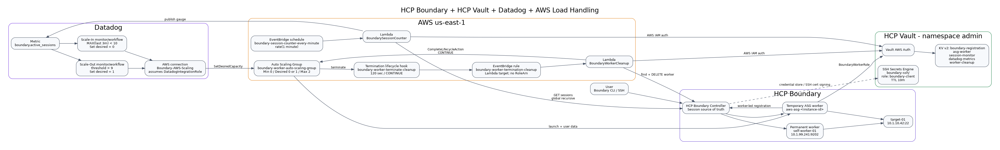
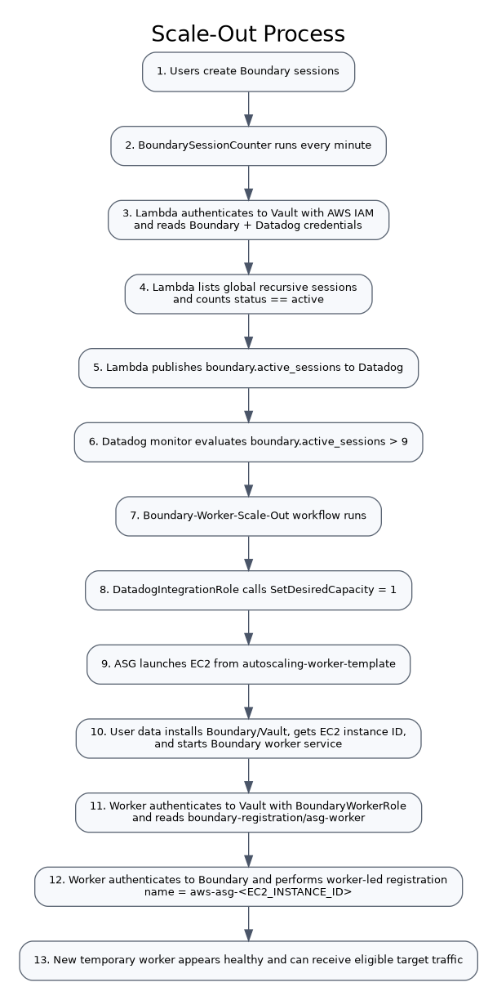
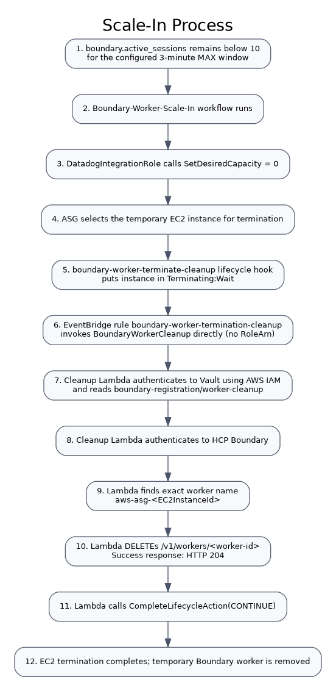

# HCP Boundary + HCP Vault + Datadog + AWS Load Handling

## Complete implementation guide

This repository contains one implementation only: the deployed session-based autoscaling design for self-managed HCP Boundary workers on AWS.

The design keeps one permanent worker online and uses an AWS Auto Scaling Group (ASG) to launch one temporary Boundary worker when active Boundary sessions reach the scaling threshold. HCP Vault protects the registration and automation credentials. Datadog receives the active-session gauge, evaluates scale-out and scale-in conditions, and changes ASG desired capacity. During scale-in, an Auto Scaling lifecycle hook pauses termination while `BoundaryWorkerCleanup` removes the temporary worker object from HCP Boundary.



---

# 1. Implementation outcome

The completed implementation provides:

- one permanent self-managed Boundary worker: `self-worker-01`
- one ASG-based temporary Boundary worker named `aws-asg-<EC2_INSTANCE_ID>`
- automatic session counting every minute
- custom Datadog gauge `boundary.active_sessions`
- Datadog scale-out when the session metric crosses the threshold (`> 9`)
- Datadog scale-in when the 3-minute MAX window remains below `10`
- ASG desired capacity `1` for scale-out and `0` for scale-in
- worker bootstrap with Vault AWS IAM authentication
- automatic worker-led registration into HCP Boundary
- automatic Boundary worker deletion during EC2 termination
- Vault SSH certificate signing for target access with a 10-minute certificate TTL

---

# 2. Environment values

| Component | Value |
|---|---|
| AWS account | `691914216603` |
| AWS region | `us-east-1` |
| HCP Boundary cluster ID | `458bfef0-c859-478d-957e-ebbc993caa7f` |
| Boundary address | `https://458bfef0-c859-478d-957e-ebbc993caa7f.boundary.hashicorp.cloud` |
| Boundary proxy | `458bfef0-c859-478d-957e-ebbc993caa7f.proxy.boundary.hashicorp.cloud:9202` |
| Boundary org | `load-testing` (`o_TvzIsIEHJU`) |
| Boundary project | `load-testing-project` (`p_ip9YfY89p5`) |
| Boundary target | `target-01` (`tssh_TKkCKYZerT`) |
| Target address | `10.1.10.42:22` |
| Password auth method | `ampw_fAa3Lwqkqy` |
| Permanent worker | `self-worker-01` |
| Permanent EC2 | `i-0968e4bb274b9dc6b` |
| Permanent worker IP | `10.1.99.241` |
| Permanent Boundary worker ID | `w_Y3A2thdNNq` |
| ASG | `boundary-worker-auto-scaling-group` |
| ASG Min / Desired / Max | `0 / 0 / 2` normally; workflows set Desired to `1` or `0` |
| Launch template | `autoscaling-worker-template` |
| Launch template ID | `lt-08f33004ee1394a99` |
| AMI | `ami-0b6d9d3d33ba97d99` |
| Instance type | `t2.small` |
| Security group | `sg-044c3429332bd60ae` |
| ASG EC2 IAM role | `BoundaryWorkerRole` |
| Session counter Lambda | `BoundarySessionCounter` |
| Session Lambda role | `BoundarySessionMonitorLambdaRole` |
| Session schedule rule | `boundary-session-counter-every-minute` |
| Datadog metric | `boundary.active_sessions` |
| Datadog AWS connection | `Boundary-AWS-Scaling` |
| Datadog AWS role | `DatadogIntegrationRole` |
| Scale-out workflow | `Boundary-Worker-Scale-Out` |
| Scale-in workflow | `Boundary-Worker-Scale-In` |
| Cleanup Lambda | `BoundaryWorkerCleanup` |
| Cleanup Lambda role | `BoundaryWorkerCleanup-role-ro7ij99a` |
| Lifecycle hook | `boundary-worker-terminate-cleanup` |
| Cleanup EventBridge rule | `boundary-worker-termination-cleanup` |
| Vault address | `https://vault-cluster-aws-private-vault-3c87b32f.7274f87b.z1.hashicorp.cloud:8200` |
| Vault namespace | `admin` |
| Vault SSH mount | `boundary-ssh/` |
| Vault SSH role | `boundary-client` |

---

# 3. Traffic and automation architecture

The permanent worker is the baseline capacity. The temporary worker is created by ASG only when required.

```text
User
  |
  v
HCP Boundary
  |
  +--> self-worker-01 (permanent)
  |
  +--> aws-asg-<instance-id> (temporary)
  |
  v
target-01 : 10.1.10.42:22
```

The scaling control path is independent from the SSH data path:

```text
EventBridge (every minute)
  -> BoundarySessionCounter
  -> Boundary API session list
  -> count status == active
  -> Datadog metric boundary.active_sessions
  -> Datadog monitor/workflow
  -> DatadogIntegrationRole
  -> AWS Auto Scaling SetDesiredCapacity
```

The termination cleanup path is:

```text
ASG termination
  -> lifecycle hook (Terminating:Wait)
  -> EventBridge
  -> BoundaryWorkerCleanup
  -> Vault AWS Auth
  -> Boundary login
  -> delete aws-asg-<instance-id> worker
  -> CompleteLifecycleAction(CONTINUE)
  -> EC2 terminates
```

---

# 4. Prerequisites and network requirements

Before configuring autoscaling, confirm these base services exist and are reachable:

1. HCP Boundary cluster is running.
2. HCP Vault cluster is running with the private endpoint reachable from AWS.
3. AWS VPC routing/DNS can resolve and reach the Vault private endpoint on TCP `8200`.
4. Boundary workers can reach HCP Boundary/proxy services and the target network.
5. The ASG worker can reach `target-01` on TCP `22`.
6. Session-counter Lambda can reach:
   - Vault private endpoint on `8200`
   - HCP Boundary HTTPS endpoint
   - Datadog HTTPS API
7. Cleanup Lambda can reach:
   - Vault private endpoint on `8200`
   - HCP Boundary HTTPS endpoint
   - AWS Auto Scaling API
8. If Lambda functions run inside private subnets, provide NAT or the required VPC endpoints for public AWS/SaaS APIs.

Validate Vault from an AWS host on the same network path:

```bash
export VAULT_ADDR="https://vault-cluster-aws-private-vault-3c87b32f.7274f87b.z1.hashicorp.cloud:8200"
export VAULT_NAMESPACE="admin"

curl -sS -o /dev/null -w '%{http_code}\n' "$VAULT_ADDR/v1/sys/health"
```

A Vault health status such as `200`, `429`, `472`, or `473` proves that TCP/TLS connectivity reaches Vault; interpret the exact code according to cluster state.

---

# 5. Configure HCP Vault SSH certificate signing

This section provides short-lived SSH certificates to Boundary sessions. The certificate TTL is 10 minutes.

## 5.1 Set Vault environment

```bash
export VAULT_ADDR="https://vault-cluster-aws-private-vault-3c87b32f.7274f87b.z1.hashicorp.cloud:8200"
export VAULT_NAMESPACE="admin"
```

Authenticate with an administrative Vault identity before configuring the engine.

## 5.2 Enable the SSH secrets engine

```bash
vault secrets enable -path=boundary-ssh ssh
```

Purpose: the `boundary-ssh/` mount becomes the dedicated signing service for Boundary SSH user certificates.

## 5.3 Generate the SSH CA

```bash
vault write boundary-ssh/config/ca generate_signing_key=true
```

Read the CA public key:

```bash
vault read -field=public_key boundary-ssh/config/ca
```

The private CA key remains protected by Vault. Only the public CA key is distributed to SSH targets.

## 5.4 Create the signing role

```bash
vault write boundary-ssh/roles/boundary-client \
  key_type=ca \
  allow_user_certificates=true \
  allowed_users=azureuser \
  default_user=azureuser \
  ttl=10m \
  max_ttl=10m \
  not_before_duration=30s
```

Verify:

```bash
vault read boundary-ssh/roles/boundary-client
```

The role constrains certificates to the `azureuser` principal and a maximum lifetime of 10 minutes.

## 5.5 Configure the target to trust the Vault CA

Save the CA public key on `target-01`, for example:

```bash
sudo install -d -m 755 /etc/ssh
sudo nano /etc/ssh/trusted-user-ca-keys.pem
```

Paste only the public CA key. Then configure OpenSSH:

```bash
sudo nano /etc/ssh/sshd_config
```

Add:

```text
TrustedUserCAKeys /etc/ssh/trusted-user-ca-keys.pem
```

Validate and restart SSH:

```bash
sudo sshd -t
sudo systemctl restart ssh
```

## 5.6 Create Vault policies for Boundary credential brokering

`vault/boundary-controller.hcl`:

```hcl
path "auth/token/lookup-self" {
  capabilities = ["read"]
}
path "auth/token/renew-self" {
  capabilities = ["update"]
}
path "auth/token/revoke-self" {
  capabilities = ["update"]
}
path "sys/leases/renew" {
  capabilities = ["update"]
}
path "sys/leases/revoke" {
  capabilities = ["update"]
}
path "sys/capabilities-self" {
  capabilities = ["update"]
}
```

`vault/boundary-ssh-policy.hcl`:

```hcl
path "boundary-ssh/sign/boundary-client" {
  capabilities = ["create", "update"]
}
```

Load them:

```bash
vault policy write boundary-controller vault/boundary-controller.hcl
vault policy write boundary-ssh-policy vault/boundary-ssh-policy.hcl
```

Create a renewable periodic orphan token for the Boundary Vault credential store:

```bash
vault token create \
  -no-default-policy=true \
  -policy="boundary-controller" \
  -policy="boundary-ssh-policy" \
  -orphan=true \
  -period=24h \
  -renewable=true
```

Store the returned token securely. Do not commit it.

## 5.7 Configure the Boundary Vault credential store

In HCP Boundary, open the `load-testing-project` project and create a Vault credential store using:

- Vault address: `https://vault-cluster-aws-private-vault-3c87b32f.7274f87b.z1.hashicorp.cloud:8200`
- Namespace: `admin`
- Token: the periodic token from the previous step
- Worker filter: use the worker tag used for Vault access, e.g. `"vault" in "/tags/cred-store"`

Create an SSH certificate credential library that signs through:

```text
boundary-ssh/sign/boundary-client
```

Attach that credential library to `target-01` as the application credential source.

Result: Boundary requests a new 10-minute SSH certificate from Vault for a session instead of storing a long-lived SSH private credential.

---

# 6. Verify the permanent Boundary worker

The baseline worker is:

```text
Name:       self-worker-01
EC2:        i-0968e4bb274b9dc6b
Private IP: 10.1.99.241
Worker ID:  w_Y3A2thdNNq
```

From an authenticated Boundary CLI:

```bash
boundary workers list \
  -scope-id=global \
  -format=json \
  -token env://BOUNDARY_TOKEN \
| jq -r '.items[] | [.id,.name,.last_status_time] | @tsv'
```

`self-worker-01` must remain healthy regardless of ASG desired capacity. It is outside the Auto Scaling Group.

---

# 7. Configure AWS IAM identities

Four IAM identities have distinct responsibilities. Keep them separate.

## 7.1 `BoundaryWorkerRole`

This is the EC2 instance profile identity used by temporary ASG workers.

Trust policy: `iam/BoundaryWorkerRole-trust.json`

```json
{
  "Version": "2012-10-17",
  "Statement": [
    {
      "Effect": "Allow",
      "Principal": {"Service": "ec2.amazonaws.com"},
      "Action": "sts:AssumeRole"
    }
  ]
}
```

No AWS secret-read permission is required for the current worker bootstrap. Vault authorizes the EC2 role through AWS IAM Auth.

Create or verify an instance profile that contains `BoundaryWorkerRole` and attach that instance profile in the launch template.

## 7.2 `BoundarySessionMonitorLambdaRole`

Trust principal:

```text
lambda.amazonaws.com
```

Attach:

```text
AWSLambdaBasicExecutionRole
AWSLambdaVPCAccessExecutionRole
```

This role does not need CloudWatch `PutMetricData`; the metric is sent directly to Datadog over HTTPS.

## 7.3 `BoundaryWorkerCleanup-role-ro7ij99a`

Trust principal:

```text
lambda.amazonaws.com
```

Attach normal Lambda logging/VPC permissions and the lifecycle permission in:

```text
iam/BoundaryWorkerCleanup-lifecycle-policy.json
```

It grants only:

```text
autoscaling:CompleteLifecycleAction
```

for `boundary-worker-auto-scaling-group`.

## 7.4 `DatadogIntegrationRole`

Datadog assumes this role using the Datadog-generated External ID.

Use `iam/DatadogIntegrationRole-trust-TEMPLATE.json` and replace only:

```text
<DATADOG_AWS_ACCOUNT_ID>
<DATADOG_EXTERNAL_ID>
```

Do not publish the real External ID.

Attach `iam/DatadogIntegrationRolePolicy.json`. It grants:

- `autoscaling:DescribeAutoScalingGroups` on `*`
- `autoscaling:SetDesiredCapacity` only on `boundary-worker-auto-scaling-group`

---

# 8. Configure Vault AWS IAM Auth for AWS workloads

## 8.1 Ensure AWS auth is enabled

```bash
vault auth list
```

If `aws/` is not present:

```bash
vault auth enable aws
```

## 8.2 Ensure KV v2 exists at `boundary-registration/`

```bash
vault secrets list
```

If it does not exist:

```bash
vault secrets enable -path=boundary-registration kv-v2
```

## 8.3 Load workload policies

```bash
vault policy write boundary-asg-worker vault/boundary-asg-worker.hcl
vault policy write boundary-session-monitor vault/boundary-session-monitor.hcl
vault policy write boundary-worker-cleanup vault/boundary-worker-cleanup.hcl
```

The policies are intentionally read-only to the specific KV records required by each workload.

## 8.4 Create Vault AWS Auth roles

Run:

```bash
cd vault
./configure-current-vault-roles.sh
```

Equivalent important mappings are:

```text
boundary-asg-worker
  -> arn:aws:iam::691914216603:role/BoundaryWorkerRole
  -> policy boundary-asg-worker

boundary-session-monitor-lambda
  -> arn:aws:iam::691914216603:role/BoundarySessionMonitorLambdaRole
  -> policy boundary-session-monitor

boundary-worker-cleanup
  -> arn:aws:iam::691914216603:role/BoundaryWorkerCleanup-role-ro7ij99a
  -> policy boundary-worker-cleanup
```

All three use:

```text
auth_type=iam
ttl=15m
max_ttl=30m
resolve_aws_unique_ids=false
```

## 8.5 Store the four KV records

Do not put real values in Git.

ASG registration credential:

```bash
vault kv put boundary-registration/asg-worker \
  login_name="<BOUNDARY_REGISTRATION_LOGIN>" \
  password="<BOUNDARY_REGISTRATION_PASSWORD>"
```

Session-monitor credential:

```bash
vault kv put boundary-registration/session-monitor \
  login_name="<BOUNDARY_MONITOR_LOGIN>" \
  password="<BOUNDARY_MONITOR_PASSWORD>"
```

Datadog API key:

```bash
vault kv put boundary-registration/datadog-metrics \
  api_key="<DATADOG_API_KEY>"
```

Cleanup credential:

```bash
vault kv put boundary-registration/worker-cleanup \
  login_name="<BOUNDARY_CLEANUP_LOGIN>" \
  password="<BOUNDARY_CLEANUP_PASSWORD>"
```

## 8.6 Boundary authorization requirements for these accounts

Use dedicated Boundary users and least privilege:

- Registration identity: must be allowed to create/register the temporary global worker used by worker-led registration.
- Session-monitor identity: must be able to list/read sessions recursively for the scopes being monitored. In this project the monitored scope is `global`, including the `load-testing` org and `load-testing-project` project.
- Cleanup identity: must be able to list/read global workers and delete the matching temporary worker.

Validate each identity functionally before proceeding. Do not give these automation users administrator rights when narrower roles are sufficient.

---

# 9. Configure the temporary worker launch template

Launch template:

```text
Name: autoscaling-worker-template
ID:   lt-08f33004ee1394a99
AMI:  ami-0b6d9d3d33ba97d99
Type: t2.small
IAM instance profile: BoundaryWorkerRole
Security group: sg-044c3429332bd60ae
```

Set the launch-template user data to the exact file:

```text
implementation/boundary_asg_userdata_vault_no_kms.sh
```

The user data performs these operations in order:

1. installs Boundary Enterprise, Vault CLI, AWS CLI, and `jq`
2. retrieves EC2 instance ID and private IP through IMDSv2
3. creates worker name `aws-asg-<EC2_INSTANCE_ID>`
4. writes `/etc/boundary.d/worker.hcl`
5. starts `boundary-worker.service`
6. waits for Boundary worker-led `auth_request_token`
7. authenticates to Vault with AWS IAM using `BoundaryWorkerRole`
8. reads `boundary-registration/asg-worker`
9. authenticates to HCP Boundary
10. runs `boundary workers create worker-led`
11. removes bootstrap secrets from the shell environment

The worker configuration uses:

```hcl
listener "tcp" {
  address = "0.0.0.0:9202"
  purpose = "proxy"
}

listener "tcp" {
  address     = "127.0.0.1:9203"
  purpose     = "ops"
  tls_disable = true
}
```

and tags:

```hcl
type       = ["egress"]
cloud      = ["aws"]
pool       = ["aws-autoscaling"]
target     = ["on-aws"]
cred-store = ["vault"]
```

After an instance boots, verify:

```bash
sudo systemctl status boundary-worker.service --no-pager
sudo journalctl -u boundary-worker.service -n 100 --no-pager
sudo tail -n 200 /var/log/boundary-user-data.log
```

---

# 10. Configure the Auto Scaling Group

ASG:

```text
boundary-worker-auto-scaling-group
```

Set:

```text
Minimum capacity: 0
Desired capacity: 0
Maximum capacity: 2
Launch template: autoscaling-worker-template
```

The Datadog workflows in this implementation use only desired capacities `0` and `1`; therefore the normal running state is either no temporary worker or one temporary worker.

Verify:

```bash
aws autoscaling describe-auto-scaling-groups \
  --region us-east-1 \
  --auto-scaling-group-names boundary-worker-auto-scaling-group \
  --query 'AutoScalingGroups[0].{Min:MinSize,Desired:DesiredCapacity,Max:MaxSize,Instances:Instances[*].[InstanceId,LifecycleState,HealthStatus]}' \
  --output json
```

---

# 11. Deploy `BoundarySessionCounter`

This Lambda converts Boundary session state into the Datadog gauge used for scaling.

## 11.1 Function settings

```text
Function: BoundarySessionCounter
Runtime:  Python 3.12
Role:     BoundarySessionMonitorLambdaRole
Source:   implementation/BoundarySessionCounter.py
```

Configure the Lambda in VPC subnets/security groups that can reach the Vault private endpoint and still reach HCP Boundary and Datadog HTTPS endpoints.

## 11.2 Environment variables

```text
VAULT_ADDR=https://vault-cluster-aws-private-vault-3c87b32f.7274f87b.z1.hashicorp.cloud:8200
VAULT_NAMESPACE=admin
VAULT_AWS_ROLE=boundary-session-monitor-lambda
BOUNDARY_ADDR=https://458bfef0-c859-478d-957e-ebbc993caa7f.boundary.hashicorp.cloud
BOUNDARY_AUTH_METHOD_ID=ampw_fAa3Lwqkqy
BOUNDARY_SCOPE_ID=global
DD_SITE=datadoghq.com
```

No Boundary password and no Datadog API key is stored in Lambda environment variables.

## 11.3 Lambda execution logic

The function:

1. signs AWS STS `GetCallerIdentity`
2. authenticates to Vault AWS Auth
3. reads `boundary-registration/session-monitor`
4. reads `boundary-registration/datadog-metrics`
5. authenticates to Boundary
6. calls the sessions API recursively from global scope
7. counts only sessions where `status == "active"`
8. posts a Datadog gauge named `boundary.active_sessions`
9. tags/resources the metric as service `hcp-boundary`

Expected logs:

```text
Vault AWS authentication successful
Boundary monitoring credentials retrieved from Vault
Datadog API key retrieved from Vault
Boundary authentication successful
Active Boundary sessions: <N>
Published Datadog metric: boundary.active_sessions=<N>
```

---

# 12. Configure the one-minute EventBridge schedule

Create the rule:

```bash
aws events put-rule \
  --name boundary-session-counter-every-minute \
  --schedule-expression 'rate(1 minute)' \
  --state ENABLED \
  --region us-east-1
```

Add Lambda permission:

```bash
events/add-session-counter-lambda-permission.sh
```

Set the Lambda as the target. Use the real function ARN returned by AWS:

```bash
SESSION_COUNTER_ARN=$(aws lambda get-function \
  --function-name BoundarySessionCounter \
  --region us-east-1 \
  --query 'Configuration.FunctionArn' \
  --output text)

aws events put-targets \
  --rule boundary-session-counter-every-minute \
  --region us-east-1 \
  --targets "Id=1,Arn=$SESSION_COUNTER_ARN"
```

Important: the EventBridge target does not require a target IAM role. Lambda invocation is authorized by the Lambda resource-based policy.

Verify:

```bash
aws events list-targets-by-rule \
  --rule boundary-session-counter-every-minute \
  --region us-east-1
```

---

# 13. Verify the Datadog metric

Open:

```text
Datadog -> Metrics -> Explorer
```

Search:

```text
boundary.active_sessions
```

Filter/resource:

```text
service:hcp-boundary
```

Before configuring scaling actions, confirm the metric follows the value returned by:

```bash
tests/count-active-sessions.sh
```

The Lambda is the authoritative collector for this autoscaling signal. Boundary audit-log streaming to Datadog can still be enabled for observability and history, but the scaling monitor uses `boundary.active_sessions`.

---

# 14. Configure Datadog AWS connection

Use the Datadog AWS connection:

```text
Boundary-AWS-Scaling
```

Configure it to assume:

```text
DatadogIntegrationRole
```

with the Datadog-generated External ID in the IAM role trust policy.

Verify that Datadog can describe the ASG and perform `SetDesiredCapacity` only on:

```text
boundary-worker-auto-scaling-group
```

---

# 15. Configure the scale-out monitor and workflow



## 15.1 Monitor condition

Use the `boundary.active_sessions` metric scoped to `service:hcp-boundary`.

Threshold semantics:

```text
boundary.active_sessions > 9
```

This means 10 or more active Boundary sessions enters the scale-out condition.

## 15.2 Scale-out workflow

Create/use:

```text
Workflow:   Boundary-Worker-Scale-Out
Connection: Boundary-AWS-Scaling
Action:     AWS Auto Scaling -> Set desired capacity
ASG:        boundary-worker-auto-scaling-group
Desired:    1
```

The workflow should run on the scale-out monitor alert transition.

## 15.3 What happens after the workflow

1. Datadog assumes `DatadogIntegrationRole`.
2. It calls `autoscaling:SetDesiredCapacity` with `1`.
3. ASG launches an EC2 instance from `autoscaling-worker-template`.
4. User data creates worker name `aws-asg-<instance-id>`.
5. EC2 authenticates to Vault using `BoundaryWorkerRole`.
6. The worker retrieves the registration credential.
7. The worker authenticates to Boundary.
8. Worker-led registration creates the temporary Boundary worker.
9. The worker appears in the global Boundary Workers page.

---

# 16. Configure scale-in lifecycle cleanup



## 16.1 Create the termination lifecycle hook

```bash
aws autoscaling put-lifecycle-hook \
  --lifecycle-hook-name boundary-worker-terminate-cleanup \
  --auto-scaling-group-name boundary-worker-auto-scaling-group \
  --lifecycle-transition autoscaling:EC2_INSTANCE_TERMINATING \
  --heartbeat-timeout 120 \
  --default-result CONTINUE \
  --region us-east-1
```

Purpose: the instance pauses in `Terminating:Wait` so the Boundary object can be deleted before EC2 disappears.

Verify:

```bash
aws autoscaling describe-lifecycle-hooks \
  --auto-scaling-group-name boundary-worker-auto-scaling-group \
  --region us-east-1
```

## 16.2 Create `BoundaryWorkerCleanup`

```text
Function: BoundaryWorkerCleanup
Runtime:  Python 3.12
Role:     BoundaryWorkerCleanup-role-ro7ij99a
Source:   implementation/BoundaryWorkerCleanup.py
```

Environment variables:

```text
VAULT_ADDR=https://vault-cluster-aws-private-vault-3c87b32f.7274f87b.z1.hashicorp.cloud:8200
VAULT_NAMESPACE=admin
VAULT_AWS_ROLE=boundary-worker-cleanup
BOUNDARY_ADDR=https://458bfef0-c859-478d-957e-ebbc993caa7f.boundary.hashicorp.cloud
BOUNDARY_AUTH_METHOD_ID=ampw_fAa3Lwqkqy
```

The Lambda role must have `autoscaling:CompleteLifecycleAction` from `iam/BoundaryWorkerCleanup-lifecycle-policy.json`.

## 16.3 Cleanup function logic

The cleanup function reads these fields from the Auto Scaling lifecycle event:

```text
EC2InstanceId
AutoScalingGroupName
LifecycleHookName
LifecycleActionToken
```

It then:

1. authenticates to Vault using the Lambda execution-role identity
2. reads `boundary-registration/worker-cleanup`
3. authenticates to Boundary
4. constructs expected worker name `aws-asg-<EC2InstanceId>`
5. lists global Boundary workers
6. finds the exact name match
7. sends `DELETE /v1/workers/<worker-id>`
8. treats HTTP `204` as successful deletion
9. calls `CompleteLifecycleAction(CONTINUE)`

If the worker is already absent (`404`), cleanup treats that as safe and continues.

The function also attempts `CONTINUE` from its exception handler so the EC2 instance does not remain stuck indefinitely in `Terminating:Wait`. Therefore always verify CloudWatch logs for a successful Boundary delete during acceptance testing.

---

# 17. Configure the cleanup EventBridge rule

Create the EventBridge rule using:

```text
events/boundary-worker-termination-pattern.json
```

Pattern:

```json
{
  "source": ["aws.autoscaling"],
  "detail-type": ["EC2 Instance-terminate Lifecycle Action"],
  "detail": {
    "AutoScalingGroupName": ["boundary-worker-auto-scaling-group"]
  }
}
```

Create the rule:

```bash
aws events put-rule \
  --name boundary-worker-termination-cleanup \
  --event-pattern file://events/boundary-worker-termination-pattern.json \
  --state ENABLED \
  --region us-east-1
```

Add Lambda resource-based permission:

```bash
events/add-cleanup-lambda-permission.sh
```

Set the Lambda target with no `RoleArn`:

```bash
CLEANUP_ARN=$(aws lambda get-function \
  --function-name BoundaryWorkerCleanup \
  --region us-east-1 \
  --query 'Configuration.FunctionArn' \
  --output text)

aws events put-targets \
  --rule boundary-worker-termination-cleanup \
  --region us-east-1 \
  --targets "Id=1,Arn=$CLEANUP_ARN"
```

Verify:

```bash
aws events list-targets-by-rule \
  --rule boundary-worker-termination-cleanup \
  --region us-east-1
```

Required shape:

```json
{
  "Id": "1",
  "Arn": "arn:aws:lambda:us-east-1:691914216603:function:BoundaryWorkerCleanup"
}
```

There must be no `RoleArn` field.

---

# 18. Configure the Datadog scale-in monitor and workflow

## 18.1 Scale-in condition

Evaluate a 3-minute MAX window and scale in only when that window stays below 10.

Semantics:

```text
MAX(boundary.active_sessions over last 3 minutes) < 10
```

Why MAX: if the metric reaches `10` at any point during the three-minute window, the scale-in condition is not satisfied for the complete window.

## 18.2 Scale-in workflow

```text
Workflow:   Boundary-Worker-Scale-In
Connection: Boundary-AWS-Scaling
Action:     AWS Auto Scaling -> Set desired capacity
ASG:        boundary-worker-auto-scaling-group
Desired:    0
```

Once desired capacity becomes zero, the lifecycle-hook/EventBridge/Lambda cleanup path handles worker removal.

---

# 19. End-to-end scale-out test

## 19.1 Authenticate to Boundary

Export your Boundary token securely:

```bash
export BOUNDARY_TOKEN='<TOKEN>'
```

Do not place it in Git history.

## 19.2 Confirm starting state

```bash
tests/count-active-sessions.sh
tests/list-workers.sh
tests/check-asg.sh
```

Expected ASG desired capacity before the load test:

```text
0
```

## 19.3 Start ten sessions

```bash
tests/start-10-sessions.sh
```

The script starts ten SSH connections to:

```text
tssh_TKkCKYZerT
```

using `ssh -N` so the connections stay open without interactive shells.

## 19.4 Confirm the count

```bash
tests/count-active-sessions.sh
```

Expected:

```text
10
```

## 19.5 Validate the monitoring path

Check `BoundarySessionCounter` CloudWatch logs for:

```text
Active Boundary sessions: 10
Published Datadog metric: boundary.active_sessions=10
```

Then confirm Datadog Metrics Explorer shows approximately `10` for `boundary.active_sessions`.

## 19.6 Validate scale-out

Check ASG:

```bash
tests/check-asg.sh
```

Desired capacity should become:

```text
1
```

Wait for the EC2 instance to reach `InService`.

Check Boundary:

```bash
tests/list-workers.sh
```

Expected temporary worker name:

```text
aws-asg-i-xxxxxxxxxxxxxxxxx
```

---

# 20. End-to-end scale-in test

## 20.1 Stop the load sessions

```bash
tests/stop-test-sessions.sh
```

## 20.2 Confirm the Boundary session count falls below 10

```bash
tests/count-active-sessions.sh
```

## 20.3 Wait for the 3-minute scale-in condition

Datadog must observe the MAX window below 10 before the scale-in workflow runs.

## 20.4 Confirm desired capacity changes to zero

```bash
tests/check-asg.sh
```

## 20.5 Observe termination lifecycle

The temporary instance enters:

```text
Terminating:Wait
```

Then `boundary-worker-termination-cleanup` invokes `BoundaryWorkerCleanup`.

## 20.6 Check cleanup logs

CloudWatch log group:

```text
/aws/lambda/BoundaryWorkerCleanup
```

Expected sequence:

```text
Authenticating to Vault using AWS IAM...
Vault AWS authentication successful
Reading Boundary cleanup credentials from Vault...
Boundary cleanup credentials retrieved
Authenticating to HCP Boundary...
Boundary authentication successful
Looking for Boundary worker: aws-asg-i-...
Matching Boundary worker found: aws-asg-i-...
Deleting Boundary worker: w_...
Boundary worker deleted. HTTP status: 204
Completing Auto Scaling lifecycle action...
Lifecycle action completed with CONTINUE
```

## 20.7 Confirm final state

```bash
tests/list-workers.sh
tests/check-asg.sh
```

Expected:

- no temporary `aws-asg-*` worker from the terminated instance
- permanent `self-worker-01` still healthy
- ASG desired capacity `0`

---

# 21. Operational validation commands

Count active sessions:

```bash
tests/count-active-sessions.sh
```

List workers:

```bash
tests/list-workers.sh
```

Check ASG:

```bash
tests/check-asg.sh
```

Verify cleanup EventBridge target:

```bash
tests/check-cleanup-event-target.sh
```

Inspect ASG worker bootstrap:

```bash
sudo tail -f /var/log/boundary-user-data.log
```

Inspect Boundary worker service:

```bash
sudo journalctl -u boundary-worker.service -f
```

Check worker service status:

```bash
sudo systemctl status boundary-worker.service --no-pager
```

---

# 22. Troubleshooting by failure point

## Session metric does not change

Check `BoundarySessionCounter` logs first.

Expected stages:

```text
Vault AWS auth
-> Vault secrets read
-> Boundary login
-> session API
-> Datadog metric POST
```

If Vault authentication fails, verify the Vault AWS Auth role principal matches:

```text
arn:aws:iam::691914216603:role/BoundarySessionMonitorLambdaRole
```

If Boundary login fails, verify `boundary-registration/session-monitor` and the Boundary auth method ID.

If Datadog publishing fails, verify the API key in `boundary-registration/datadog-metrics`, `DD_SITE`, and outbound HTTPS connectivity.

## ASG does not scale out

Confirm:

1. Datadog metric is >= 10.
2. Scale-out monitor enters alert.
3. Workflow `Boundary-Worker-Scale-Out` executes.
4. AWS connection is `Boundary-AWS-Scaling`.
5. `DatadogIntegrationRole` trust has the correct Datadog account and External ID.
6. `DatadogIntegrationRolePolicy` can set desired capacity on the exact ASG ARN.

## EC2 launches but Boundary worker does not appear

On the new instance:

```bash
sudo tail -n 300 /var/log/boundary-user-data.log
sudo journalctl -u boundary-worker.service -n 200 --no-pager
aws sts get-caller-identity
```

Then verify Vault role:

```bash
vault read auth/aws/role/boundary-asg-worker
```

The bound IAM principal must be:

```text
arn:aws:iam::691914216603:role/BoundaryWorkerRole
```

## EC2 terminates but Boundary worker remains

Inspect `/aws/lambda/BoundaryWorkerCleanup` and determine the exact last successful step.

Also verify the EventBridge target:

```bash
tests/check-cleanup-event-target.sh
```

The target must have the Lambda ARN and no `RoleArn`.

Confirm the Lambda function policy:

```bash
aws lambda get-policy \
  --function-name BoundaryWorkerCleanup \
  --region us-east-1
```

Confirm Vault cleanup role:

```bash
vault read auth/aws/role/boundary-worker-cleanup
```

The bound principal must be:

```text
arn:aws:iam::691914216603:role/BoundaryWorkerCleanup-role-ro7ij99a
```

If DELETE returns `403`, verify the Boundary cleanup user can list/read/delete workers globally.

---

# 23. Security requirements

Never commit or log:

- Boundary tokens
- Boundary passwords
- Vault tokens
- Datadog API/App keys
- Datadog External ID
- AWS access keys
- Boundary worker auth request tokens

Use Vault for all automation credentials. Keep the GitHub repository private because the implementation contains infrastructure identifiers, IP addressing, ARNs, and architecture details.

The least-privilege separation is:

```text
BoundaryWorkerRole
  -> EC2 identity for Vault worker-registration secret

BoundarySessionMonitorLambdaRole
  -> Lambda identity for Vault session-monitor + Datadog key

BoundaryWorkerCleanup-role-ro7ij99a
  -> Lambda identity for Vault cleanup secret
  -> CompleteLifecycleAction on the Boundary ASG

DatadogIntegrationRole
  -> Describe ASGs
  -> SetDesiredCapacity only for the Boundary ASG
```

---

# 24. Acceptance checklist

The implementation is complete when all items below pass:

- [ ] `self-worker-01` is healthy.
- [ ] Vault private endpoint is reachable from workers and Lambdas.
- [ ] Vault SSH CA signs 10-minute user certificates.
- [ ] `boundary-registration` secrets exist and are readable only by their intended Vault AWS roles.
- [ ] `BoundarySessionCounter` runs every minute.
- [ ] `boundary.active_sessions` appears in Datadog.
- [ ] At 10 active sessions, the scale-out monitor triggers.
- [ ] Datadog sets ASG desired capacity to 1.
- [ ] New worker registers as `aws-asg-<EC2_INSTANCE_ID>`.
- [ ] When the 3-minute MAX window remains below 10, scale-in triggers.
- [ ] Datadog sets ASG desired capacity to 0.
- [ ] Lifecycle hook places the EC2 instance in `Terminating:Wait`.
- [ ] EventBridge invokes `BoundaryWorkerCleanup` without a target `RoleArn`.
- [ ] Cleanup Lambda finds the exact temporary worker.
- [ ] Boundary DELETE returns HTTP 204.
- [ ] Lifecycle action completes with `CONTINUE`.
- [ ] EC2 termination completes.
- [ ] Permanent worker remains available.

---

# 25. Repository layout

```text
boundary-vault-datadog-current-implementation/
├── README.md
├── GITHUB_PUSH.md
├── .gitignore
├── .env.example
├── implementation/
│   ├── BoundarySessionCounter.py
│   ├── BoundaryWorkerCleanup.py
│   └── boundary_asg_userdata_vault_no_kms.sh
├── iam/
│   ├── BoundaryWorkerRole-trust.json
│   ├── LambdaExecutionRole-trust.json
│   ├── DatadogIntegrationRole-trust-TEMPLATE.json
│   ├── DatadogIntegrationRolePolicy.json
│   └── BoundaryWorkerCleanup-lifecycle-policy.json
├── vault/
│   ├── boundary-asg-worker.hcl
│   ├── boundary-session-monitor.hcl
│   ├── boundary-worker-cleanup.hcl
│   ├── boundary-controller.hcl
│   ├── boundary-ssh-policy.hcl
│   └── configure-current-vault-roles.sh
├── events/
│   ├── boundary-worker-termination-pattern.json
│   ├── add-session-counter-lambda-permission.sh
│   ├── add-cleanup-lambda-permission.sh
│   └── reset-cleanup-target-no-role.sh
├── tests/
│   ├── start-10-sessions.sh
│   ├── stop-test-sessions.sh
│   ├── count-active-sessions.sh
│   ├── list-workers.sh
│   ├── check-asg.sh
│   └── check-cleanup-event-target.sh
├── diagrams/
│   ├── overall.png
│   ├── scale-out.png
│   └── scale-in.png
└── docs/
    └── Boundary_Vault_Datadog_Current_Implementation.docx
```

The implementation files in this repository are intended to be used together as one deployment design.
