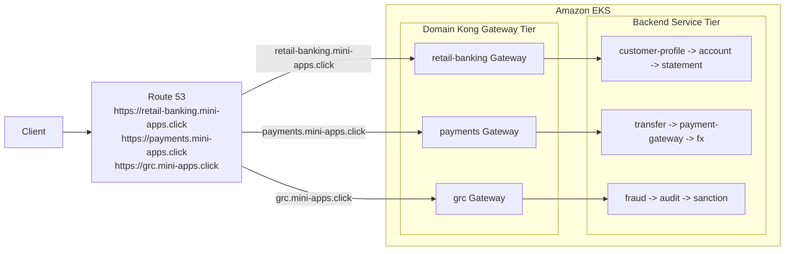
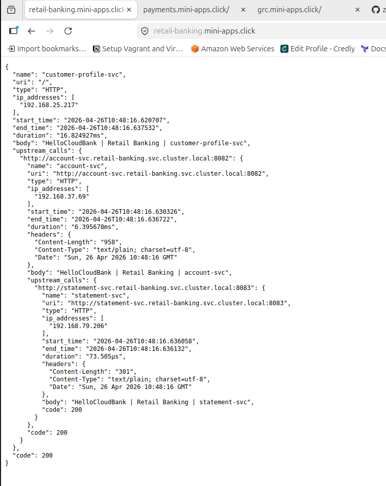
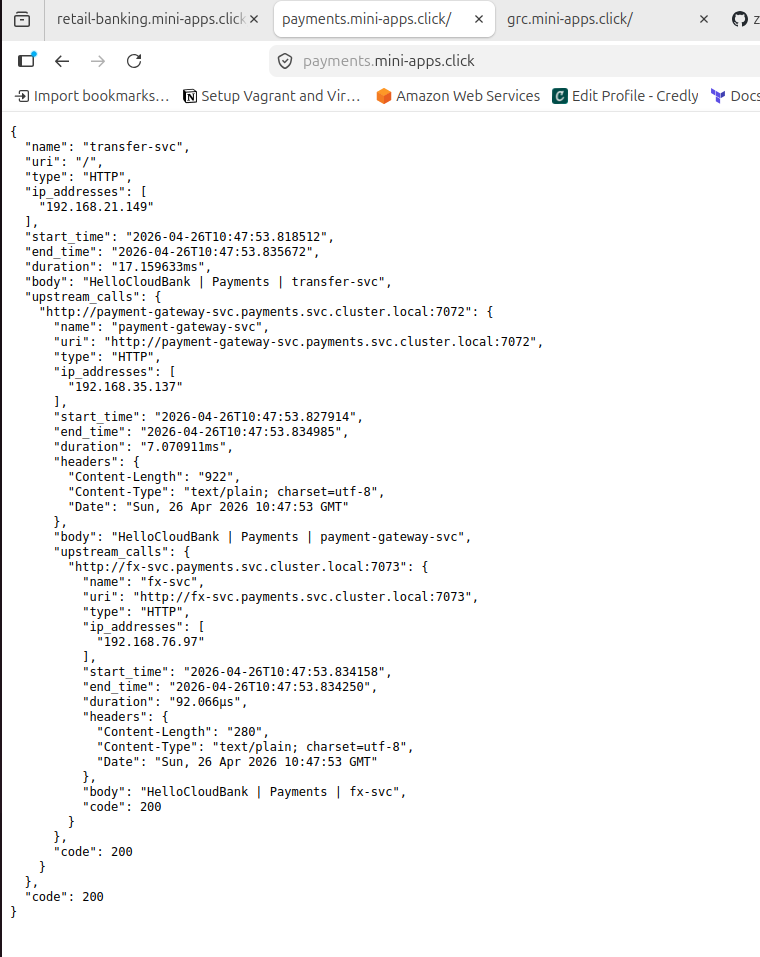
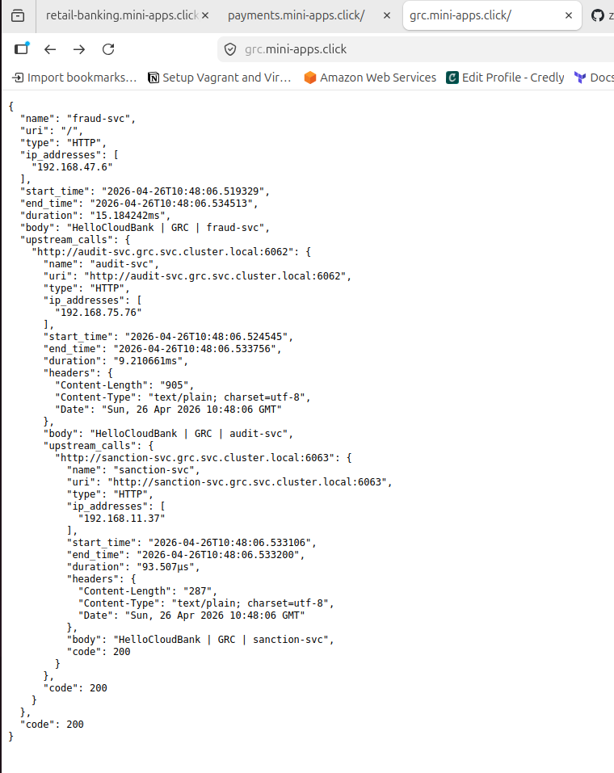

# Kong Distributed API Gateway on EKS with HTTPS and ReferenceGrant

Production-style distributed API gateway reference project for Amazon EKS using Kong Ingress Controller, Kubernetes Gateway API, Route 53, and optional HTTPS automation with Terraform.

The project models a banking platform with three business domains:

- Retail Banking
- Payments
- GRC, Governance Risk and Compliance

Each domain owns its own Kong Gateway, route, namespace, and backend service chain. The repo also includes an optional global gateway layer that can sit in front of the domain gateways for centralized path-based routing.

## What This Project Builds

```text
Route 53
  -> Domain Kong Gateways
  -> Gateway API HTTPRoutes
  -> Backend fake-service chains
```

Current public domain routes:

| Domain | Public URL | Entry service | Service chain |
| --- | --- | --- | --- |
| Retail Banking | `https://retail-banking.mini-apps.click/` | `customer-profile-svc` | `customer-profile-svc -> account-svc -> statement-svc` |
| Payments | `https://payments.mini-apps.click/` | `transfer-svc` | `transfer-svc -> payment-gateway-svc -> fx-svc` |
| GRC | `https://grc.mini-apps.click/` | `fraud-svc` | `fraud-svc -> audit-svc -> sanction-svc` |

## Architecture

Detailed editable Mermaid diagrams are available here:

[docs/architecture.md](docs/architecture.md)

High-level direct domain flow:



Optional centralized global gateway flow:

```text
Client
  -> Global Kong Gateway
  -> global HTTPRoute
  -> downstream KIC gateway proxy Service
  -> domain Kong Gateway
  -> domain HTTPRoute
  -> backend services
```

## Repository Layout

```text
.
├── apps/
│   ├── retail-banking/        # Retail gateway, route, and services
│   ├── payments/              # Payments gateway, route, and services
│   └── grc/                   # GRC gateway, route, and services
├── kong/                      # Optional global gateway tier
├── for_https/                 # Terraform for certificates and HTTPS listeners
├── docs/
│   └── architecture.md        # Detailed diagrams and flows
├── setup.coffee               # Step-by-step deployment runbook
└── README.md
```

## Main Components

### Domain Kong Gateways

Each domain has:

- A dedicated GatewayClass.
- A dedicated Gateway.
- A dedicated Kong Ingress Controller release.
- An HTTPRoute that maps the public hostname to the domain entry service.

| Domain | KIC namespace | Gateway | HTTPRoute |
| --- | --- | --- | --- |
| Retail Banking | `retail-banking-kic` | `retail-banking-kong-api-gateway` | `customer-profile-httproute` |
| Payments | `payments-kic` | `payments-kong-api-gateway` | `transfer-httproute` |
| GRC | `grc-kic` | `grc-kong-api-gateway` | `fraud-httproute` |

### Backend Services

The demo workloads use `nicholasjackson/fake-service` so you can see the request chain in the response body.

### Optional Global Gateway

The `kong/` folder contains the optional first tier:

- `GatewayClass`
- `Gateway`
- `HTTPRoute`
- `ReferenceGrant`

This layer can route traffic by path prefix to downstream domain gateway proxy Services.

## Prerequisites

- AWS CLI with profile `demo-microservices`
- `eksctl`
- `kubectl`
- `helm`
- Gateway API CRDs
- Kong Helm chart repository
- Route 53 public hosted zone for `mini-apps.click`
- Terraform, only for HTTPS setup

## Deployment

Use [setup.coffee](setup.coffee) as the ordered deployment runbook.

Summary:

1. Create or connect to the EKS cluster.
2. Install Gateway API CRDs.
3. Install one Kong Ingress Controller release per domain.
4. Apply domain GatewayClass and Gateway manifests.
5. Deploy backend services.
6. Apply domain HTTPRoutes.
7. Create Route 53 alias records for the Kong LoadBalancers.
8. Enable HTTPS with Terraform.
9. Test HTTPS access.

## Test HTTPS

```bash
curl -i https://retail-banking.mini-apps.click/
curl -i https://payments.mini-apps.click/
curl -i https://grc.mini-apps.click/
```

If HTTPS is not enabled yet, test HTTP through the LoadBalancer with a Host header:

```bash
curl -i -H "Host: retail-banking.mini-apps.click" http://<retail-banking-kong-elb>/
curl -i -H "Host: payments.mini-apps.click" http://<payments-kong-elb>/
curl -i -H "Host: grc.mini-apps.click" http://<grc-kong-elb>/
```

Expected result: `HTTP/1.1 200 OK` with a fake-service response showing the upstream service chain.

## Verified Test Results

Browser testing confirmed that all three public domain routes resolve through Kong and return successful fake-service responses.

| Domain URL | Entry service returned | Verified upstream chain | Result |
| --- | --- | --- | --- |
| `https://retail-banking.mini-apps.click/` | `customer-profile-svc` | `customer-profile-svc -> account-svc -> statement-svc` | `code: 200` |
| `https://payments.mini-apps.click/` | `transfer-svc` | `transfer-svc -> payment-gateway-svc -> fx-svc` | `code: 200` |
| `https://grc.mini-apps.click/` | `fraud-svc` | `fraud-svc -> audit-svc -> sanction-svc` | `code: 200` |

Sample response indicators:

```text
HelloCloudBank | Retail Banking | customer-profile-svc
HelloCloudBank | Retail Banking | account-svc
HelloCloudBank | Retail Banking | statement-svc

HelloCloudBank | Payments | transfer-svc
HelloCloudBank | Payments | payment-gateway-svc
HelloCloudBank | Payments | fx-svc

HelloCloudBank | GRC | fraud-svc
HelloCloudBank | GRC | audit-svc
HelloCloudBank | GRC | sanction-svc
```

### Browser Test Screenshots

Retail banking test:



Payments test:



GRC test:



## Enable HTTPS

The `for_https/` Terraform creates:

- Let's Encrypt certificates using Route 53 DNS validation.
- Kubernetes TLS Secrets in each `*-kic` namespace.
- HTTPS listeners on port `443` for each Gateway.

Run:

```bash
cd for_https
cp terraform.tfvars.example terraform.tfvars
terraform init
terraform plan
terraform apply
```

Then test:

```bash
curl -i https://retail-banking.mini-apps.click/
curl -i https://payments.mini-apps.click/
curl -i https://grc.mini-apps.click/
```

Do not commit `terraform.tfvars` or Terraform state files.

## Useful Commands

Check Gateway API status:

```bash
kubectl get gatewayclass
kubectl get gateway -A
kubectl get httproute -A
kubectl get referencegrant -A
```

Check Kong proxy Services:

```bash
kubectl get svc -A | grep gateway-proxy
```

Check backend apps:

```bash
kubectl get pods,svc -n retail-banking
kubectl get pods,svc -n payments
kubectl get pods,svc -n grc
```

Inspect route attachment:

```bash
kubectl describe httproute -n retail-banking customer-profile-httproute
kubectl describe httproute -n payments transfer-httproute
kubectl describe httproute -n grc fraud-httproute
```

Healthy routes should show:

```text
Accepted=True
ResolvedRefs=True
Programmed=True
```

## Notes

- Public DNS uses Route 53 records under `mini-apps.click`.
- Local DNS may cache old failures. Use `nslookup <host> 1.1.1.1` or test with a Host header if needed.
- The HTTPS Terraform state contains certificate private keys. Keep state private.
- Do not commit AWS credentials, kubeconfig files, private keys, `terraform.tfvars`, or `.terraform/`.
