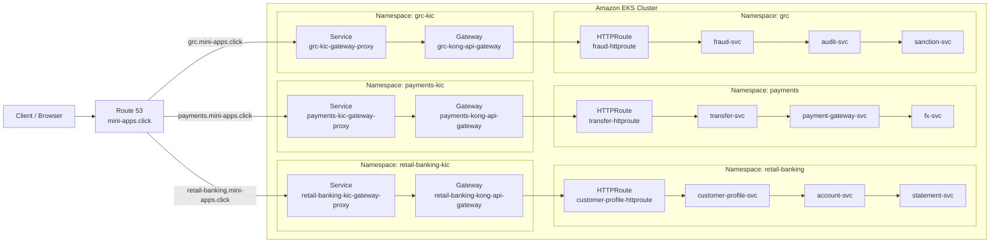
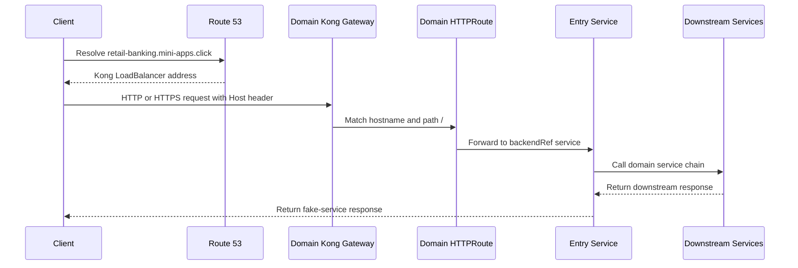
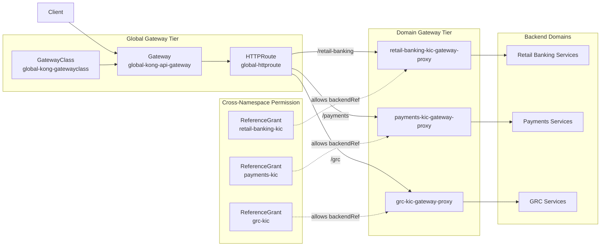
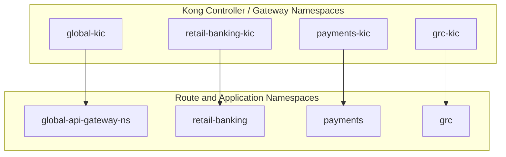
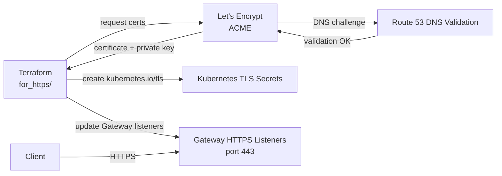
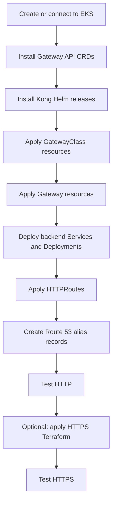
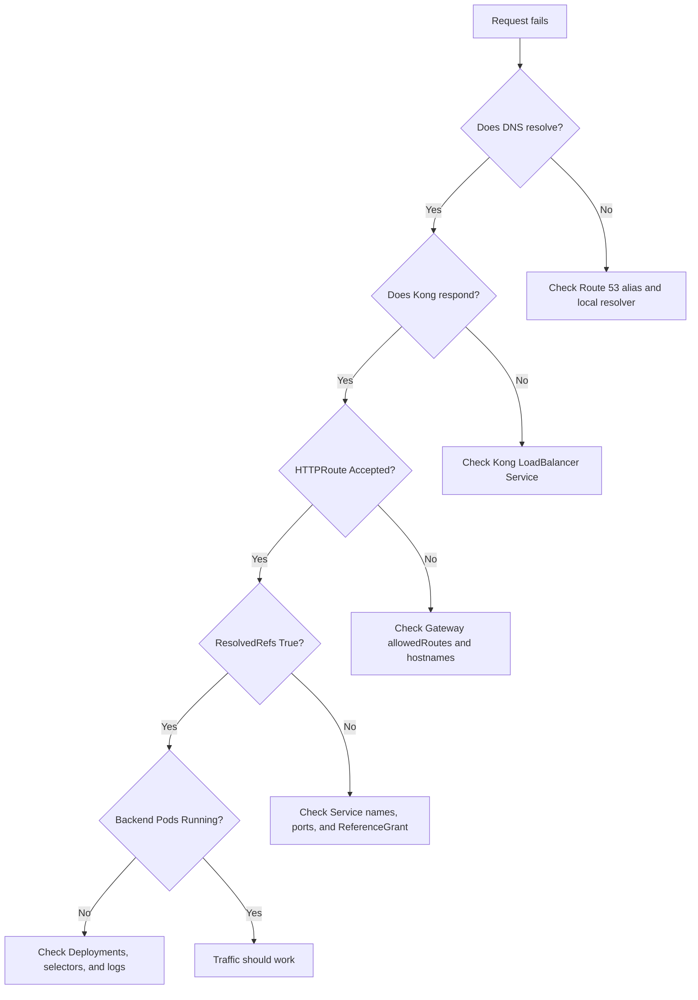

# Kong Distributed API Gateway Architecture

This document explains the project visually with Mermaid diagrams. GitHub renders these diagrams automatically in Markdown.

## 1. High-Level Architecture



## 2. Direct Domain Gateway Flow

This is the active public access pattern for the three `mini-apps.click` records.



Domain mappings:

| Hostname | Kong Gateway | HTTPRoute | Backend chain |
| --- | --- | --- | --- |
| `retail-banking.mini-apps.click` | `retail-banking-kong-api-gateway` | `customer-profile-httproute` | `customer-profile-svc -> account-svc -> statement-svc` |
| `payments.mini-apps.click` | `payments-kong-api-gateway` | `transfer-httproute` | `transfer-svc -> payment-gateway-svc -> fx-svc` |
| `grc.mini-apps.click` | `grc-kong-api-gateway` | `fraud-httproute` | `fraud-svc -> audit-svc -> sanction-svc` |

## 3. Optional Centralized Global Gateway Flow

The global gateway tier can sit in front of the domain gateways and route by path prefix.



Important idea: `ReferenceGrant` is created in the target namespace. It allows an `HTTPRoute` from `global-api-gateway-ns` to reference Services in the downstream KIC namespaces.

## 4. Namespace and Ownership Model



Each domain has its own controller name:

| Domain | Controller name |
| --- | --- |
| Retail Banking | `konghq.com/retail-banking-kong-gateway-controller` |
| Payments | `konghq.com/payments-kong-gateway-controller` |
| GRC | `konghq.com/grc-kong-gateway-controller` |
| Global | `konghq.com/global-kong-gateway-controller` |

## 5. HTTPS Automation Flow



Terraform creates one TLS Secret per domain gateway namespace:

| Domain | Secret namespace | HTTPS hostname |
| --- | --- | --- |
| Retail Banking | `retail-banking-kic` | `https://retail-banking.mini-apps.click/` |
| Payments | `payments-kic` | `https://payments.mini-apps.click/` |
| GRC | `grc-kic` | `https://grc.mini-apps.click/` |

## 6. Deployment Order



## 7. Troubleshooting Flow



Useful commands:

```bash
kubectl get gateway -A
kubectl get httproute -A
kubectl get referencegrant -A
kubectl get svc -A | grep gateway-proxy
kubectl get pods,svc -n retail-banking
kubectl get pods,svc -n payments
kubectl get pods,svc -n grc
```
