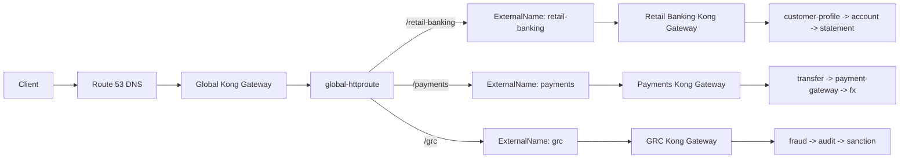
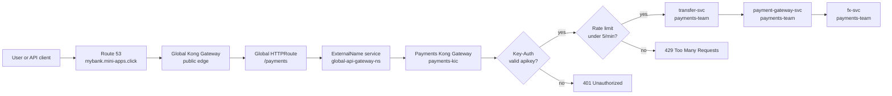

# Kong Global Gateway With ExternalName

Reference project for a distributed API gateway pattern on Amazon EKS.

This project shows how one public banking gateway can route traffic to multiple domain-owned Kong gateways while keeping east-west traffic inside the Kubernetes cluster. It uses Kong Ingress Controller, Kubernetes Gateway API, `ExternalName` services, Route 53 DNS, optional Terraform-managed HTTPS, and optional Istio mTLS for in-cluster encryption.

## Architecture Summary

This project implements a production-style API gateway topology for a banking platform with three independent business domains: Retail Banking, Payments, and GRC.

The key idea is a two-tier gateway model:

- The Global Kong Gateway owns the customer-facing hostname: `mybank.mini-apps.click`.
- Each domain owns its own Kong Gateway, namespace, Gateway API resources, and backend services.
- The global gateway routes `/retail-banking`, `/payments`, and `/grc` to the correct domain gateway.
- Instead of sending traffic out to public load balancers and back in again, the global route uses Kubernetes `ExternalName` services that point directly to the internal Kong proxy services.
- Istio can then secure the internal hops with mutual TLS while Kong remains the public API entry point.

This demonstrates API gateway federation, domain isolation, Gateway API routing, internal service discovery, TLS termination, and service mesh security in one small but realistic EKS project.

## Problem This Solves

In larger organizations, one central API team often needs a single public entry point, while domain teams still need ownership of their routes and release cycles.

This project models that setup:

- Platform team owns the global gateway and public DNS.
- Domain teams own their own gateways, routes, namespaces, and services.
- Traffic between gateways stays private inside the cluster.
- Security teams can enforce in-cluster mTLS without exposing Istio directly at the public edge.
- Each manifest shows clear ownership boundaries between the platform layer and domain teams.

## Architecture

```text
Client
  -> Route 53: mybank.mini-apps.click
  -> Global Kong Gateway
  -> Global HTTPRoute
  -> ExternalName service in global-api-gateway-ns
  -> Domain Kong proxy Service inside the cluster
  -> Domain Kong Gateway
  -> Domain HTTPRoute
  -> Backend service chain
```




## User Traffic and Plugin Workflow

Payments has two Kong plugins attached to its domain `HTTPRoute`:

```text
rate-limit-payments
key-auth-payments
```

The plugins run at the Payments Kong Gateway before the request reaches
`transfer-svc`.



Request behavior:

| Request | Result | Why |
| --- | --- | --- |
| No API key | `401 Unauthorized` | Kong Key-Auth blocks the request. |
| Wrong API key | `401 Unauthorized` | Kong cannot match the key to a valid consumer. |
| Correct API key | `200 OK` | Kong accepts the key and forwards the request. |
| More than 5 valid requests per minute | `429 Too Many Requests` | Kong rate limiting blocks excess traffic. |

The valid demo header is:

```text
apikey: payments-demo-key
```

## Public Routes

| Business domain | Global URL | Domain hostname | Entry service |
| --- | --- | --- | --- |
| Retail Banking | `https://mybank.mini-apps.click/retail-banking` | `retail-banking.mini-apps.click` | `customer-profile-svc` |
| Payments | `https://mybank.mini-apps.click/payments` | `payments.mini-apps.click` | `transfer-svc` |
| GRC | `https://mybank.mini-apps.click/grc` | `grc.mini-apps.click` | `fraud-svc` |

## Service Chains

The backend workloads use `nicholasjackson/fake-service` so every response shows the full upstream call chain.

| Domain | Chain |
| --- | --- |
| Retail Banking | `customer-profile-svc -> account-svc -> statement-svc` |
| Payments | `transfer-svc -> payment-gateway-svc -> fx-svc` |
| GRC | `fraud-svc -> audit-svc -> sanction-svc` |

Expected response indicators:

```text
HelloCloudBank | Retail Banking | customer-profile-svc
HelloCloudBank | Retail Banking | account-svc
HelloCloudBank | Retail Banking | statement-svc

HelloCloudBank | Payments | transfer-svc
HelloCloudBank | Payments | payment-gateway-svc
HelloCloudBank | Payments | fx-svc

HelloCloudBank | GRC | fraud-svc
HelloCloudBank | GRC | audit-svc
HelloCloudBank | GRC | sanction-svc
```

## Key Design Decisions

### 1. Gateway API Instead of Ingress

The project uses Kubernetes Gateway API resources:

- `GatewayClass` defines which Kong controller owns a gateway.
- `Gateway` defines listeners and namespace route permissions.
- `HTTPRoute` defines hostname, path matching, rewrites, and backend targets.

This is more expressive than a traditional Kubernetes `Ingress` and fits a multi-team platform model.

### 2. One Kong Controller Per Gateway Tier

Each gateway has its own Kong Ingress Controller instance and controller name:

| Tier | Namespace | GatewayClass |
| --- | --- | --- |
| Global | `global-kic` | `global-kong-gatewayclass` |
| Retail Banking | `retail-banking-kic` | `retail-banking-kong-gatewayclass` |
| Payments | `payments-kic` | `payments-kong-gatewayclass` |
| GRC | `grc-kic` | `grc-kong-gatewayclass` |

This prevents one controller from reconciling another team's routes.

### 3. ExternalName Services for Private Gateway-to-Gateway Routing

The global `HTTPRoute` references services in `global-api-gateway-ns`.

Those services are `ExternalName` aliases to downstream Kong proxy services:

| ExternalName service | Internal target |
| --- | --- |
| `retail-banking-kic-gateway-proxy` | `retail-banking-kic-gateway-proxy.retail-banking-kic.svc.cluster.local` |
| `payments-kic-gateway-proxy` | `payments-kic-gateway-proxy.payments-kic.svc.cluster.local` |
| `grc-kic-gateway-proxy` | `grc-kic-gateway-proxy.grc-kic.svc.cluster.local` |

This keeps global-to-domain traffic inside Kubernetes DNS and avoids hairpinning through public cloud load balancers.

### 4. Hostname and Path Rewrites

The global route receives paths such as:

```text
/retail-banking
/payments
/grc
```

Before forwarding to a downstream gateway, it:

- Strips the global path prefix with `URLRewrite`.
- Rewrites the hostname to the downstream domain hostname.

Example:

```text
GET https://mybank.mini-apps.click/payments
  -> Host becomes payments.mini-apps.click
  -> Path becomes /
  -> Payments domain HTTPRoute matches successfully
```

### 5. Istio mTLS for Internal Hops

The `istio/` directory adds sidecar injection and mTLS policies for internal namespaces.

Security model:

- Public client to Global Kong: normal HTTP or HTTPS.
- Global Kong to domain Kong: Istio mTLS.
- Domain Kong to backend service: Istio mTLS.
- Backend service to backend service: Istio mTLS.
- `global-kic` remains inbound PERMISSIVE so public clients do not need Istio certificates.
- Domain and application namespaces can be switched to STRICT mTLS after sidecars are confirmed.

See [istio/README.md](istio/README.md) for the rollout sequence.

## Repository Layout

```text
.
+-- 0-gatewayclass-global.yaml
+-- 1-kong-api-gateway-global.yaml
+-- 2-global-httproute.yaml
+-- 3-downstream-proxy-services.yaml
+-- apps/
|   +-- retail-banking/
|   |   +-- 00-retail-banking-gatewayclass.yaml
|   |   +-- 01-retail-banking-kong-api-gateway.yaml
|   |   +-- 02-customer-profile-httproute.yaml
|   |   +-- customer/account/statement services
|   +-- payments/
|   |   +-- 00-payments-gatewayclass.yaml
|   |   +-- 01-payments-kong-api-gateway.yaml
|   |   +-- 02-transfer-httproute.yaml
|   |   +-- 03-rate-limit-plugin.yaml
|   |   +-- 04-key-auth-plugin.yaml
|   |   +-- transfer/payment-gateway/fx services
|   +-- grc/
|       +-- 00-grc-gatewayclass.yaml
|       +-- 01-grc-kong-api-gateway.yaml
|       +-- 02-fraud-httproute.yaml
|       +-- fraud/audit/sanction services
+-- istio/
|   +-- 00-mesh-namespaces.yaml
|   +-- 01-mtls-permissive-client-in.yaml
|   +-- 02-mtls-strict-internal.yaml
|   +-- 03-destinationrules-istio-mutual.yaml
+-- for_https/
|   +-- Terraform for Let's Encrypt TLS and HTTPS Gateway listeners
+-- SETUP.md
+-- README.md
```

## Manifest Walkthrough

Use this section when explaining the project structure and resource ownership.

| File | What to explain |
| --- | --- |
| `0-gatewayclass-global.yaml` | Creates the global GatewayClass and binds it to the global Kong controller name. |
| `1-kong-api-gateway-global.yaml` | Creates `global-kic`, the global Gateway, and `global-api-gateway-ns` for global routes and aliases. |
| `2-global-httproute.yaml` | Routes `/retail-banking`, `/payments`, and `/grc`; rewrites path and hostname for downstream gateways. |
| `3-downstream-proxy-services.yaml` | Creates `ExternalName` services pointing to internal domain Kong proxy services. |
| `apps/*/00-*.yaml` | Creates a domain GatewayClass owned by that domain's Kong controller. |
| `apps/*/01-*.yaml` | Creates the domain Kong Gateway and restricts allowed route namespaces. |
| `apps/*/02-*.yaml` | Creates the domain HTTPRoute and sends traffic to the first backend service. |
| `apps/payments/03-rate-limit-plugin.yaml` | Adds a Kong rate-limiting plugin to the Payments route. |
| `apps/payments/04-key-auth-plugin.yaml` | Adds Key-Auth, a demo API key secret, and a KongConsumer for Payments. |
| Domain service manifests | Deploy fake-service workloads that call the next service in the chain. |
| `istio/*.yaml` | Enables sidecars, DestinationRules, and STRICT mTLS for internal traffic. |
| `for_https/*.tf` | Adds Let's Encrypt certificates, Kubernetes TLS secrets, and HTTPS listeners. |

## Prerequisites

- AWS CLI with access to EKS and Route 53.
- `eksctl`
- `kubectl`
- `helm`
- `istioctl`, if enabling mTLS
- Terraform, if enabling HTTPS automation
- Gateway API CRDs installed in the cluster
- Kong Helm chart repository
- Route 53 public hosted zone for `mini-apps.click`

## Deployment Overview

Use [SETUP.md](SETUP.md) as the detailed deployment runbook.

High-level sequence:

1. Create or connect to the EKS cluster.
2. Install Gateway API CRDs.
3. Install Istio and prepare sidecar-injected namespaces, if using mTLS.
4. Install the four Kong Ingress Controller Helm releases.
5. Apply the global GatewayClass, Gateway, ExternalName services, and global HTTPRoute.
6. Apply each domain GatewayClass and Gateway.
7. Deploy the domain backend services.
8. Apply each domain HTTPRoute. For Payments, apply the Kong plugin manifests first.
9. Apply Istio mTLS policies after confirming sidecars.
10. Configure Route 53 records.
11. Enable HTTPS with Terraform.
12. Test global and direct domain routes.

## Test Commands

Global routes:

```bash
curl -i https://mybank.mini-apps.click/retail-banking
curl -i https://mybank.mini-apps.click/payments \
  -H "apikey: payments-demo-key"
curl -i https://mybank.mini-apps.click/grc
```

Direct domain routes:

```bash
curl -i https://retail-banking.mini-apps.click/
curl -i https://payments.mini-apps.click/ \
  -H "apikey: payments-demo-key"
curl -i https://grc.mini-apps.click/
```

Before HTTPS is enabled, test through the load balancer with a Host header:

```bash
curl -i -H "Host: mybank.mini-apps.click" http://<global-kong-elb>/retail-banking
curl -i -H "Host: payments.mini-apps.click" \
  -H "apikey: payments-demo-key" \
  http://<payments-kong-elb>/
```

Expected result: `HTTP/1.1 200 OK` and a fake-service response showing the service chain.


## Useful Verification Commands

Gateway API status:

```bash
kubectl get gatewayclass
kubectl get gateway -A
kubectl get httproute -A
```

Kong proxy services:

```bash
kubectl get svc -A | grep gateway-proxy
```

Backend applications:

```bash
kubectl get pods,svc -n retail-banking-team
kubectl get pods,svc -n payments-team
kubectl get pods,svc -n grc-team
```

Route attachment status:

```bash
kubectl describe httproute -n global-api-gateway-ns global-httproute
kubectl describe httproute -n retail-banking-team customer-profile-httproute
kubectl describe httproute -n payments-team transfer-httproute
kubectl describe httproute -n grc-team fraud-httproute
```

Healthy routes should show:

```text
Accepted=True
ResolvedRefs=True
Programmed=True
```

## HTTPS

The `for_https/` Terraform module creates:

- Let's Encrypt certificates using Route 53 DNS validation.
- Kubernetes TLS secrets in Kong KIC namespaces.
- HTTPS listeners on port `443` for the global and domain Gateways.

Run:

```bash
cd for_https
cp terraform.tfvars.example terraform.tfvars
terraform init
terraform plan
terraform apply
```

Do not commit `terraform.tfvars`, `.terraform/`, Terraform state files, private keys, AWS credentials, or kubeconfig files.

## Troubleshooting Notes

If Kong returns:

```json
{
  "message": "no Route matched with those values"
}
```

Check:

- The request `Host` header matches the route hostname.
- The global `URLRewrite.hostname` matches the downstream domain route hostname.
- The downstream `HTTPRoute` has `Accepted=True` and `ResolvedRefs=True`.
- The correct Kong controller is installed with the matching `gateway_api_controller_name`.

If Istio STRICT mTLS breaks traffic:

- Confirm every pod has an `istio-proxy` sidecar.
- Apply PERMISSIVE mode again.
- Restart pods that were created before namespace injection was enabled.
- Reapply STRICT only after routes work in PERMISSIVE mode.

## Tradeoffs and Next Improvements

This project intentionally focuses on architecture clarity, but the same pattern can be extended with:

- Kong plugins for authentication, rate limiting, request transformation, and observability.
- GitOps promotion per domain team.
- Separate AWS accounts or clusters per environment.
- NetworkPolicy for namespace-level traffic control.
- OpenTelemetry traces across Kong, Istio, and application services.
- Production certificate and Terraform state management.

The main takeaway: the global gateway provides a single customer-facing API surface, while domain gateways preserve team ownership and internal mTLS keeps service-to-service traffic protected.
