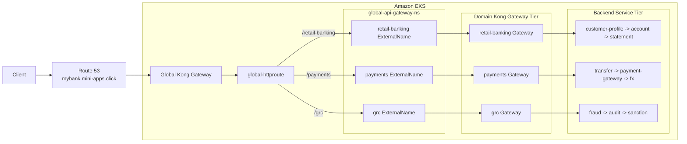
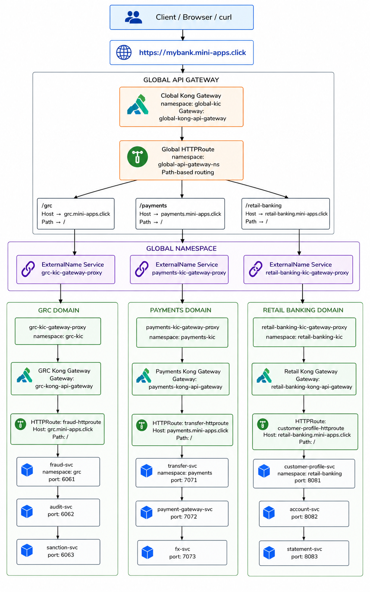
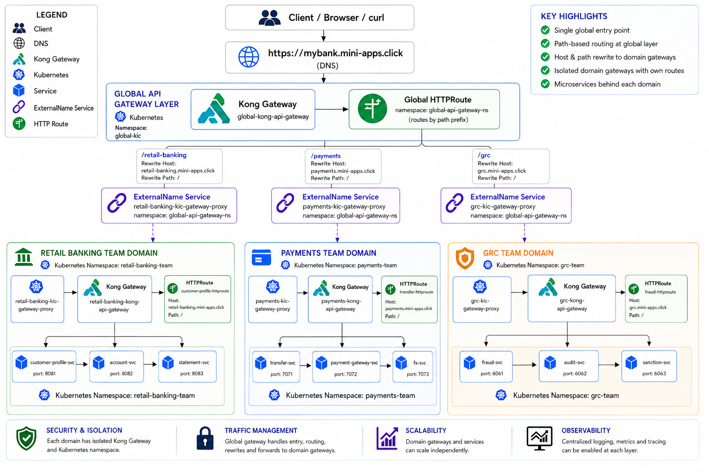
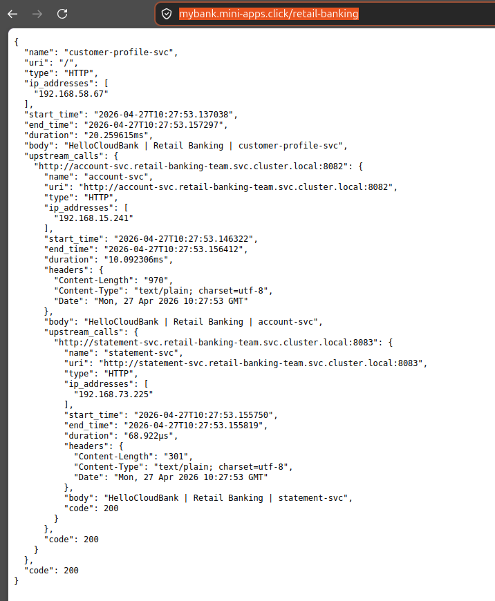
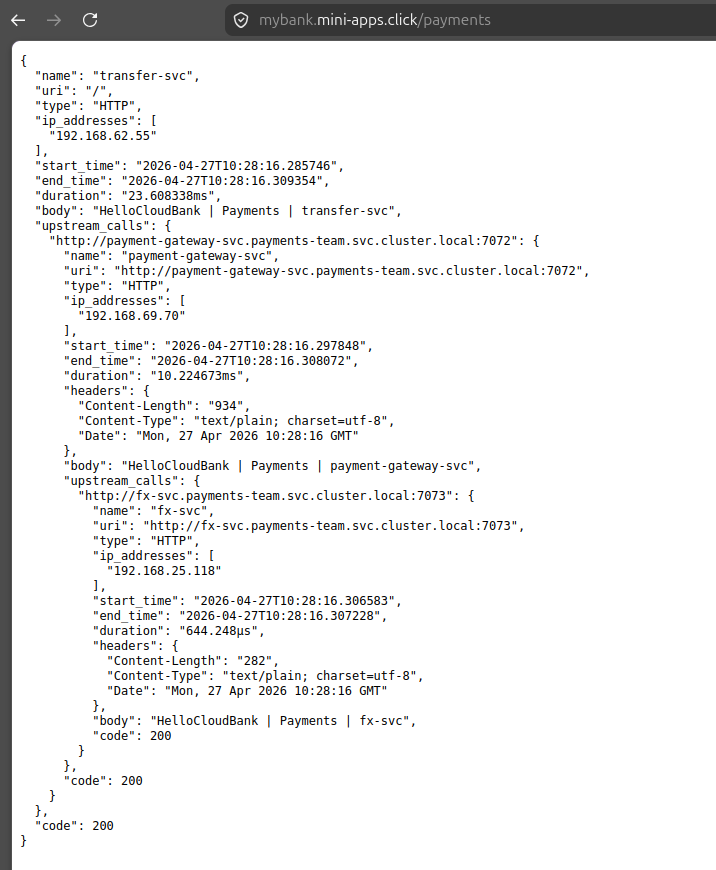
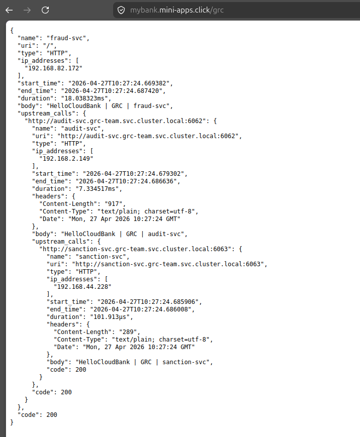

# Kong Distributed API Gateway on EKS with HTTPS and ExternalName

Production-style distributed API gateway reference project for Amazon EKS using Kong Ingress Controller, Kubernetes Gateway API, Route 53, Kubernetes `ExternalName` services, and optional HTTPS automation with Terraform.

The project models a banking platform with three business domains:

- Retail Banking
- Payments
- GRC, Governance Risk and Compliance

Each domain owns its own Kong Gateway, route, namespace, and backend service chain. The repo also includes a global gateway layer that sits in front of the domain gateways for centralized path-based routing through `mybank.mini-apps.click`.

## What This Project Builds

```text
Route 53
  -> Global Kong Gateway
  -> Global Gateway API HTTPRoute
  -> ExternalName Services
  -> Domain Kong Gateways
  -> Domain Gateway API HTTPRoutes
  -> Backend fake-service chains
```

Current global public routes:

| Domain | Global URL | Entry service | Service chain |
| --- | --- | --- | --- |
| Retail Banking | `https://mybank.mini-apps.click/retail-banking` | `customer-profile-svc` | `customer-profile-svc -> account-svc -> statement-svc` |
| Payments | `https://mybank.mini-apps.click/payments` | `transfer-svc` | `transfer-svc -> payment-gateway-svc -> fx-svc` |
| GRC | `https://mybank.mini-apps.click/grc` | `fraud-svc` | `fraud-svc -> audit-svc -> sanction-svc` |

Current downstream domain routes:

| Domain | Public URL | Entry service |
| --- | --- | --- |
| Retail Banking | `https://retail-banking.mini-apps.click/` | `customer-profile-svc` |
| Payments | `https://payments.mini-apps.click/` | `transfer-svc` |
| GRC | `https://grc.mini-apps.click/` | `fraud-svc` |

## Architecture

High-level global gateway flow:



Detailed flow:

```text
Client
  -> Global Kong Gateway
  -> global HTTPRoute
  -> ExternalName service in global-api-gateway-ns
  -> downstream KIC gateway proxy Service
  -> domain Kong Gateway
  -> domain HTTPRoute
  -> backend services
```




## Repository Layout

```text
.
├── 0-gatewayclass-global.yaml
├── 1-kong-api-gateway-global.yaml
├── 2-downstream-proxy-services.yaml
├── 3-global-httproute.yaml
├── apps/
│   ├── retail-banking/        # Retail gateway, route, and services
│   ├── payments/              # Payments gateway, route, and services
│   └── grc/                   # GRC gateway, route, and services
├── for_https/                 # Terraform for certificates and HTTPS listeners
├── istio/                     # Sidecar injection namespaces and STRICT mTLS
├── SETUP.md                   # Step-by-step deployment runbook
└── README.md
```

## Main Components

### Global Gateway

The global gateway receives traffic for:

```text
mybank.mini-apps.click
```

It routes by path prefix:

- `/retail-banking`
- `/payments`
- `/grc`

The global route uses `URLRewrite` to strip the domain path prefix and set the downstream hostname before forwarding traffic to the domain gateway proxy.

### ExternalName Services

The global `HTTPRoute` backend references local services in `global-api-gateway-ns`.

Those services are `ExternalName` aliases that point to the downstream Kong proxy services:

| ExternalName service | Target |
| --- | --- |
| `retail-banking-kic-gateway-proxy` | `retail-banking-kic-gateway-proxy.retail-banking-kic.svc.cluster.local` |
| `payments-kic-gateway-proxy` | `payments-kic-gateway-proxy.payments-kic.svc.cluster.local` |
| `grc-kic-gateway-proxy` | `grc-kic-gateway-proxy.grc-kic.svc.cluster.local` |

This keeps traffic inside the cluster and avoids sending the global gateway to the downstream public load balancers.

### Domain Kong Gateways

Each domain has:

- A dedicated `GatewayClass`.
- A dedicated `Gateway`.
- A dedicated Kong Ingress Controller release.
- An `HTTPRoute` that maps the domain hostname to the domain entry service.

| Domain | KIC namespace | App namespace | Gateway | HTTPRoute |
| --- | --- | --- | --- | --- |
| Retail Banking | `retail-banking-kic` | `retail-banking-team` | `retail-banking-kong-api-gateway` | `customer-profile-httproute` |
| Payments | `payments-kic` | `payments-team` | `payments-kong-api-gateway` | `transfer-httproute` |
| GRC | `grc-kic` | `grc-team` | `grc-kong-api-gateway` | `fraud-httproute` |

### Backend Services

The demo workloads use `nicholasjackson/fake-service` so you can see the request chain in the response body.

Retail Banking:

```text
customer-profile-svc
  -> account-svc
  -> statement-svc
```

Payments:

```text
transfer-svc
  -> payment-gateway-svc
  -> fx-svc
```

GRC:

```text
fraud-svc
  -> audit-svc
  -> sanction-svc
```

### Istio mTLS

The `istio/` directory adds Istio sidecar injection labels for the Kong and application namespaces, then applies namespace-wide `PeerAuthentication` resources with `mtls.mode: STRICT`.

This protects in-cluster traffic across:

- Global Kong Gateway to downstream domain Kong gateways.
- Domain Kong gateways to the domain entry services.
- Microservice-to-microservice calls inside Retail Banking, Payments, and GRC.

Install Istio and apply `istio/00-mesh-namespaces.yaml` before installing Kong and the application workloads so new pods receive an `istio-proxy` sidecar. Apply `istio/01-strict-mtls.yaml` after the pods are meshed.

## Prerequisites

- AWS CLI with a profile that can manage EKS and Route 53.
- `eksctl`
- `kubectl`
- `helm`
- `istioctl`, for Istio sidecar mTLS
- Gateway API CRDs
- Kong Helm chart repository
- Route 53 public hosted zone for `mini-apps.click`
- Terraform, only for HTTPS setup

## Deployment

Use [SETUP.md](SETUP.md) as the ordered deployment runbook.

Summary:

1. Create or connect to the EKS cluster.
2. Install Gateway API CRDs.
3. Install Istio and prepare the meshed namespaces.
4. Install Kong Ingress Controller instances.
5. Apply global GatewayClass, Gateway, `ExternalName` services, and global HTTPRoute.
6. Apply domain GatewayClass and Gateway manifests.
7. Deploy backend services.
8. Apply domain HTTPRoutes.
9. Apply Istio STRICT mTLS policies.
10. Create Route 53 records for `mybank.mini-apps.click` and any direct domain hostnames.
11. Enable HTTPS with Terraform.
12. Test global and downstream access.

## Test Global HTTPS

```bash
curl -k -i https://mybank.mini-apps.click/retail-banking
curl -k -i https://mybank.mini-apps.click/payments
curl -k -i https://mybank.mini-apps.click/grc
```

Use `-k` only while a self-signed certificate is still being served. After Terraform creates trusted Let's Encrypt certificates, test without `-k`:

```bash
curl -i https://mybank.mini-apps.click/retail-banking
curl -i https://mybank.mini-apps.click/payments
curl -i https://mybank.mini-apps.click/grc
```

## Test Downstream Domains

```bash
curl -i https://retail-banking.mini-apps.click/
curl -i https://payments.mini-apps.click/
curl -i https://grc.mini-apps.click/
```

If HTTPS is not enabled yet, test HTTP through each LoadBalancer with a Host header:

```bash
curl -i -H "Host: retail-banking.mini-apps.click" http://<retail-banking-kong-elb>/
curl -i -H "Host: payments.mini-apps.click" http://<payments-kong-elb>/
curl -i -H "Host: grc.mini-apps.click" http://<grc-kong-elb>/
```

Expected result: `HTTP/1.1 200 OK` with a fake-service response showing the upstream service chain.

## Expected Response Indicators

```text
HelloCloudBank | Retail Banking | customer-profile-svc
HelloCloudBank | Retail Banking | account-svc
HelloCloudBank | Retail Banking | statement-svc

HelloCloudBank | Payments | transfer-svc
HelloCloudBank | Payments | payment-gateway-svc
HelloCloudBank | Payments | fx-svc

HelloCloudBank | GRC | fraud-svc
HelloCloudBank | GRC | audit-svc
HelloCloudBank | GRC | sanction-svc
```

## Enable HTTPS

The `for_https/` Terraform creates:

- Let's Encrypt certificates using Route 53 DNS validation.
- Kubernetes TLS Secrets in the Kong KIC namespaces.
- HTTPS listeners on port `443` for each Gateway.

Run:

```bash
cd for_https
cp terraform.tfvars.example terraform.tfvars
terraform init
terraform plan
terraform apply
```

Then test:

```bash
curl -i https://mybank.mini-apps.click/retail-banking
curl -i https://retail-banking.mini-apps.click/
curl -i https://payments.mini-apps.click/
curl -i https://grc.mini-apps.click/
```

Do not commit `terraform.tfvars` or Terraform state files.

###Expected Test Results





## Useful Commands

Check Gateway API status:

```bash
kubectl get gatewayclass
kubectl get gateway -A
kubectl get httproute -A
```

Check Kong proxy services:

```bash
kubectl get svc -A | grep gateway-proxy
```

Check backend apps:

```bash
kubectl get pods,svc -n retail-banking-team
kubectl get pods,svc -n payments-team
kubectl get pods,svc -n grc-team
```

Inspect route attachment:

```bash
kubectl describe httproute -n global-api-gateway-ns global-httproute
kubectl describe httproute -n retail-banking-team customer-profile-httproute
kubectl describe httproute -n payments-team transfer-httproute
kubectl describe httproute -n grc-team fraud-httproute
```

Healthy routes should show:

```text
Accepted=True
ResolvedRefs=True
Programmed=True
```

## Troubleshooting

If a domain returns this Kong response:

```json
{
  "message": "no Route matched with those values"
}
```

Check the matching `HTTPRoute` status:

```bash
kubectl describe httproute transfer-httproute -n payments-team
kubectl describe httproute fraud-httproute -n grc-team
```

If no `Status` section appears, the Kong controller for that domain is not reconciling the route. Check the matching KIC namespace and Helm values:

```bash
kubectl get pods -n payments-kic
kubectl get pods -n grc-kic
helm get values payments-kic -n payments-kic
helm get values grc-kic -n grc-kic
```

## Notes

- Public DNS uses Route 53 records under `mini-apps.click`.
- Local DNS may cache old failures. Use `nslookup <host> 1.1.1.1` or test with a Host header if needed.
- Browser HTTPS warnings mean the site is serving a self-signed certificate. Use Terraform to issue trusted Let's Encrypt certificates.
- The HTTPS Terraform state contains certificate private keys. Keep state private.
- Do not commit AWS credentials, kubeconfig files, private keys, `terraform.tfvars`, `.terraform/`, or Terraform state files.
