# Istio mTLS for the Kong Gateway Project

This directory contains the Istio resources that secure in-cluster traffic with mutual TLS.

The public edge is still Kong. Istio protects the private hops after traffic enters the cluster:

```text
Public client
  -> Global Kong Gateway
  -> Domain Kong Gateway
  -> Domain backend services
```

## mTLS Workflow Diagram

Istio mTLS starts after traffic reaches a meshed workload. Public clients do
not have Istio workload certificates, so `global-kic` stays inbound
PERMISSIVE. The internal hops are protected by sidecars and `DestinationRule`
resources that use `ISTIO_MUTUAL`.

```mermaid
flowchart LR
    client[Public client<br/>HTTP or HTTPS]
    globalKong[Global Kong pod<br/>global-kic]
    globalEnvoy[Envoy sidecar<br/>global-kic]
    externalName[ExternalName alias<br/>global-api-gateway-ns]
    paymentsEnvoy[Envoy sidecar<br/>payments-kic]
    paymentsKong[Payments Kong pod<br/>payments-kic]
    transferEnvoy[Envoy sidecar<br/>payments-team]
    transfer[transfer-svc]
    gatewayEnvoy[Envoy sidecar<br/>payments-team]
    paymentGateway[payment-gateway-svc]
    fxEnvoy[Envoy sidecar<br/>payments-team]
    fx[fx-svc]

    client -->|normal edge traffic<br/>not Istio mTLS| globalKong
    globalKong --> globalEnvoy
    globalEnvoy -. DNS lookup .-> externalName
    externalName -. resolves to .-> paymentsEnvoy
    globalEnvoy -->|ISTIO_MUTUAL mTLS| paymentsEnvoy
    paymentsEnvoy --> paymentsKong
    paymentsKong -->|Kong route and plugins pass| paymentsEnvoy
    paymentsEnvoy -->|ISTIO_MUTUAL mTLS| transferEnvoy
    transferEnvoy --> transfer
    transfer --> transferEnvoy
    transferEnvoy -->|ISTIO_MUTUAL mTLS| gatewayEnvoy
    gatewayEnvoy --> paymentGateway
    paymentGateway --> gatewayEnvoy
    gatewayEnvoy -->|ISTIO_MUTUAL mTLS| fxEnvoy
    fxEnvoy --> fx
```



For the other domains, the same pattern applies:

```text
Global Kong sidecar
  -> domain Kong sidecar
  -> first service sidecar
  -> next service sidecar
  -> final service sidecar
```

## Design Summary

The important design choice is that `global-kic` stays inbound PERMISSIVE because public clients do not present Istio workload certificates. Internal namespaces can be STRICT because all participating Kong and application pods have Istio sidecars.

Outbound mTLS is controlled with `DestinationRule` resources. Those rules tell the caller's Envoy sidecar to originate `ISTIO_MUTUAL` TLS when calling the next internal service.

## Protected Traffic

| Hop | Caller namespace | Destination namespace |
| --- | --- | --- |
| Global Kong -> Retail Banking KIC | `global-kic` | `retail-banking-kic` |
| Global Kong -> Payments KIC | `global-kic` | `payments-kic` |
| Global Kong -> GRC KIC | `global-kic` | `grc-kic` |
| Retail Banking KIC -> customer-profile | `retail-banking-kic` | `retail-banking-team` |
| customer-profile -> account -> statement | `retail-banking-team` | `retail-banking-team` |
| Payments KIC -> transfer | `payments-kic` | `payments-team` |
| transfer -> payment-gateway -> fx | `payments-team` | `payments-team` |
| GRC KIC -> fraud | `grc-kic` | `grc-team` |
| fraud -> audit -> sanction | `grc-team` | `grc-team` |

`global-api-gateway-ns` contains only `ExternalName` services and `HTTPRoute` objects. It has no pods, so it does not need sidecar injection.

## Files

| File | Purpose |
| --- | --- |
| `00-mesh-namespaces.yaml` | Creates or patches mesh namespaces with `istio-injection: enabled`. |
| `01-mtls-permissive-client-in.yaml` | Sets mesh-wide PERMISSIVE mode so sidecars can be introduced safely. |
| `02-mtls-strict-internal.yaml` | Enforces STRICT mTLS in domain KIC and application namespaces. |
| `03-destinationrules-istio-mutual.yaml` | Configures caller-side `ISTIO_MUTUAL` TLS for every internal service hop. |

## Rollout Sequence

### 1. Create sidecar-injected namespaces

Apply this before installing Kong and before deploying application pods:

```bash
kubectl apply -f istio/00-mesh-namespaces.yaml
```

Confirm the namespace labels:

```bash
kubectl get namespace -L istio-injection
```

The following namespaces should show `enabled`:

```text
global-kic
retail-banking-kic
retail-banking-team
payments-kic
payments-team
grc-kic
grc-team
```

### 2. Start in PERMISSIVE mode

```bash
kubectl apply -f istio/01-mtls-permissive-client-in.yaml
```

PERMISSIVE allows both plaintext and mTLS while workloads are being checked.

### 3. Apply DestinationRules

```bash
kubectl apply -f istio/03-destinationrules-istio-mutual.yaml
```

These rules cover:

- Global Kong to each domain Kong proxy, including both the `ExternalName` alias and the real target service.
- Domain Kong to each domain entry service.
- Service-to-service calls inside Retail Banking, Payments, and GRC.

### 4. Verify sidecars

Every workload pod in the mesh namespaces must include an `istio-proxy` container:

```bash
for ns in global-kic retail-banking-kic retail-banking-team payments-kic payments-team grc-kic grc-team; do
  echo "=== $ns ==="
  kubectl get pods -n "$ns" -o jsonpath='{range .items[*]}{.metadata.name}{"  "}{.spec.containers[*].name}{"\n"}{end}'
done
```

If a pod is missing the sidecar, restart the deployment after confirming the namespace has injection enabled:

```bash
kubectl rollout restart deployment -n <namespace>
```

### 5. Enforce STRICT mTLS internally

Apply STRICT only after all internal routes work in PERMISSIVE mode:

```bash
kubectl apply -f istio/02-mtls-strict-internal.yaml
```

`global-kic` is intentionally not made STRICT inbound. Public HTTP or HTTPS clients need to reach Global Kong normally. Traffic leaving `global-kic` is still protected by the DestinationRules.

## Verification

Check active PeerAuthentication policies:

```bash
kubectl get peerauthentication -A
```

Check DestinationRules:

```bash
kubectl get destinationrule -A
```

Check routes after STRICT mTLS:

```bash
curl -i -H "Host: mybank.mini-apps.click" http://<global-kong-elb>/retail-banking
curl -i -H "Host: mybank.mini-apps.click" \
  -H "apikey: payments-demo-key" \
  http://<global-kong-elb>/payments
curl -i -H "Host: mybank.mini-apps.click" http://<global-kong-elb>/grc
```

Inspect Envoy stats from a meshed pod:

```bash
kubectl exec -n retail-banking-team deploy/customer-profile-svc \
  -c istio-proxy -- pilot-agent request GET stats | grep ssl.handshake
```

A non-zero `ssl.handshake` counter shows TLS sessions are being established.

## Rollback

If STRICT mode exposes a workload that does not have a sidecar, return to PERMISSIVE:

```bash
kubectl delete -f istio/02-mtls-strict-internal.yaml --ignore-not-found
kubectl apply -f istio/01-mtls-permissive-client-in.yaml
kubectl apply -f istio/03-destinationrules-istio-mutual.yaml
```

Then fix sidecar injection, restart the affected deployment, test traffic again, and reapply STRICT mode.
