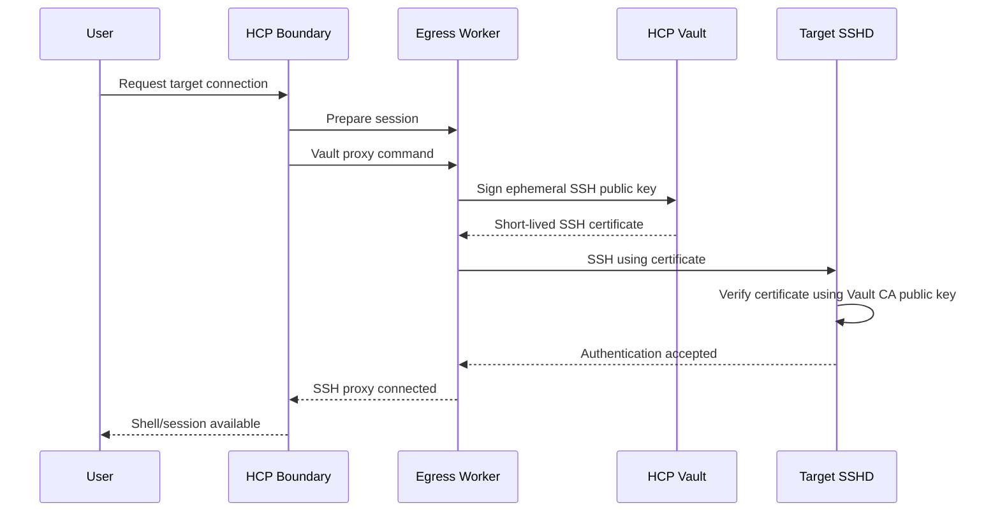

# Session 07 — Automatic SSH Flow Explained

## Goal

Understand exactly what happens when a user clicks/connects to the Boundary target.

## Flow



## What Boundary generates

Boundary uses an ephemeral SSH keypair for the connection.

Conceptually:

```text
ephemeral private key  -> used for SSH authentication
ephemeral public key   -> sent to Vault for signing
```

The public key is safe to send to the signer.

The private key must remain protected.

## What Vault returns

Vault returns an OpenSSH certificate:

```text
ssh-ed25519-cert-v01@openssh.com ...
```

The certificate says, in effect:

```text
This public key is approved by the trusted CA
for azureuser
for this limited validity period.
```

## What the target verifies

The target does not call Vault during SSH authentication.

It locally verifies the presented certificate against:

```text
/etc/ssh/trusted-user-ca-keys.pem
```

This is an important concept:

```text
Vault signs earlier
Target verifies locally
```

## Certificate TTL

Our role uses:

```text
ttl     = 10m
max_ttl = 10m
```

This limits the credential's authentication validity.

It does not necessarily mean an already established Boundary session is killed exactly 10 minutes later.

## Manual versus automatic

```text
MANUAL
You generate key -> You call Vault -> You use certificate

AUTOMATIC
Boundary generates/manages key -> Boundary/worker calls Vault
-> Boundary injects credential -> worker connects
```
