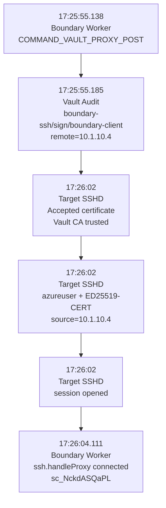

# Session 10 — Correlate One SSH Session End-to-End

## Goal

Prove that one user access event caused a Vault SSH certificate request and resulted in successful target authentication.

## Evidence timeline

### 1. Boundary worker asks for Vault operation

```text
17:25:55.138 UTC
COMMAND_VAULT_PROXY_POST
```

Worker:

```text
egress-worker-01
10.1.10.4
```

### 2. Vault receives the SSH signing request

Vault audit:

```text
17:25:55.185 UTC

operation:
update

path:
boundary-ssh/sign/boundary-client

request_uri:
/v1/boundary-ssh/sign/boundary-client

remote_address:
10.1.10.4

mount_type:
ssh

namespace:
admin/
```

Policies:

```text
boundary-controller
boundary-ssh-policy
```

This is important because the source IP matches the worker:

```text
Worker = 10.1.10.4
Vault request remote_address = 10.1.10.4
```

### 3. Target accepts Vault certificate

Target SSHD:

```text
17:26:02 UTC
Accepted certificate ID "vault-token-..."
signed by RSA CA SHA256:<Vault CA>
via /etc/ssh/trusted-user-ca-keys.pem
```

### 4. Target authenticates user

```text
Accepted publickey for azureuser
from 10.1.10.4
ssh2: ED25519-CERT
```

Again:

```text
source = 10.1.10.4 = Boundary worker
```

### 5. SSH session opens

```text
session opened for user azureuser
```

### 6. Worker confirms SSH proxy

```text
17:26:04.111 UTC
ssh protocol handler successfully connected
connection id: sc_NckdASQaPL
```

Then:

```text
multihop chain established
connection id: sc_NckdASQaPL
```

## Correlation diagram



## Why timestamps do not have to be identical

These are different systems:

```text
Boundary worker
Vault
Target SSHD
Datadog ingestion
```

Small differences are normal.

Correlate using several facts together:

```text
same narrow time window
same worker IP
same Vault signing path
same target
same SSH certificate authentication
same Boundary connection/session context
```

## Final proof statement

The evidence supports this sequence:

```text
Boundary initiated dynamic credential handling
        ->
worker contacted Vault
        ->
Vault authorized the boundary-ssh-policy
        ->
Vault processed boundary-ssh/sign/boundary-client
        ->
worker connected from 10.1.10.4
        ->
target validated a Vault-signed SSH certificate
        ->
azureuser authenticated
        ->
SSH session opened
```
