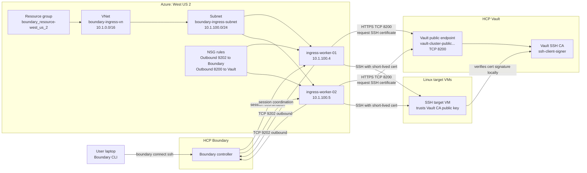

# Boundary with HCP Vault overall diagram

This diagram shows the lab flow when Azure uses the HCP Vault public endpoint.



## Important traffic

```text
Boundary worker ---> HCP Boundary controller/upstreams: TCP 9202
Boundary worker ---> HCP Vault public endpoint: TCP 8200
Boundary worker ---> Linux target VM: TCP 22
```

The Linux target VM does not need to connect to Vault during login. It only
checks that the SSH certificate was signed by the Vault SSH CA public key it
already trusts.
