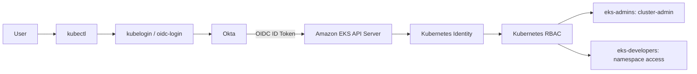

# Amazon EKS Authentication with Okta OIDC

This repository documents a proof-of-concept integration between **Okta OIDC** and **Amazon EKS** for Kubernetes user authentication, with **Kubernetes RBAC** for authorization.

## Architecture



## Access Model

| Okta Group | Kubernetes Permission |
|---|---|
| `eks-admins` | Cluster-wide administrator |
| `eks-developers` | Restricted to `developers-team` namespace |

## Documentation

- [Full implementation](docs/IMPLEMENTATION.md)
- [Evidence photo index](docs/EVIDENCE.md)
- [Troubleshooting](docs/TROUBLESHOOTING.md)
- [Security guidance](SECURITY.md)

## Repository Structure

```text
eks-okta-oidc/
├── README.md
├── SECURITY.md
├── docs/
├── images/
├── kubernetes/
└── scripts/
```
