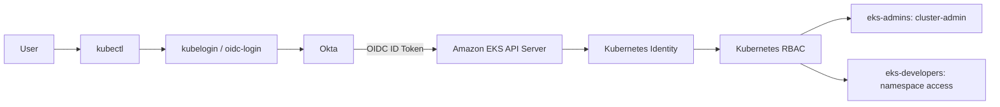

# Amazon EKS Authentication with Okta OIDC

This repository documents a proof-of-concept integration between **Okta OIDC** and **Amazon EKS** for Kubernetes user authentication, with **Kubernetes RBAC** for authorization.

## Architecture




## Why This Project Is Useful

This project demonstrates an enterprise-friendly way to access Amazon EKS.

Instead of creating a separate AWS IAM user for every Kubernetes user, authentication is delegated to Okta. Okta handles identity, password/MFA policy, and group membership. Amazon EKS validates the OIDC token, while Kubernetes RBAC controls permissions.

### Core Concepts

| Component | Purpose |
|---|---|
| Okta OIDC Application | Represents the kubectl/kubelogin client |
| Authorization Server | Issues OIDC tokens and defines the issuer |
| Access Policy / Rule | Controls when the client may obtain tokens |
| `eks_groups` Claim | Sends Okta group membership to EKS |
| EKS OIDC Provider | Makes EKS trust Okta-issued tokens |
| kubelogin | Performs interactive browser authentication |
| Kubernetes Role / ClusterRole | Defines permissions |
| RoleBinding / ClusterRoleBinding | Assigns permissions to OIDC groups |

### Authentication vs Authorization

```text
Authentication = Who are you?
Okta answers this.

Authorization = What can you do?
Kubernetes RBAC answers this.
```

This separation is the main concept behind the design.

## Access Model

| Okta Group | Kubernetes Permission |
|---|---|
| `eks-admins` | Cluster-wide administrator |
| `eks-developers` | Restricted to `developers-team` namespace |

## Documentation

- [Full implementation](docs/IMPLEMENTATION.md)
- [Evidence photo index](docs/EVIDENCE.md)
- [Troubleshooting](docs/TROUBLESHOOTING.md)
- [Security guidance](SECURITY.md)

## Repository Structure

```text
eks-okta-oidc/
├── README.md
├── SECURITY.md
├── docs/
├── images/
├── kubernetes/
└── scripts/
```
