# Full Implementation — Amazon EKS with Okta OIDC

## Step-1 — Create the Okta OIDC Application

Open `Okta Admin Console → Applications → Applications → Create App Integration`.

Create an OIDC application named `EKS-OIDC-APP`. Record the Client ID. In this lab, client authentication was **None** and PKCE was enabled.

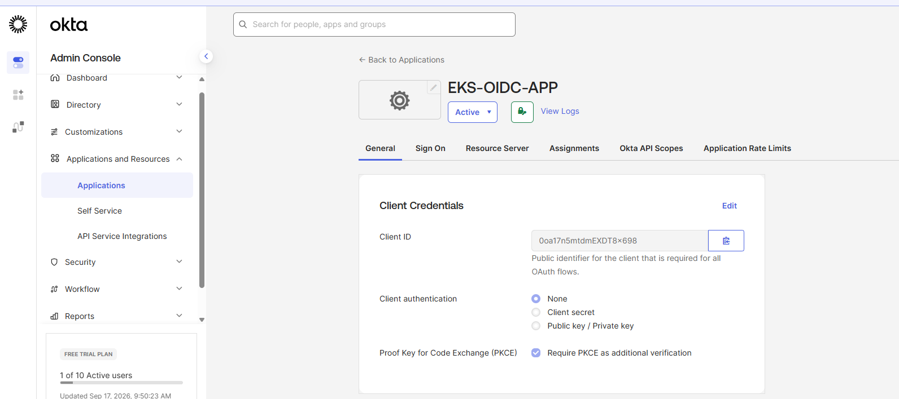

## Step-2 — Create an Okta Authorization Server

Open `Security → API → Authorization Servers`.

Create a dedicated server, for example:

- Name: `EKS-OIDC`
- Audience: `api://eks`

Record the exact Issuer URL:

`https://<OKTA_DOMAIN>/oauth2/<AUTHORIZATION_SERVER_ID>`

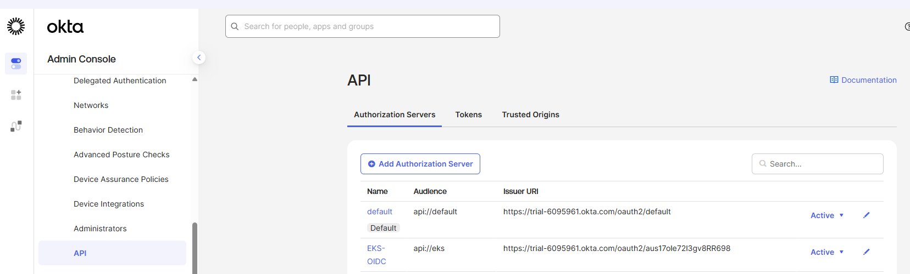

## Step-3 — Create the Okta Access Policy

Open `Security → API → Authorization Servers → EKS-OIDC → Access Policies`.

Create:

- Name: `EKS-OIDC-Policy`
- Description: `Access policy for Amazon EKS OIDC authentication`
- Assigned client: `EKS-OIDC-APP`

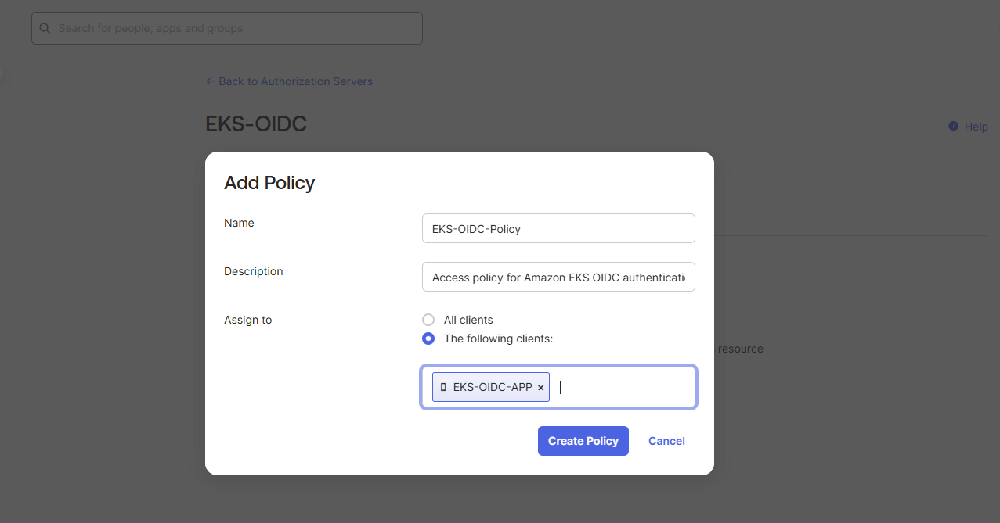

## Step-4 — Create the Authorization Rule

Inside the policy, add a rule:

- Rule Name: `EKS-OIDC-Authentication-Rule`
- Grant Type: `Authorization Code`
- User: `Any user assigned the app`
- Scopes: `openid`, `profile`, `email`
- Access token lifetime: `1 hour`

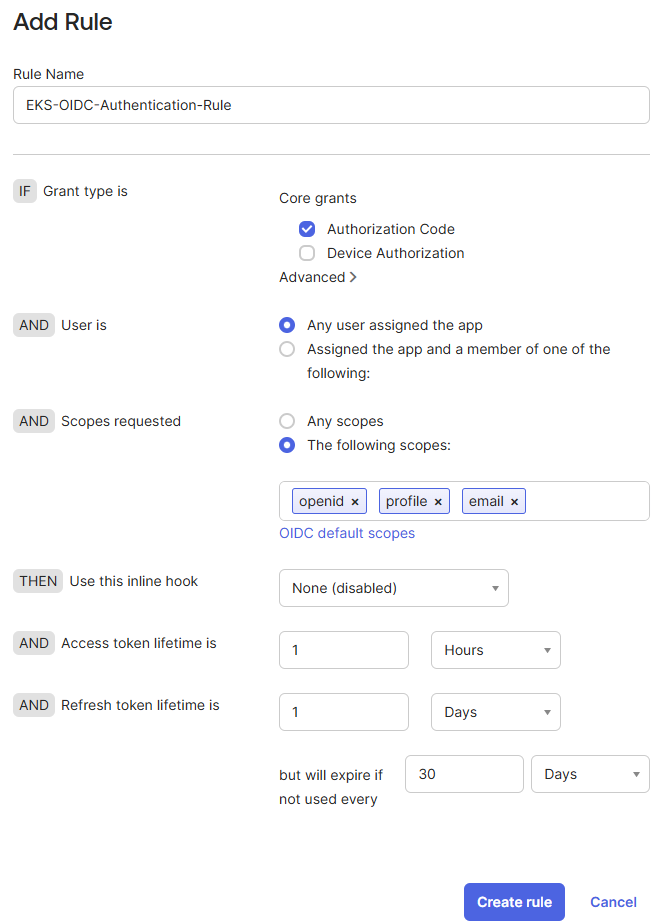

## Step-5 — Create Okta Groups

Create:

- `eks-admins`
- `eks-developers`

Assign users to the appropriate group.

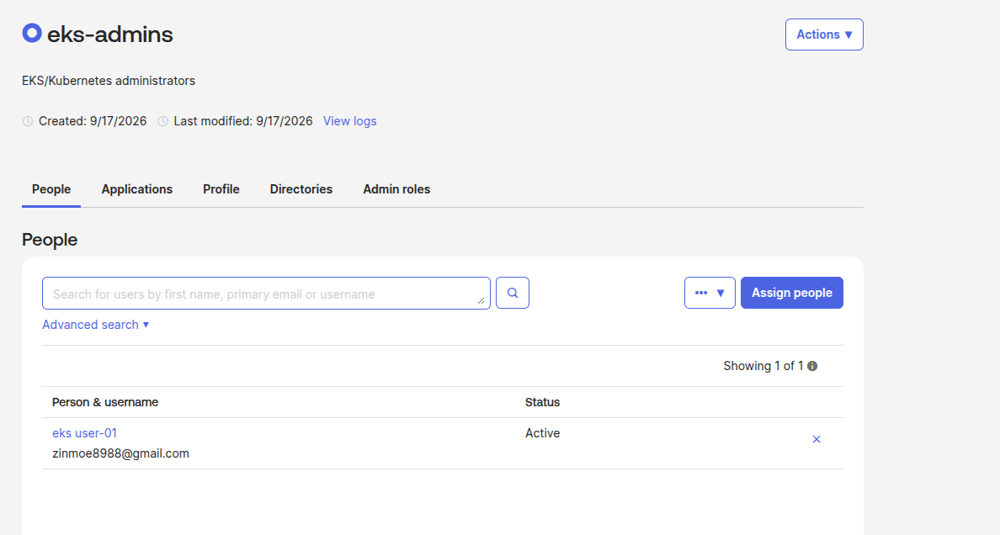

## Step-6 — Create the `eks_groups` Claim

Open `Security → API → Authorization Servers → EKS-OIDC → Claims`.

Create:

- Name: `eks_groups`
- Token: `ID Token`
- Value type: `Groups`
- Filter: `Starts with`
- Value: `eks-`
- Include in: `Any scope`

Expected token claim:

```json
"eks_groups": ["eks-admins"]
```

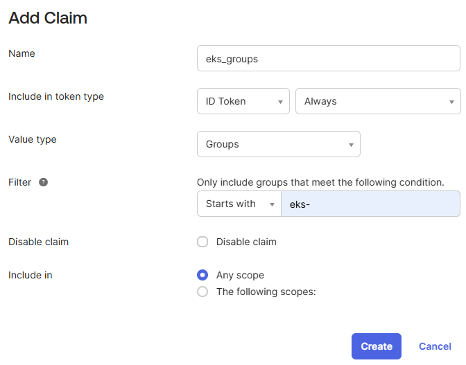

## Step-7 — Create the EKS Cluster IAM Role

Create `EKS-Cluster-Role_UDR` with trust for `eks.amazonaws.com`.

Attach the policies required by your EKS cluster mode. In this lab, screenshots showed:

- `AmazonEKSClusterPolicy`
- `AmazonEKSBlockStoragePolicyV2`
- `AmazonEKSComputePolicy`
- `AmazonEKSLoadBalancingPolicy`
- `AmazonEKSNetworkingPolicy`

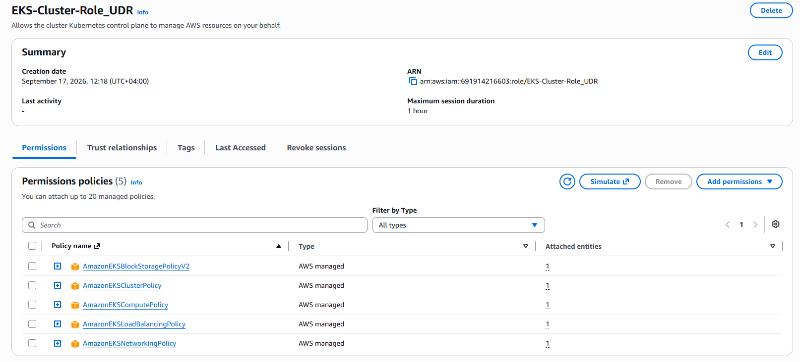

## Step-8 — Create the EKS Node Role

Create `EKS-Auto-Node-Role_UDR`.

Typical trust principal: `ec2.amazonaws.com`.

The lab used node policies including:

- `AmazonEC2ContainerRegistryPullOnly`
- `AmazonEKSWorkerNodeMinimalPolicy`

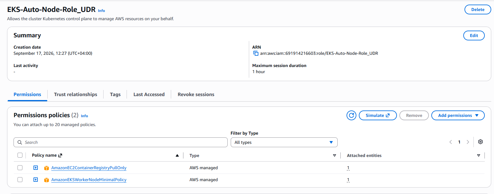

## Step-9 — Create the EKS Cluster

Open `AWS Console → Amazon EKS → Clusters → Create cluster`.

Example:

- Cluster: `eks-oidc-project`
- Region: `us-east-1`
- Cluster role: `EKS-Cluster-Role_UDR`
- Select VPC and subnets
- Select the required compute/node role

Wait until status becomes `Active`.

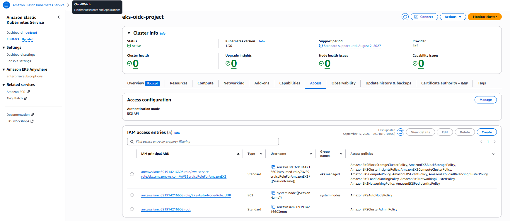

## Step-10 — Configure Bootstrap Administrative Access

Open `EKS → eks-oidc-project → Access`.

Create an access entry for the bootstrap IAM administrator:

- Type: `Standard`
- Access policy: `AmazonEKSClusterAdminPolicy`
- Access scope: `Cluster`

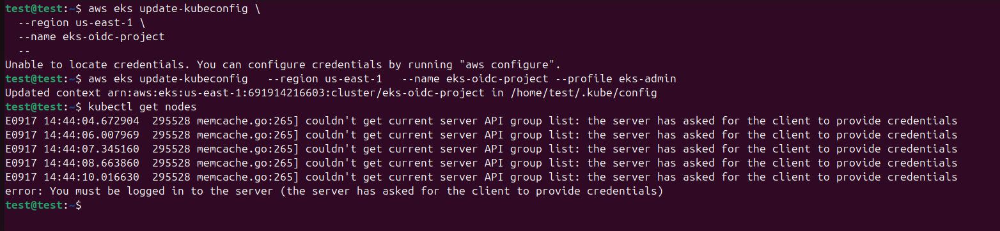

## Step-11 — Update Administrator kubeconfig

```bash
aws eks update-kubeconfig \
  --region us-east-1 \
  --name eks-oidc-project \
  --profile eks-admin

kubectl get nodes
```

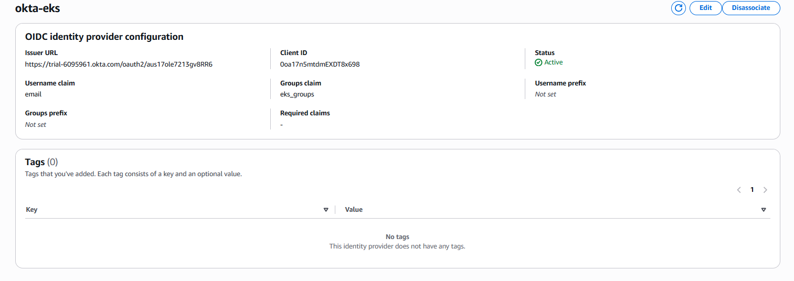

## Step-12 — Associate Okta with Amazon EKS

Open `EKS → eks-oidc-project → Access → OIDC identity providers → Associate identity provider`.

Configure:

- Name: `okta-eks`
- Issuer URL: `https://<OKTA_DOMAIN>/oauth2/<AUTHORIZATION_SERVER_ID>`
- Client ID: `<OKTA_CLIENT_ID>`
- Username claim: `email`
- Groups claim: `eks_groups`

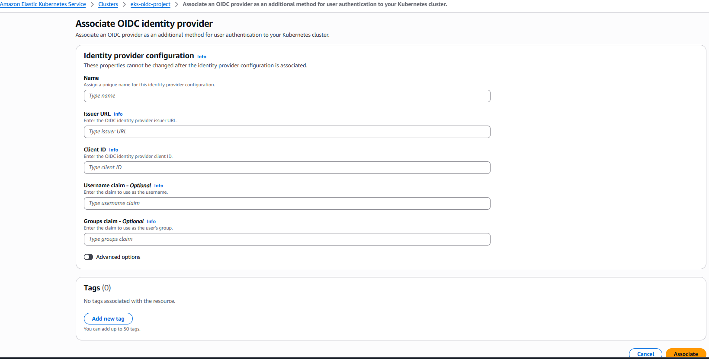

## Step-13 — Verify OIDC Provider Status

```bash
aws eks describe-identity-provider-config \
  --cluster-name eks-oidc-project \
  --identity-provider-config type=oidc,name=okta-eks \
  --region us-east-1 \
  --profile eks-admin
```

Expected:

- Status: `ACTIVE`
- Username claim: `email`
- Groups claim: `eks_groups`

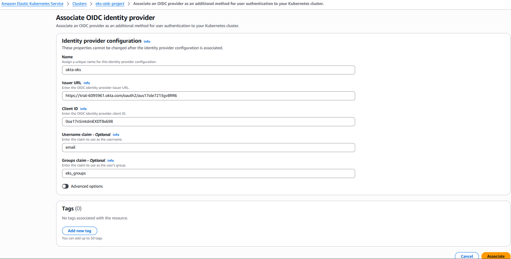

## Step-14 — Create RBAC for Okta Administrators

```bash
kubectl create clusterrolebinding okta-eks-admins \
  --clusterrole=cluster-admin \
  --group=eks-admins
```

Verify:

```bash
kubectl describe clusterrolebinding okta-eks-admins
```

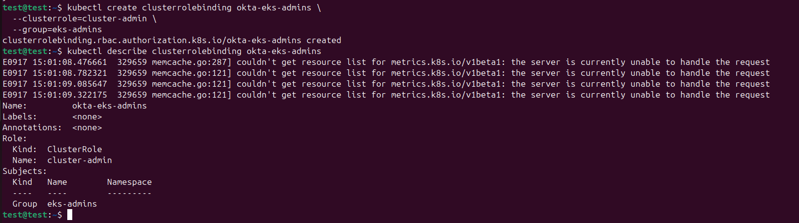

## Step-15 — Create Developer Namespace

```bash
kubectl create namespace developers-team
```

## Step-16 — Create Developer Role

Use `kubernetes/developer-role.yaml`.

```bash
kubectl apply -f kubernetes/developer-role.yaml
```

## Step-17 — Bind the Okta Developer Group

Use `kubernetes/developer-rolebinding.yaml`.

```bash
kubectl apply -f kubernetes/developer-rolebinding.yaml
```

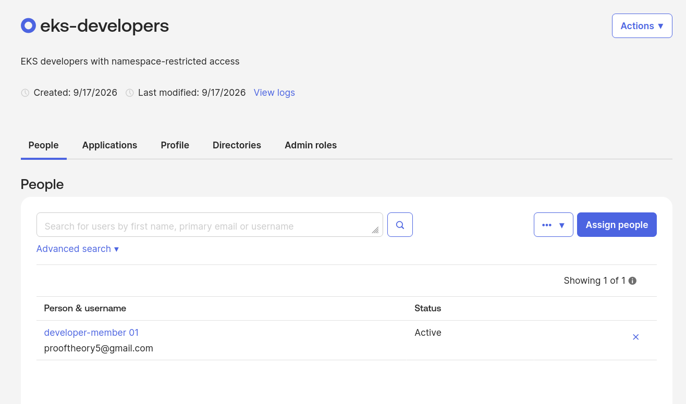

## Step-18 — Install kubelogin

Verify architecture:

```bash
uname -m
```

Install kubelogin and verify:

```bash
kubectl oidc-login --version
```

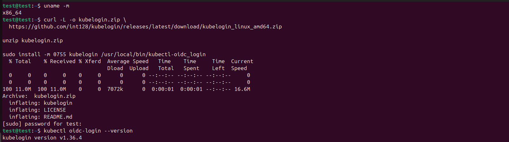

## Step-19 — Test Okta Authentication

```bash
kubectl oidc-login setup \
  --oidc-issuer-url="https://<OKTA_DOMAIN>/oauth2/<AUTHORIZATION_SERVER_ID>" \
  --oidc-client-id="<OKTA_CLIENT_ID>" \
  --oidc-extra-scope="profile" \
  --oidc-extra-scope="email" \
  --grant-type=authcode \
  --listen-address=127.0.0.1:8000
```

A browser opens for Okta authentication.

Expected token content includes email plus `eks_groups`.

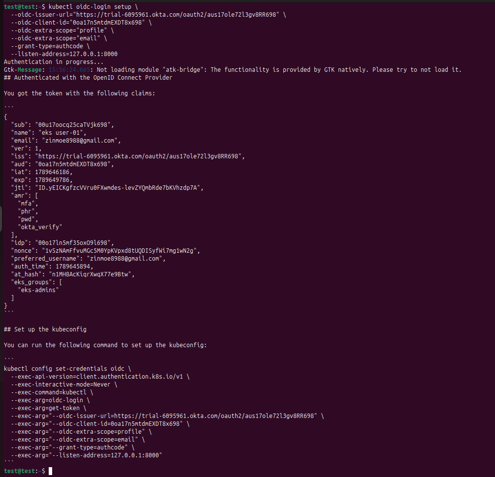

## Step-20 — Configure the OIDC User in kubeconfig

```bash
kubectl config set-credentials okta-user-login \
  --exec-api-version=client.authentication.k8s.io/v1beta1 \
  --exec-command=kubectl \
  --exec-arg=oidc-login \
  --exec-arg=get-token \
  --exec-arg="--oidc-issuer-url=https://<OKTA_DOMAIN>/oauth2/<AUTHORIZATION_SERVER_ID>" \
  --exec-arg="--oidc-client-id=<OKTA_CLIENT_ID>" \
  --exec-arg="--oidc-extra-scope=profile" \
  --exec-arg="--oidc-extra-scope=email" \
  --exec-arg="--grant-type=authcode" \
  --exec-arg="--listen-address=127.0.0.1:8000"
```

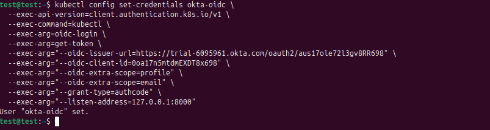

## Step-21 — Create the Okta Context

```bash
kubectl config set-context eks-okta-context \
  --cluster="<EKS_CLUSTER_ENTRY>" \
  --user=okta-user-login

kubectl config use-context eks-okta-context
kubectl config get-contexts
```

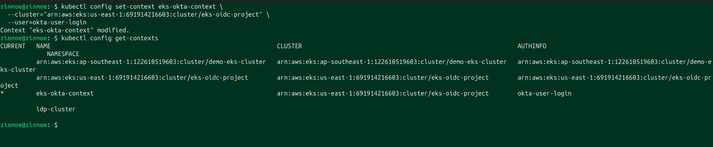

## Step-22 — Verify Administrator Authorization

Authenticate with a member of `eks-admins`.

```bash
kubectl auth can-i '*' '*' --all-namespaces
```

Expected:

```text
yes
```


## Step-23 — Verify Developer Identity

Authenticate with a member of `eks-developers`.

Run a SelfSubjectReview:

```bash
kubectl create -f - -o yaml --validate=false <<'EOF'
apiVersion: authentication.k8s.io/v1
kind: SelfSubjectReview
EOF
```

Expected:

- username = user email
- groups include `eks-developers`
- groups include `system:authenticated`

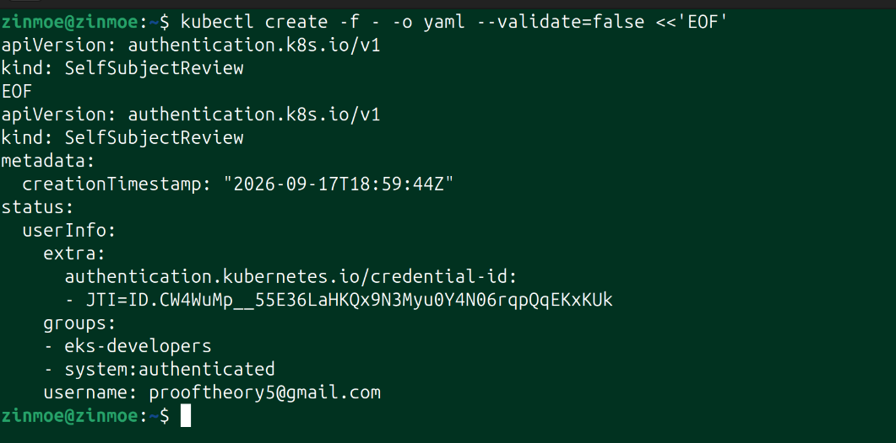

## Step-24 — Verify Restricted Developer RBAC

```bash
kubectl auth can-i get pods -n developers-team
# yes

kubectl auth can-i create pods -n developers-team
# yes

kubectl auth can-i get pods -n default
# no

kubectl auth can-i get nodes
# no
```

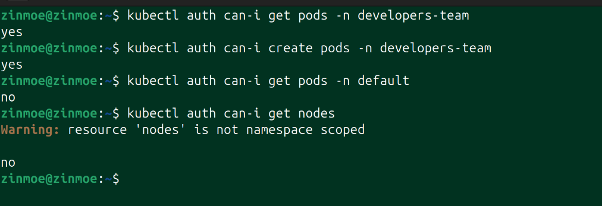

## Step-25 — Final Result

```text
Okta
  ↓
OIDC token
  ↓
email + eks_groups
  ↓
Amazon EKS
  ↓
Kubernetes RBAC
  ├── eks-admins → cluster-admin
  └── eks-developers → developers-team only
```

The PoC demonstrates successful external authentication, group propagation, and least-privilege Kubernetes authorization.
