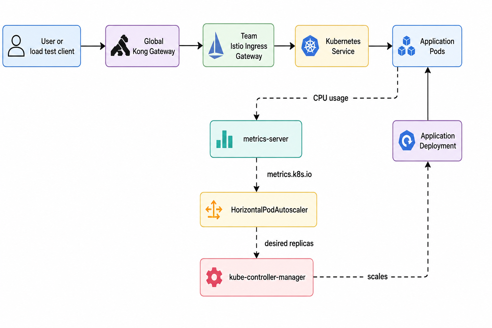
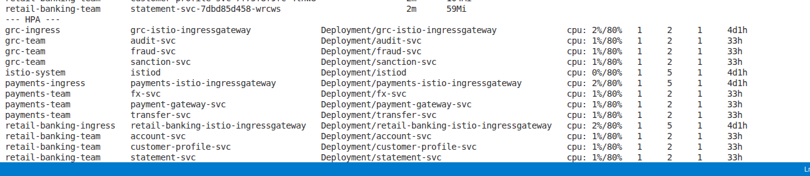
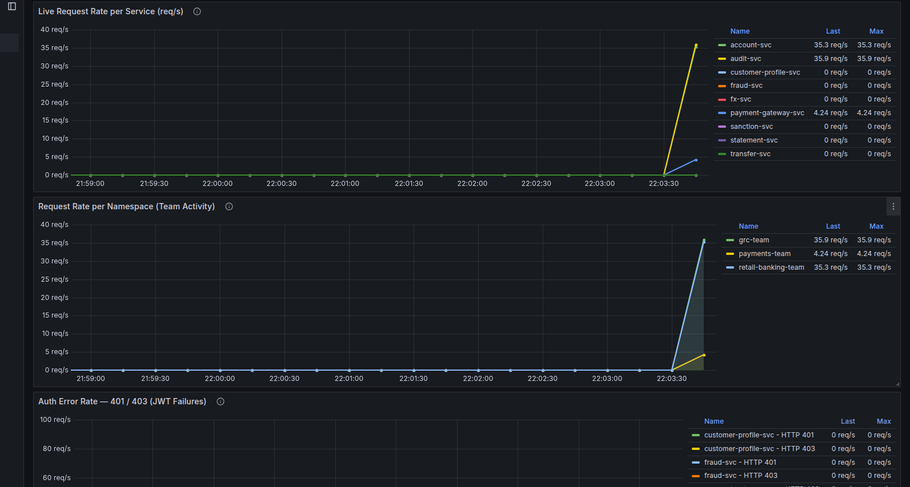

# Autoscaling Setup

This note enables Horizontal Pod Autoscaling for the nine application
deployments in this Istio gateway demo.

Autoscaling in this folder uses:

- `01-metrics-server.yaml` to expose Kubernetes CPU and memory metrics.
- `02-hpa.yaml` to create one `HorizontalPodAutoscaler` per application
  deployment.
- CPU-based scaling at `80%` average utilization.
- `minReplicas: 1` and `maxReplicas: 2` for each demo service.

The HPA target is based on each container CPU request. For these services the
request is `100m`, so `80%` means the HPA starts scaling out when average CPU
usage is around `80m` per pod.

## Diagram




## 1. Confirm The Application Is Deployed

Apply the base application and route manifests first if they are not already
running:

```bash
kubectl apply -f istio-gateway/apps/retail-banking/
kubectl apply -f istio-gateway/apps/payments/
kubectl apply -f istio-gateway/apps/grc/
kubectl apply -f istio-gateway/global-api-gateway
kubectl apply -f istio-gateway/team-istio-routes/namespaces.yaml
kubectl apply -f istio-gateway/team-istio-routes/retail-banking/gateway-virtualservice.yaml
kubectl apply -f istio-gateway/team-istio-routes/payments/gateway-virtualservice.yaml
kubectl apply -f istio-gateway/team-istio-routes/grc/gateway-virtualservice.yaml
```

Check the application pods:

```bash
kubectl get pods -n retail-banking-team
kubectl get pods -n payments-team
kubectl get pods -n grc-team
```

## 2. Install metrics-server

The HPA needs the Kubernetes Metrics API. Apply the included metrics-server
manifest:

```bash
kubectl apply -f istio-gateway/autoscaling/01-metrics-server.yaml
```

Wait until it is ready:

```bash
kubectl rollout status deployment/metrics-server -n kube-system
kubectl get apiservice v1beta1.metrics.k8s.io
```

For this Kind-based setup, the manifest includes `--kubelet-insecure-tls`
because Kind node kubelet certificates are not signed for normal TLS
verification.

Verify that metrics are available:

```bash
kubectl top nodes
kubectl top pods -n retail-banking-team
kubectl top pods -n payments-team
kubectl top pods -n grc-team
```

If `kubectl top` returns metrics, HPA can read CPU usage.

## 3. Apply The HPA Manifests

Create HPAs for all nine microservices:

```bash
kubectl apply -f istio-gateway/autoscaling/02-hpa.yaml
```

Verify them:

```bash
kubectl get hpa -n retail-banking-team
kubectl get hpa -n payments-team
kubectl get hpa -n grc-team
```

Expected HPA targets:

```text
retail-banking-team:
  customer-profile-svc
  account-svc
  statement-svc

payments-team:
  transfer-svc
  payment-gateway-svc
  fx-svc

grc-team:
  fraud-svc
  audit-svc
  sanction-svc
```

## 4. Watch Autoscaling

Open one terminal to watch HPAs:

```bash
kubectl get hpa -A -w
```

Open another terminal to watch pods:

```bash
kubectl get pods -n retail-banking-team -w
```

Use the namespace you are testing if it is not `retail-banking-team`.

## 5. Generate Test Load

Get the global Kong address:

```bash
kubectl get svc -n global-kic
```

Send repeated requests through the global gateway. Replace
`<GLOBAL_KONG_LB>` with the load balancer IP or DNS name.

```bash
while true; do
  curl -s -H "Host: finance.hellocloud.io" \
    http://<GLOBAL_KONG_LB>/retail-banking/accounts >/dev/null
done
```

For a stronger test, run several loops in parallel from different terminals, or
use a load tool such as `hey`:

```bash
hey -z 3m -c 50 \
  -H "Host: finance.hellocloud.io" \
  http://<GLOBAL_KONG_LB>/retail-banking/accounts
```

Watch the HPA output. When CPU crosses the target, replicas should move from
`1` toward `2`.

## 6. Verify The Deployment Scaled

Check the HPA detail:

```bash
kubectl describe hpa account-svc -n retail-banking-team
```

Check the target deployment:

```bash
kubectl get deployment account-svc -n retail-banking-team
kubectl get pods -n retail-banking-team -l app=account-svc
```

Repeat with another service name and namespace as needed.

## 7. Stop Load And Watch Scale Down

Stop the load test with `Ctrl+C`.

The HPA does not scale down instantly. Kubernetes waits through its scale-down
stabilization window before reducing replicas. Keep watching:

```bash
kubectl get hpa -A -w
kubectl get pods -n retail-banking-team -w
```

## Troubleshooting

If HPA shows `<unknown>` for CPU:

```bash
kubectl get deployment metrics-server -n kube-system
kubectl logs deployment/metrics-server -n kube-system
kubectl get --raw /apis/metrics.k8s.io/v1beta1/nodes
```

If HPA exists but does not scale:

```bash
kubectl describe hpa account-svc -n retail-banking-team
kubectl top pods -n retail-banking-team
kubectl get deployment account-svc -n retail-banking-team -o yaml
```

Common causes:

- `metrics-server` is not ready.
- `kubectl top` cannot return pod metrics.
- The target deployment has no CPU request.
- The generated traffic is not CPU-heavy enough to exceed the `80%` target.
- The HPA has already reached `maxReplicas: 2`.

## Load Testing Result






## Cleanup

Remove only the autoscaling resources:

```bash
kubectl delete -f istio-gateway/autoscaling/02-hpa.yaml
kubectl delete -f istio-gateway/autoscaling/01-metrics-server.yaml
```
