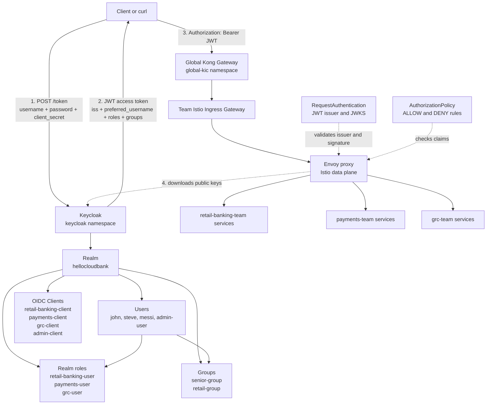

# Keycloak And Istio JWT Authorization

This folder adds Keycloak as the identity provider for the Istio gateway demo.
Clients log in to Keycloak, receive a JWT access token, and send that token to
the global API gateway. Istio then validates the token and applies
authorization rules before traffic reaches the application services.

## Relationship Diagram



## Access Model

Keycloak owns identity. Istio owns enforcement.

| Identity data in JWT | Used by | Purpose |
| --- | --- | --- |
| `iss` | `RequestAuthentication` | Confirms the token came from the expected realm |
| JWT signature | `RequestAuthentication` + JWKS | Confirms the token was signed by Keycloak |
| `realm_access.roles` | `AuthorizationPolicy` | Allows users into the matching team namespace |
| `groups` | `AuthorizationPolicy` | Allows group-based access, such as `senior-group` |
| `preferred_username` | `AuthorizationPolicy` | Allows special user-based access, such as `admin-user` |

Namespace access in the default JWT policy:

| Keycloak role or group | Access |
| --- | --- |
| `retail-banking-user` | `retail-banking-team` |
| `payments-user` | `payments-team` |
| `grc-user` | `grc-team` |
| `senior-group` | all three team namespaces |
| `admin-user` | all three team namespaces when `11-admin-role.yaml` is applied |

## Files

| File | Purpose |
| --- | --- |
| `00-namespace.yaml` | Creates the `keycloak` namespace without Istio injection |
| `01-keycloak.yaml` | Runs Keycloak 26.0.0 in local dev mode with a `LoadBalancer` service |
| `02-request-authentication.yaml` | Configures Istio JWT validation for the three team namespaces |
| `03-authz-policy-jwt.yaml` | Enforces role/group based access for retail, payments, and GRC |
| `10-authz-policy-retail-group.yaml` | Optional stricter per-service policy using `groups` and `preferred_username` claims |
| `11-admin-role.yaml` | Optional admin-user policy for full namespace access |
| `how-to.md` | Detailed step-by-step Keycloak UI setup and token testing |
| `how-to-write-policy.md` | Notes for decoding JWT claims and writing claim-based policies |

## Setup

Run these commands from the repository root.

### 1. Deploy Keycloak

```bash
kubectl apply -f istio-gateway/keycloak/00-namespace.yaml
kubectl apply -f istio-gateway/keycloak/01-keycloak.yaml
```

Wait for Keycloak:

```bash
kubectl rollout status deployment/keycloak -n keycloak
kubectl get svc keycloak -n keycloak
```

Add the Keycloak load balancer IP to `/etc/hosts`:

```bash
echo "<KEYCLOAK_LB_IP> keycloak.hellocloud.io" | sudo tee -a /etc/hosts
```

Verify:

```bash
curl -s http://keycloak.hellocloud.io:8080/realms/master
```

### 2. Configure Keycloak Realm Data

In the Keycloak UI, create:

- Realm: `hellocloudbank`
- Confidential OIDC clients for the applications that need tokens.
- Users such as `john`, `steve`, `messi`, and `admin-user`.
- Realm roles such as `retail-banking-user`, `payments-user`, and `grc-user`.
- Groups such as `senior-group` or `retail-group` if you use group policies.

Use [how-to.md](./how-to.md) for the detailed click-by-click setup.

Important: if policies check `request.auth.claims[groups]`, configure a
Keycloak Group Membership mapper so the `groups` claim appears in access
tokens.

### 3. Apply Istio JWT Validation

```bash
kubectl apply -f istio-gateway/keycloak/02-request-authentication.yaml
```

Verify:

```bash
kubectl get requestauthentication -A
```

The issuer must match the token's `iss` claim:

```text
http://keycloak.hellocloud.io:8080/realms/hellocloudbank
```

The JWKS URI uses internal cluster DNS:

```text
http://keycloak.keycloak.svc.cluster.local:8080/realms/hellocloudbank/protocol/openid-connect/certs
```

This lets Envoy fetch Keycloak public keys from inside the cluster while users
still request tokens through `keycloak.hellocloud.io`.

### 4. Apply Authorization Policies

For the role/group namespace policy:

```bash
kubectl apply -f istio-gateway/keycloak/03-authz-policy-jwt.yaml
```

Optionally allow `admin-user` full access:

```bash
kubectl apply -f istio-gateway/keycloak/11-admin-role.yaml
```

Use `10-authz-policy-retail-group.yaml` only when you want stricter per-service
rules based on the `groups` claim and `preferred_username`.

Verify:

```bash
kubectl get authorizationpolicy -n retail-banking-team
kubectl get authorizationpolicy -n payments-team
kubectl get authorizationpolicy -n grc-team
```

## Token Flow

1. Client requests a token from Keycloak.
2. Keycloak authenticates the user and returns a signed JWT.
3. Client calls `finance.hellocloud.io` through Kong with
   `Authorization: Bearer <JWT>`.
4. Istio Envoy validates the JWT using `RequestAuthentication`.
5. Istio checks token claims using `AuthorizationPolicy`.
6. If the token and claims match, the request reaches the application service.

Example token request shape:

```bash
TOKEN=$(curl -s -X POST \
  http://keycloak.hellocloud.io:8080/realms/hellocloudbank/protocol/openid-connect/token \
  -H "Content-Type: application/x-www-form-urlencoded" \
  -d "client_id=<CLIENT_ID>" \
  -d "client_secret=<CLIENT_SECRET>" \
  -d "username=<USERNAME>" \
  -d "password=<PASSWORD>" \
  -d "grant_type=password" \
  | python3 -c "import sys,json; print(json.load(sys.stdin)['access_token'])")
```

Example API call:

```bash
curl -s -o /dev/null -w "HTTP: %{http_code}\n" \
  -H "Host: finance.hellocloud.io" \
  -H "Authorization: Bearer $TOKEN" \
  http://<GLOBAL_KONG_LB>/retail-banking/customer-profile-svc
```

## Expected Results

| Request | Expected result |
| --- | --- |
| No JWT | blocked by DENY policy |
| Invalid or expired JWT | `401` from JWT validation |
| Valid JWT with wrong role/group | blocked by AuthorizationPolicy |
| Valid JWT with matching role/group | request reaches the service |
| `admin-user` with `11-admin-role.yaml` applied | request can reach all team namespaces |

## Troubleshooting

Check Keycloak:

```bash
kubectl get pods -n keycloak
kubectl logs deployment/keycloak -n keycloak
kubectl get svc keycloak -n keycloak
```

Check JWT validation:

```bash
kubectl get requestauthentication -A
kubectl describe requestauthentication keycloak-jwt -n retail-banking-team
```

Check authorization:

```bash
kubectl get authorizationpolicy -A
kubectl describe authorizationpolicy require-jwt-retail-banking -n retail-banking-team
```

Decode a JWT payload:

```bash
echo "$TOKEN" | cut -d'.' -f2 | python3 -c '
import sys, base64, json
p=sys.stdin.read().strip()
p += "=" * (-len(p) % 4)
print(json.dumps(json.loads(base64.urlsafe_b64decode(p)), indent=2))
'
```

Common issues:

- `Could not resolve host: keycloak.hellocloud.io`: add the `/etc/hosts` entry.
- `Realm does not exist`: Keycloak dev-mode data was lost after pod restart.
- `unauthorized_client`: use a confidential client and pass its client secret.
- `invalid_grant`: check username, password, and temporary-password setting.
- Token has no `groups`: add a Group Membership mapper to the client scope.
- HTTP `401`: compare the token `iss` claim with the Istio `issuer`.
- HTTP `403`: the token is valid, but claims do not match the policy.

## Cleanup

Remove Istio JWT policies:

```bash
kubectl delete -f istio-gateway/keycloak/11-admin-role.yaml --ignore-not-found
kubectl delete -f istio-gateway/keycloak/03-authz-policy-jwt.yaml --ignore-not-found
kubectl delete -f istio-gateway/keycloak/02-request-authentication.yaml --ignore-not-found
```

Remove Keycloak:

```bash
kubectl delete -f istio-gateway/keycloak/01-keycloak.yaml --ignore-not-found
kubectl delete -f istio-gateway/keycloak/00-namespace.yaml --ignore-not-found
```
