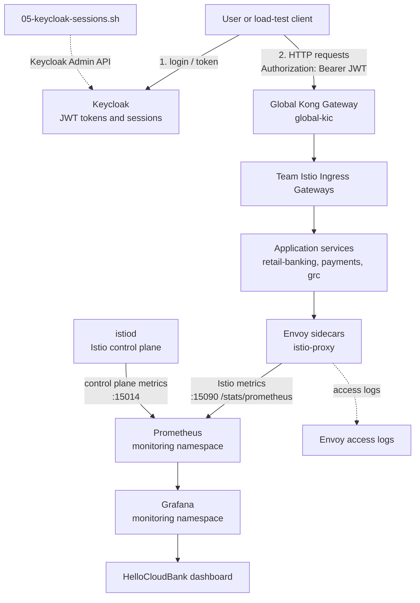

# Observability Setup

This folder installs a lightweight observability stack for the
HelloCloudBank Istio gateway demo.

It provides:

- Prometheus for scraping Istio control plane and Envoy sidecar metrics.
- Grafana for a pre-provisioned "HelloCloudBank - Live User Sessions"
  dashboard.
- Istio Telemetry resources for Envoy access logs.
- Helper scripts for generating traffic and checking active Keycloak sessions.

## Architecture Diagram



## Files

| File | Purpose |
| --- | --- |
| `01-monitoring-ns.yaml` | Creates the `monitoring` namespace with Istio injection disabled |
| `02-prometheus.yaml` | Deploys Prometheus, RBAC, scrape config, and a `LoadBalancer` service |
| `03-grafana.yaml` | Deploys Grafana, Prometheus datasource, dashboard provider, and live sessions dashboard |
| `04-telemetry.yaml` | Enables Envoy access logs in the three team namespaces |
| `load-test.sh` | Generates continuous authenticated traffic through Kong to all three teams |
| `05-keycloak-sessions.sh` | Prints active Keycloak realm/client/user sessions from the Admin API |

## What Prometheus Scrapes

| Job | Source | Metrics |
| --- | --- | --- |
| `istiod` | `istio-system/istiod` on port `15014` | Istio control plane metrics |
| `istio-proxy` | Pods with `istio-proxy` containers on port `15090` | Envoy and Istio request metrics |

The `istio-proxy` job covers:

- `retail-banking-team`
- `payments-team`
- `grc-team`
- `istio-system`

Important metrics used by the Grafana dashboard:

| Metric | Meaning |
| --- | --- |
| `istio_requests_total` | Request count by service, namespace, response code, reporter, and more |
| `istio_request_duration_milliseconds_bucket` | Request latency histogram used for p99 latency |

## Setup

Run these commands from the repository root.

### 1. Deploy Prometheus

```bash
kubectl apply -f istio-gateway/observability/01-monitoring-ns.yaml
kubectl apply -f istio-gateway/observability/02-prometheus.yaml
```

Wait and verify:

```bash
kubectl rollout status deployment/prometheus -n monitoring
kubectl get pods,svc -n monitoring
```

Get the Prometheus external IP:

```bash
kubectl get svc prometheus -n monitoring
```

Open:

```text
http://<PROMETHEUS_LB_IP>:9090
```

### 2. Deploy Grafana

```bash
kubectl apply -f istio-gateway/observability/03-grafana.yaml
```

Wait and verify:

```bash
kubectl rollout status deployment/grafana -n monitoring
kubectl get svc grafana -n monitoring
```

Open:

```text
http://<GRAFANA_LB_IP>:3000
```

Login:

```text
username: admin
password: admin
```

The dashboard is provisioned automatically:

```text
HelloCloudBank / HelloCloudBank - Live User Sessions
```

### 3. Enable Envoy Access Logs

```bash
kubectl apply -f istio-gateway/observability/04-telemetry.yaml
```

Check logs from any injected application pod:

```bash
kubectl logs <POD_NAME> -n retail-banking-team -c istio-proxy
kubectl logs <POD_NAME> -n payments-team -c istio-proxy
kubectl logs <POD_NAME> -n grc-team -c istio-proxy
```

## Verify Metrics

In Prometheus, check targets:

```text
Status -> Targets
```

Expected jobs:

- `istiod`
- `istio-proxy`

Useful PromQL checks:

```promql
up
```

```promql
sum(rate(istio_requests_total[1m])) by (destination_service_namespace)
```

```promql
sum(rate(istio_requests_total{
  reporter="destination",
  destination_service_namespace=~"retail-banking-team|payments-team|grc-team"
}[1m])) by (destination_service_name)
```

```promql
histogram_quantile(
  0.99,
  sum(rate(istio_request_duration_milliseconds_bucket{
    reporter="destination",
    destination_service_namespace=~"retail-banking-team|payments-team|grc-team"
  }[1m])) by (destination_service_name, le)
)
```

## Generate Dashboard Traffic

The dashboard needs live traffic before the graphs become interesting.

Make sure these are already working:

- Kong global gateway is reachable.
- Keycloak is reachable at `keycloak.hellocloud.io:8080`.
- Keycloak users, clients, secrets, roles, and groups match the script.
- `/etc/hosts` contains the correct entries for `finance.hellocloud.io` and
  `keycloak.hellocloud.io`.

Run:

```bash
bash istio-gateway/observability/load-test.sh
```

The script continuously sends traffic to:

| Team | Path | User token |
| --- | --- | --- |
| retail banking | `/retail-banking/customer-profile-svc` | `john` |
| payments | `/payments/transactions` | `steve` |
| GRC | `/grc/audits` | `messi` |

Stop it with `Ctrl+C`.

## Check Keycloak Sessions

To inspect active Keycloak sessions:

```bash
bash istio-gateway/observability/05-keycloak-sessions.sh
```

This script uses the Keycloak Admin API to print:

- active sessions per client
- active users per client
- login start time and source IP

## Dashboard Panels

The Grafana dashboard includes:

| Panel | Shows |
| --- | --- |
| Live Request Rate per Service | request throughput per microservice |
| Request Rate per Namespace | active team namespace traffic |
| Auth Error Rate | `401` and `403` JWT/authz failures |
| Total Request Rate | overall request rate |
| Success Rate | percentage of `2xx` responses |
| Auth Errors | combined auth failure rate |
| Active Services | number of services receiving traffic |
| P99 Request Latency | p99 latency per service |

## Troubleshooting

If Grafana has no data:

```bash
kubectl get pods -n monitoring
kubectl logs deployment/grafana -n monitoring
kubectl logs deployment/prometheus -n monitoring
kubectl get svc -n monitoring
```

Check that Prometheus can see targets:

```text
http://<PROMETHEUS_LB_IP>:9090/targets
```

If `istio-proxy` targets are missing:

- Confirm application pods have an `istio-proxy` sidecar.
- Confirm team namespaces are included in `02-prometheus.yaml`.
- Confirm the services are receiving traffic.

If PromQL returns no request metrics:

- Generate traffic with `load-test.sh`.
- Check that requests pass through Istio sidecars.
- Use `reporter="destination"` queries for service-side metrics.

If `load-test.sh` fails:

- Check the hardcoded Kong IP in the script.
- Check Keycloak client secrets and usernames.
- Confirm `keycloak.hellocloud.io` resolves locally.
- Confirm each user has the role/group required by the Istio policies.

If access logs do not appear:

```bash
kubectl get telemetry -A
kubectl describe telemetry retail-banking-access-logs -n retail-banking-team
```

Then generate new traffic and read the `istio-proxy` container logs again.

## Cleanup

Remove access logging:

```bash
kubectl delete -f istio-gateway/observability/04-telemetry.yaml --ignore-not-found
```

Remove Grafana and Prometheus:

```bash
kubectl delete -f istio-gateway/observability/03-grafana.yaml --ignore-not-found
kubectl delete -f istio-gateway/observability/02-prometheus.yaml --ignore-not-found
kubectl delete -f istio-gateway/observability/01-monitoring-ns.yaml --ignore-not-found
```

