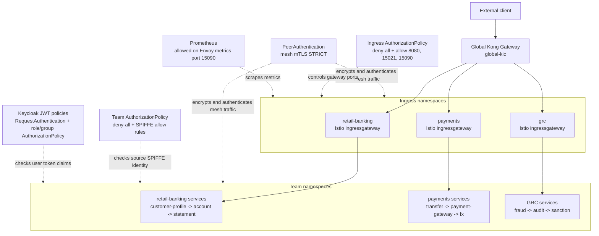

# Security Setup

This folder contains the Istio security controls for the HelloCloudBank gateway
demo. It locks down service-to-service traffic with mesh mTLS, SPIFFE workload
identity, and Istio `AuthorizationPolicy` rules.

For the full control-by-control reference, see [SECURITY.md](./SECURITY.md).

## Security Relationship Diagram



## What This Secures

| Layer | Control | Purpose |
| --- | --- | --- |
| Transport | `PeerAuthentication` STRICT | Requires mTLS for mesh traffic |
| Workload identity | SPIFFE principals | Identifies callers by namespace and service account |
| Ingress boundary | Ingress `AuthorizationPolicy` | Allows only gateway traffic, health checks, and metrics |
| Team boundary | Team `AuthorizationPolicy` | Allows only expected service-to-service paths |
| User auth | Keycloak JWT policies | Allows only users with matching roles/groups |
| Exposure | ClusterIP team gateways | Keeps team ingress gateways internal to the cluster |

## Files

| File | Purpose |
| --- | --- |
| `peer-authentication.yaml` | Enables mesh-wide mTLS `STRICT` mode |
| `authz-retail-banking-ingress.yaml` | Secures the retail banking ingress gateway namespace |
| `authz-payments-ingress.yaml` | Secures the payments ingress gateway namespace |
| `authz-grc-ingress.yaml` | Secures the GRC ingress gateway namespace |
| `authz-retail-banking.yaml` | Allows only approved retail banking SPIFFE callers |
| `authz-payments.yaml` | Allows only approved payments SPIFFE callers |
| `authz-grc.yaml` | Allows only approved GRC SPIFFE callers |
| `SECURITY.md` | Detailed security design and policy reference |
| `note.md` | Earlier security assessment notes |

Related Keycloak files:

| File | Purpose |
| --- | --- |
| `../keycloak/02-request-authentication.yaml` | Validates JWT issuer, signature, and expiry |
| `../keycloak/10-authz-policy-retail-group.yaml` | Enforces per-service access using JWT `groups` and `preferred_username` |

## Policy Model

The security manifests use a deny-by-default pattern:

1. Add an empty `AuthorizationPolicy` in each namespace to deny all traffic.
2. Add narrow `ALLOW` policies for known ports and known callers.
3. Match internal service calls by SPIFFE principal.
4. Match external user access with Keycloak JWT claims.

SPIFFE principal format:

```text
cluster.local/ns/<namespace>/sa/<service-account>
```

Example:

```text
cluster.local/ns/retail-banking-team/sa/customer-profile-svc
```

Istio certificates contain the full URI:

```text
spiffe://cluster.local/ns/retail-banking-team/sa/customer-profile-svc
```

In `AuthorizationPolicy`, the `spiffe://` prefix is omitted.

## Apply Order

Run these commands from the repository root after Istio, the gateways, and the
application workloads are deployed.

### 1. Enable Mesh mTLS

```bash
kubectl apply -f istio-gateway/security/peer-authentication.yaml
```

Verify:

```bash
kubectl get peerauthentication -n istio-system
kubectl describe peerauthentication mesh-mtls-strict -n istio-system
```

### 2. Apply Ingress Namespace Policies

```bash
kubectl apply -f istio-gateway/security/authz-retail-banking-ingress.yaml
kubectl apply -f istio-gateway/security/authz-payments-ingress.yaml
kubectl apply -f istio-gateway/security/authz-grc-ingress.yaml
```

These policies allow:

- gateway listener traffic on port `8080`
- kubelet health checks on port `15021`
- Prometheus scraping on port `15090`

### 3. Apply Team Namespace Policies

```bash
kubectl apply -f istio-gateway/security/authz-retail-banking.yaml
kubectl apply -f istio-gateway/security/authz-payments.yaml
kubectl apply -f istio-gateway/security/authz-grc.yaml
```

These policies allow only the expected gateway and service-to-service calls.

### 4. Apply JWT Policies

JWT policies live in the Keycloak folder:

```bash
kubectl apply -f istio-gateway/keycloak/02-request-authentication.yaml
kubectl apply -f istio-gateway/keycloak/10-authz-policy-retail-group.yaml
```

## Allowed Service Paths

Retail banking:

```text
retail-banking-ingressgateway -> customer-profile-svc
retail-banking-ingressgateway -> account-svc
retail-banking-ingressgateway -> statement-svc
customer-profile-svc -> account-svc
account-svc -> statement-svc
```

Payments:

```text
payments-ingressgateway -> transfer-svc
payments-ingressgateway -> payment-gateway-svc
payments-ingressgateway -> fx-svc
transfer-svc -> payment-gateway-svc
payment-gateway-svc -> fx-svc
```

GRC:

```text
grc-ingressgateway -> fraud-svc
grc-ingressgateway -> audit-svc
grc-ingressgateway -> sanction-svc
fraud-svc -> audit-svc
audit-svc -> sanction-svc
```

Everything else should be denied unless another policy explicitly allows it.

## Pod-to-Pod Port Security

Istio `AuthorizationPolicy` is enforced at the destination pod's Envoy sidecar.
That means each service decides which source identity may call which destination
container port.

The policy port is the pod container port, not the Kubernetes Service port.

### Retail Banking

| Source pod identity | Destination pod | Allowed destination port | Policy |
| --- | --- | --- | --- |
| `retail-banking-ingressgateway` | `customer-profile-svc` | `9091` | `allow-ingressgateway-to-customer-profile-svc` |
| `retail-banking-ingressgateway` | `account-svc` | `9092` | `allow-ingressgateway-to-account-svc` |
| `retail-banking-ingressgateway` | `statement-svc` | `9093` | `allow-ingressgateway-to-statement-svc` |
| `customer-profile-svc` | `account-svc` | `9092` | `allow-customer-profile-svc-to-account-svc` |
| `account-svc` | `statement-svc` | `9093` | `allow-account-svc-to-statement-svc` |

### Payments

| Source pod identity | Destination pod | Allowed destination port | Policy |
| --- | --- | --- | --- |
| `payments-ingressgateway` | `transfer-svc` | `9091` | `allow-ingressgateway-to-transfer-svc` |
| `payments-ingressgateway` | `payment-gateway-svc` | `9092` | `allow-ingressgateway-to-payment-gateway-svc` |
| `payments-ingressgateway` | `fx-svc` | `9093` | `allow-ingressgateway-to-fx-svc` |
| `transfer-svc` | `payment-gateway-svc` | `9092` | `allow-transfer-svc-to-payment-gateway-svc` |
| `payment-gateway-svc` | `fx-svc` | `9093` | `allow-payment-gateway-svc-to-fx-svc` |

### GRC

| Source pod identity | Destination pod | Allowed destination port | Policy |
| --- | --- | --- | --- |
| `grc-ingressgateway` | `fraud-svc` | `9091` | `allow-ingressgateway-to-fraud-svc` |
| `grc-ingressgateway` | `audit-svc` | `9092` | `allow-ingressgateway-to-audit-svc` |
| `grc-ingressgateway` | `sanction-svc` | `9093` | `allow-ingressgateway-to-sanction-svc` |
| `fraud-svc` | `audit-svc` | `9092` | `allow-fraud-svc-to-audit-svc` |
| `audit-svc` | `sanction-svc` | `9093` | `allow-audit-svc-to-sanction-svc` |

Examples of denied pod-to-pod traffic:

```text
customer-profile-svc -> statement-svc:9093    denied
account-svc -> payment-gateway-svc:9092       denied
transfer-svc -> fx-svc:9093                   denied
fraud-svc -> sanction-svc:9093                denied
any service -> any unlisted port              denied
```

The deny happens because each team namespace has a deny-all policy, and only
the source identity plus destination port combinations above are explicitly
allowed.

## Verify Policies

List policies:

```bash
kubectl get authorizationpolicy -A
kubectl get peerauthentication -A
```

Check ingress namespaces:

```bash
kubectl get authorizationpolicy -n retail-banking-ingress
kubectl get authorizationpolicy -n payments-ingress
kubectl get authorizationpolicy -n grc-ingress
```

Check team namespaces:

```bash
kubectl get authorizationpolicy -n retail-banking-team
kubectl get authorizationpolicy -n payments-team
kubectl get authorizationpolicy -n grc-team
```

Inspect Envoy mTLS state for a workload:

```bash
istioctl authn tls-check <POD_NAME>.<NAMESPACE>
```

Inspect policy effects:

```bash
istioctl x authz check <POD_NAME>.<NAMESPACE>
```

## Test Expected Access

Use valid Keycloak tokens when JWT policies are applied.

Allowed retail call:

```bash
curl -s -o /dev/null -w "HTTP: %{http_code}\n" \
  -H "Host: finance.hellocloud.io" \
  -H "Authorization: Bearer $RETAIL_TOKEN" \
  http://<GLOBAL_KONG_LB>/retail-banking/customer-profile-svc
```

Expected:

```text
HTTP: 200
```

No token:

```bash
curl -s -o /dev/null -w "HTTP: %{http_code}\n" \
  -H "Host: finance.hellocloud.io" \
  http://<GLOBAL_KONG_LB>/retail-banking/customer-profile-svc
```

Expected:

```text
HTTP: 403
```

Wrong role or wrong namespace token:

```bash
curl -s -o /dev/null -w "HTTP: %{http_code}\n" \
  -H "Host: finance.hellocloud.io" \
  -H "Authorization: Bearer $PAYMENTS_TOKEN" \
  http://<GLOBAL_KONG_LB>/retail-banking/customer-profile-svc
```

Expected:

```text
HTTP: 403
```

Invalid or expired token:

```text
HTTP: 401
```

## Troubleshooting

If all requests fail:

```bash
kubectl get pods -A
kubectl get authorizationpolicy -A
kubectl get peerauthentication -A
```

If gateway traffic fails:

```bash
kubectl describe authorizationpolicy -n retail-banking-ingress
kubectl logs -n retail-banking-ingress deploy/retail-banking-istio-ingressgateway -c istio-proxy
```

If service-to-service calls fail:

```bash
kubectl describe authorizationpolicy -n retail-banking-team
kubectl logs -n retail-banking-team deploy/customer-profile-svc -c istio-proxy
```

If JWT requests fail:

```bash
kubectl get requestauthentication -A
kubectl describe requestauthentication keycloak-jwt -n retail-banking-team
```

Common causes:

- Namespace is missing sidecar injection, so mTLS cannot work.
- Caller service account does not match the SPIFFE principal in policy.
- Policy port uses the wrong container port.
- Keycloak token `iss` does not match the `RequestAuthentication` issuer.
- JWT has no `groups` claim because the Keycloak mapper is missing.
- DENY policy is matching before an ALLOW policy, which is expected in Istio.

## Cleanup

Remove JWT policies:

```bash
kubectl delete -f istio-gateway/keycloak/10-authz-policy-retail-group.yaml --ignore-not-found
kubectl delete -f istio-gateway/keycloak/02-request-authentication.yaml --ignore-not-found
```

Remove AuthorizationPolicies:

```bash
kubectl delete -f istio-gateway/security/authz-grc.yaml --ignore-not-found
kubectl delete -f istio-gateway/security/authz-payments.yaml --ignore-not-found
kubectl delete -f istio-gateway/security/authz-retail-banking.yaml --ignore-not-found
kubectl delete -f istio-gateway/security/authz-grc-ingress.yaml --ignore-not-found
kubectl delete -f istio-gateway/security/authz-payments-ingress.yaml --ignore-not-found
kubectl delete -f istio-gateway/security/authz-retail-banking-ingress.yaml --ignore-not-found
```

Remove mesh mTLS strict mode:

```bash
kubectl delete -f istio-gateway/security/peer-authentication.yaml --ignore-not-found
```
